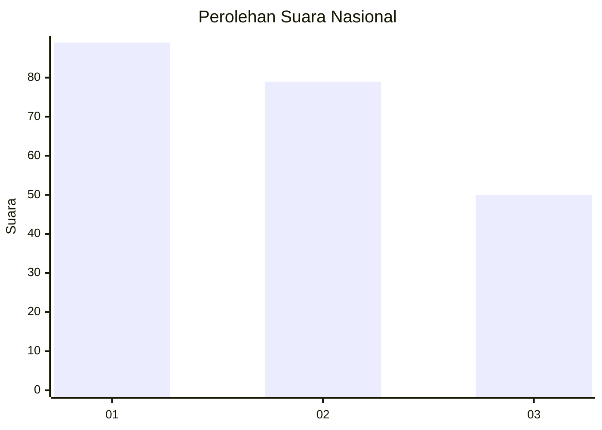
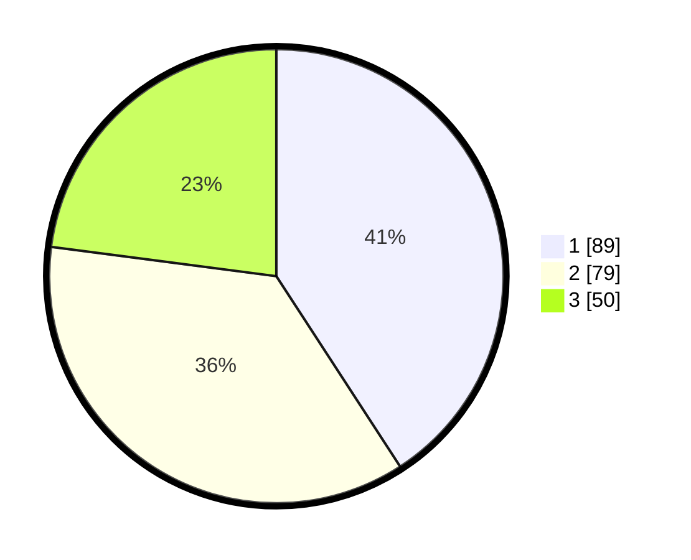

# Hasil

## Grafik

## Tabel

| No.    | Nama Paslon    | Suara | Suara (raw) | Persentase |
|:------ |:-------------- | -----:| -----------:| ----------:|
| 100025 | ANIES MUHAIMIN | 89    | [89][p-1]   | 40,83      |
| 100026 | PRABOWO GIBRAN | 79    | [79][p-2]   | 36,24      |
| 100027 | GANJAR MAHFUD  | 50    | [50][p-3]   | 22,94      |

[p-1]: https://github.com/gigit-pemilu/pemilu-2024/blob/main/pilpres/hitung-suara/sub/31-dki-jakarta/sub/75-jakarta-timur/sub/06-cakung/sub/1005-pulo-gebang/sub/295-tps/sub/paslon-1.txt
[p-2]: https://github.com/gigit-pemilu/pemilu-2024/blob/main/pilpres/hitung-suara/sub/31-dki-jakarta/sub/75-jakarta-timur/sub/06-cakung/sub/1005-pulo-gebang/sub/295-tps/sub/paslon-2.txt
[p-3]: https://github.com/gigit-pemilu/pemilu-2024/blob/main/pilpres/hitung-suara/sub/31-dki-jakarta/sub/75-jakarta-timur/sub/06-cakung/sub/1005-pulo-gebang/sub/295-tps/sub/paslon-3.txt

## Foto C Plano

https://sirekap-obj-formc.kpu.go.id/d1aa/pemilu/ppwp/31/75/06/10/05/3175061005295-20240214-193737--a1de76fe-4ce5-48d6-b386-34d92068560a.jpg

https://sirekap-obj-formc.kpu.go.id/d1aa/pemilu/ppwp/31/75/06/10/05/3175061005295-20240214-193755--98baf523-5434-4c9a-b0f8-377dd6298a4a.jpg

https://sirekap-obj-formc.kpu.go.id/d1aa/pemilu/ppwp/31/75/06/10/05/3175061005295-20240214-193832--e468d3c9-ccb6-44e5-b320-b63981f41cf2.jpg

## Metadata

| Key        | Value               |
| ---------- | ------------------- |
| Time Stamp | 2024-02-20 11:00:00 |

