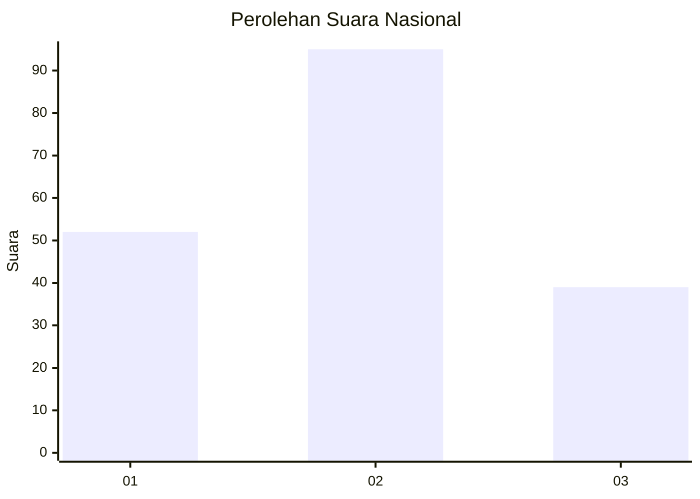
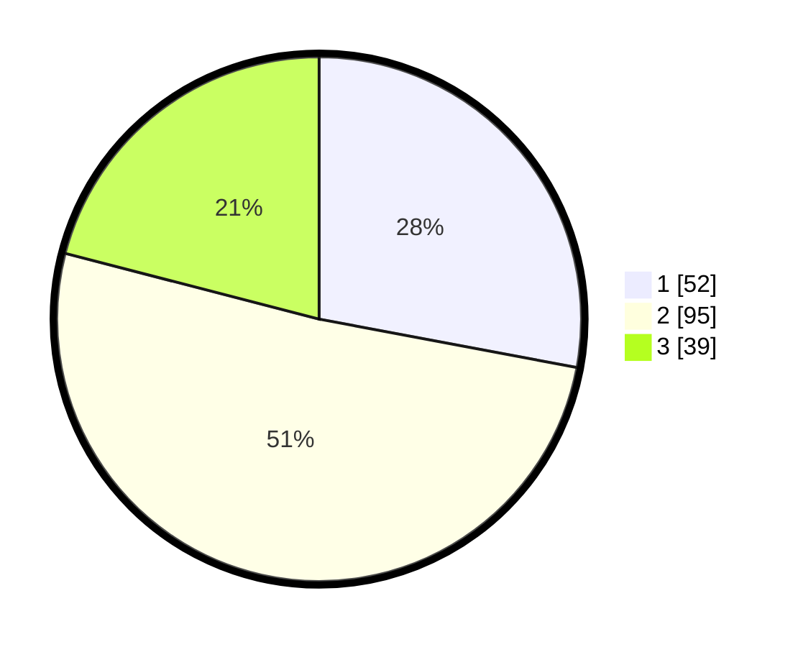

# Hasil

## Grafik

## Tabel

| No.    | Nama Paslon    | Suara | Suara (raw) | Persentase |
|:------ |:-------------- | -----:| -----------:| ----------:|
| 100025 | ANIES MUHAIMIN | 52    | [52][p-1]   | 27,96      |
| 100026 | PRABOWO GIBRAN | 95    | [95][p-2]   | 51,08      |
| 100027 | GANJAR MAHFUD  | 39    | [39][p-3]   | 20,97      |

[p-1]: https://github.com/gigit-pemilu/pemilu-2024/blob/main/pilpres/hitung-suara/sub/31-dki-jakarta/sub/75-jakarta-timur/sub/06-cakung/sub/1005-pulo-gebang/sub/305-tps/sub/paslon-1.txt
[p-2]: https://github.com/gigit-pemilu/pemilu-2024/blob/main/pilpres/hitung-suara/sub/31-dki-jakarta/sub/75-jakarta-timur/sub/06-cakung/sub/1005-pulo-gebang/sub/305-tps/sub/paslon-2.txt
[p-3]: https://github.com/gigit-pemilu/pemilu-2024/blob/main/pilpres/hitung-suara/sub/31-dki-jakarta/sub/75-jakarta-timur/sub/06-cakung/sub/1005-pulo-gebang/sub/305-tps/sub/paslon-3.txt

## Foto C Plano

https://sirekap-obj-formc.kpu.go.id/7d56/pemilu/ppwp/31/75/06/10/05/3175061005305-20240215-013500--5029a73e-7bf3-4cb0-9df9-b8d21b8fdf9c.jpg

https://sirekap-obj-formc.kpu.go.id/7d56/pemilu/ppwp/31/75/06/10/05/3175061005305-20240215-013534--2d9e6590-271f-4736-86bf-74cfd73ef6c5.jpg

https://sirekap-obj-formc.kpu.go.id/7d56/pemilu/ppwp/31/75/06/10/05/3175061005305-20240215-013631--7f92bf97-28da-45e9-b474-699161ff3def.jpg

## Metadata

| Key        | Value               |
| ---------- | ------------------- |
| Time Stamp | 2024-02-25 16:00:00 |

