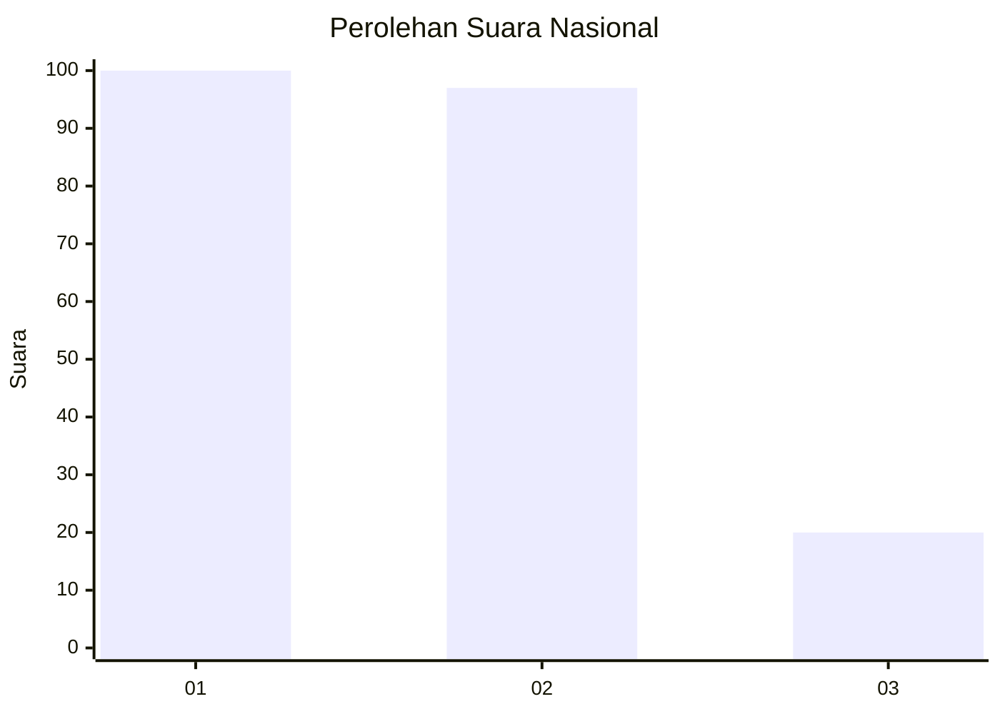
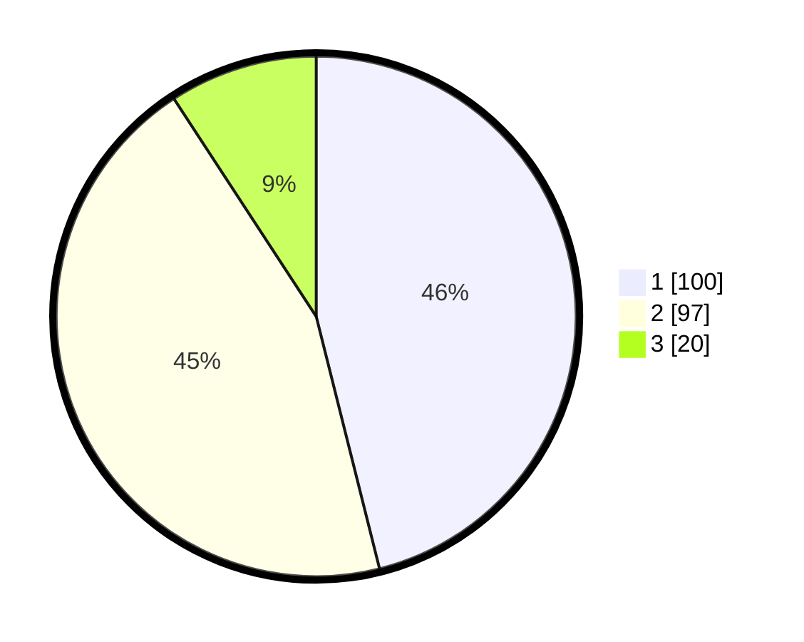

# Hasil

## Grafik

## Tabel

| No.    | Nama Paslon    | Suara | Suara (raw) | Persentase |
|:------ |:-------------- | -----:| -----------:| ----------:|
| 100025 | ANIES MUHAIMIN | 100   | [100][p-1]  | 46,08      |
| 100026 | PRABOWO GIBRAN | 97    | [97][p-2]   | 44,70      |
| 100027 | GANJAR MAHFUD  | 20    | [20][p-3]   | 9,22       |

[p-1]: https://github.com/gigit-pemilu/pemilu-2024/blob/main/pilpres/hitung-suara/sub/31-dki-jakarta/sub/75-jakarta-timur/sub/06-cakung/sub/1005-pulo-gebang/sub/328-tps/sub/paslon-1.txt
[p-2]: https://github.com/gigit-pemilu/pemilu-2024/blob/main/pilpres/hitung-suara/sub/31-dki-jakarta/sub/75-jakarta-timur/sub/06-cakung/sub/1005-pulo-gebang/sub/328-tps/sub/paslon-2.txt
[p-3]: https://github.com/gigit-pemilu/pemilu-2024/blob/main/pilpres/hitung-suara/sub/31-dki-jakarta/sub/75-jakarta-timur/sub/06-cakung/sub/1005-pulo-gebang/sub/328-tps/sub/paslon-3.txt

## Foto C Plano

https://sirekap-obj-formc.kpu.go.id/8047/pemilu/ppwp/31/75/06/10/05/3175061005328-20240214-215949--ab96c25f-5557-495a-b2e4-6ce7cbfda662.jpg

https://sirekap-obj-formc.kpu.go.id/8047/pemilu/ppwp/31/75/06/10/05/3175061005328-20240214-220117--b145f826-a208-4f15-891c-735e6de6637c.jpg

https://sirekap-obj-formc.kpu.go.id/8047/pemilu/ppwp/31/75/06/10/05/3175061005328-20240214-220221--20b4eaf6-f942-4bff-824a-d1cb1b0f4004.jpg

## Metadata

| Key        | Value               |
| ---------- | ------------------- |
| Time Stamp | 2024-02-20 11:00:00 |

