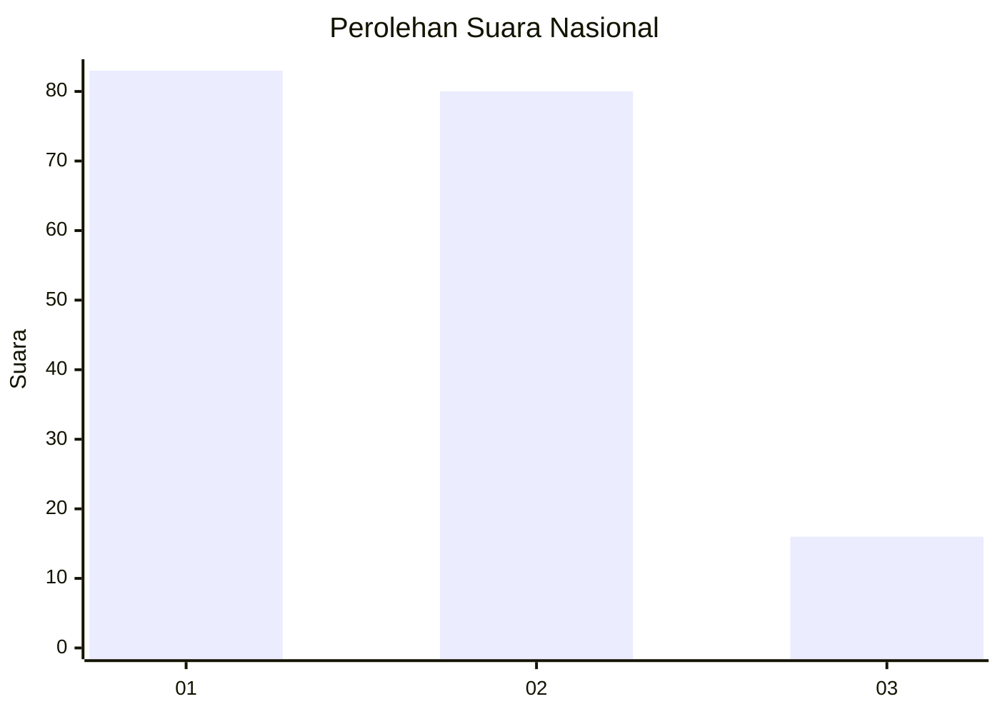
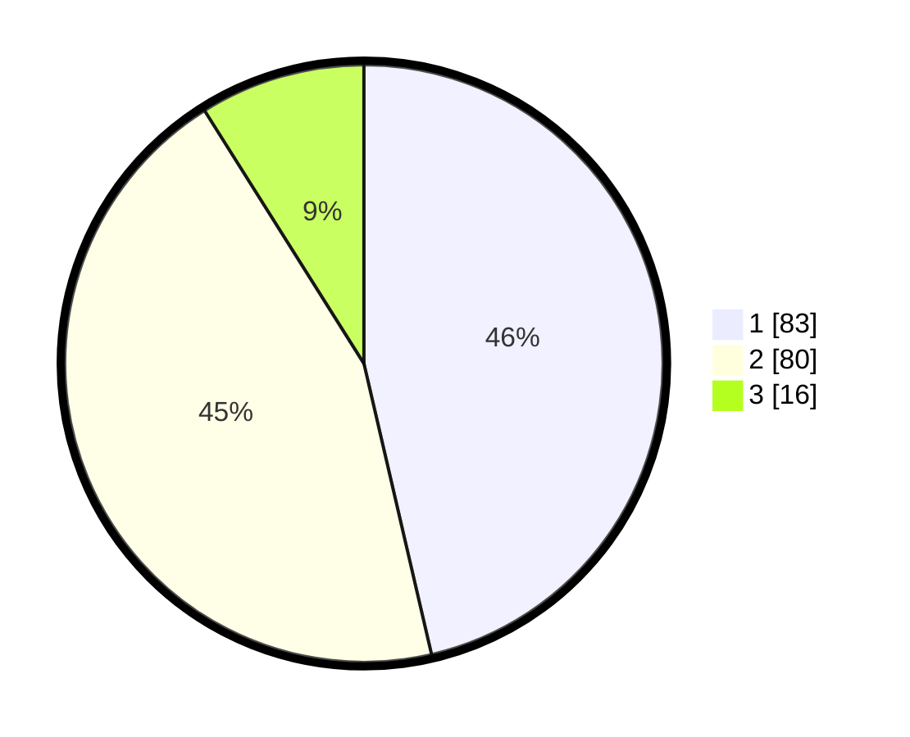

# Hasil

## Grafik

## Tabel

| No.    | Nama Paslon    | Suara | Suara (raw) | Persentase |
|:------ |:-------------- | -----:| -----------:| ----------:|
| 100025 | ANIES MUHAIMIN | 83    | [83][p-1]   | 46,37      |
| 100026 | PRABOWO GIBRAN | 80    | [80][p-2]   | 44,69      |
| 100027 | GANJAR MAHFUD  | 16    | [16][p-3]   | 8,94       |

[p-1]: https://github.com/gigit-pemilu/pemilu-2024/blob/main/pilpres/hitung-suara/sub/31-dki-jakarta/sub/75-jakarta-timur/sub/06-cakung/sub/1005-pulo-gebang/sub/333-tps/sub/paslon-1.txt
[p-2]: https://github.com/gigit-pemilu/pemilu-2024/blob/main/pilpres/hitung-suara/sub/31-dki-jakarta/sub/75-jakarta-timur/sub/06-cakung/sub/1005-pulo-gebang/sub/333-tps/sub/paslon-2.txt
[p-3]: https://github.com/gigit-pemilu/pemilu-2024/blob/main/pilpres/hitung-suara/sub/31-dki-jakarta/sub/75-jakarta-timur/sub/06-cakung/sub/1005-pulo-gebang/sub/333-tps/sub/paslon-3.txt

## Foto C Plano

https://sirekap-obj-formc.kpu.go.id/b7d0/pemilu/ppwp/31/75/06/10/05/3175061005333-20240214-221946--66f7511d-4275-40be-a77f-a7aa168e9b9b.jpg

https://sirekap-obj-formc.kpu.go.id/b7d0/pemilu/ppwp/31/75/06/10/05/3175061005333-20240214-193130--94b6c1f0-b964-4947-8331-a4a0d4bc5daa.jpg

https://sirekap-obj-formc.kpu.go.id/b7d0/pemilu/ppwp/31/75/06/10/05/3175061005333-20240214-201004--fb9bc7e6-b91f-4eb3-b365-76d56169461a.jpg

## Metadata

| Key        | Value               |
| ---------- | ------------------- |
| Time Stamp | 2024-02-20 15:00:00 |

