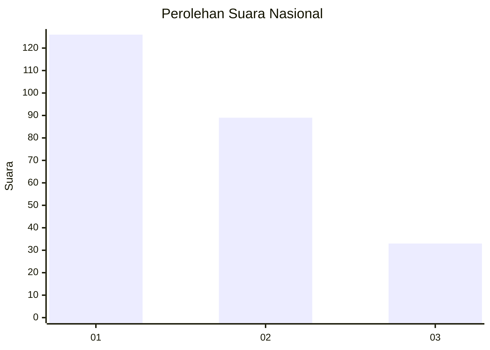
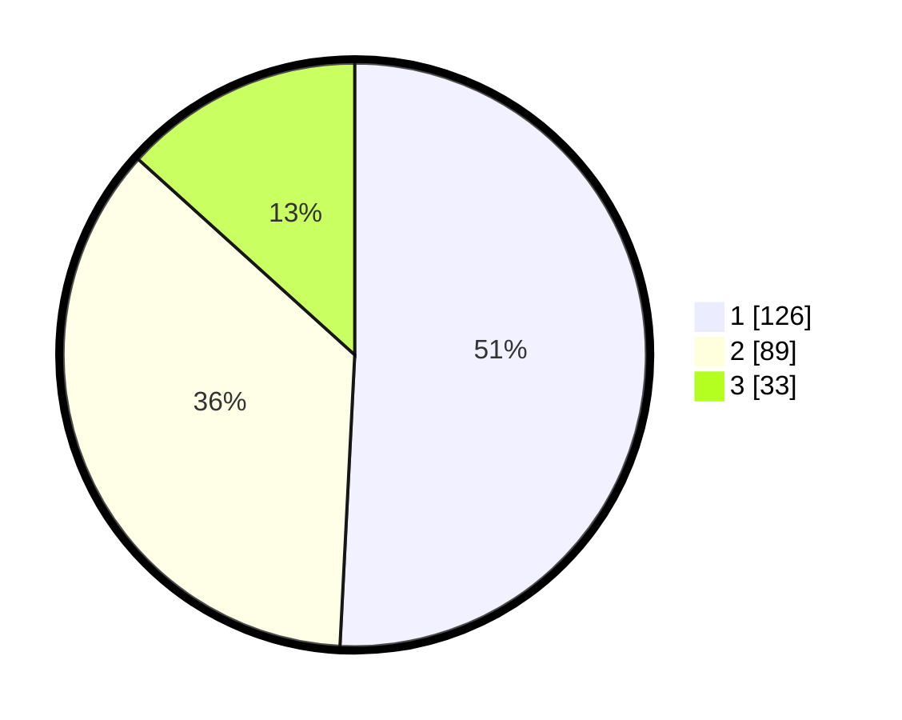

# Hasil

## Grafik

## Tabel

| No. | Nama Paslon    | Suara | Suara (raw) | Persentase |
|:--- |:-------------- | -----:| -----------:| ----------:|
| 1   | ANIES MUHAIMIN | 126   | [126][p-1]  | 50,81      |
| 2   | PRABOWO GIBRAN | 89    | [89][p-2]   | 35,89      |
| 3   | GANJAR MAHFUD  | 33    | [33][p-3]   | 13,31      |

[p-1]: https://github.com/gigit-pemilu/pemilu-2024/blob/main/pilpres/hitung-suara/sub/31-dki-jakarta/sub/75-jakarta-timur/sub/06-cakung/sub/1006-ujung-menteng/sub/002-tps/sub/paslon-1.txt
[p-2]: https://github.com/gigit-pemilu/pemilu-2024/blob/main/pilpres/hitung-suara/sub/31-dki-jakarta/sub/75-jakarta-timur/sub/06-cakung/sub/1006-ujung-menteng/sub/002-tps/sub/paslon-2.txt
[p-3]: https://github.com/gigit-pemilu/pemilu-2024/blob/main/pilpres/hitung-suara/sub/31-dki-jakarta/sub/75-jakarta-timur/sub/06-cakung/sub/1006-ujung-menteng/sub/002-tps/sub/paslon-3.txt

## Foto C Plano

https://sirekap-obj-formc.kpu.go.id/c8cc/pemilu/ppwp/31/75/06/10/06/3175061006002-20240214-214726--d1c8937b-62f8-4bfe-9be5-21cf75df2316.jpg

https://sirekap-obj-formc.kpu.go.id/c8cc/pemilu/ppwp/31/75/06/10/06/3175061006002-20240214-214800--c14cbe3a-939e-4054-b82d-10ca2501e71e.jpg

https://sirekap-obj-formc.kpu.go.id/c8cc/pemilu/ppwp/31/75/06/10/06/3175061006002-20240214-214840--f0d5354a-d4c8-45a6-bef4-dd79103a7c5a.jpg

## Metadata

| Key        | Value               |
| ---------- | ------------------- |
| Time Stamp | 2024-02-24 22:31:28 |

