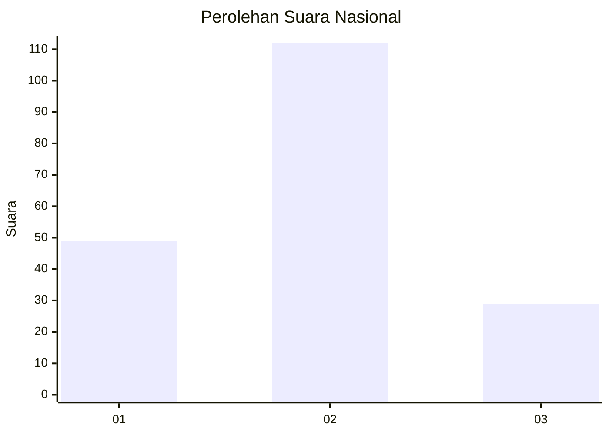

# Hasil

## Grafik

## Tabel

| No.    | Nama Paslon    | Suara | Suara (raw) | Persentase |
|:------ |:-------------- | -----:| -----------:| ----------:|
| 100025 | ANIES MUHAIMIN | 49    | [49][p-1]   | 25,79      |
| 100026 | PRABOWO GIBRAN | 112   | [112][p-2]  | 58,95      |
| 100027 | GANJAR MAHFUD  | 29    | [29][p-3]   | 15,26      |

[p-1]: https://github.com/gigit-pemilu/pemilu-2024/blob/main/pilpres/hitung-suara/sub/31-dki-jakarta/sub/75-jakarta-timur/sub/06-cakung/sub/1006-ujung-menteng/sub/011-tps/sub/paslon-1.txt
[p-2]: https://github.com/gigit-pemilu/pemilu-2024/blob/main/pilpres/hitung-suara/sub/31-dki-jakarta/sub/75-jakarta-timur/sub/06-cakung/sub/1006-ujung-menteng/sub/011-tps/sub/paslon-2.txt
[p-3]: https://github.com/gigit-pemilu/pemilu-2024/blob/main/pilpres/hitung-suara/sub/31-dki-jakarta/sub/75-jakarta-timur/sub/06-cakung/sub/1006-ujung-menteng/sub/011-tps/sub/paslon-3.txt

## Foto C Plano

https://sirekap-obj-formc.kpu.go.id/6910/pemilu/ppwp/31/75/06/10/06/3175061006011-20240214-204450--6a029345-48a8-407a-b735-e08f2264a943.jpg

https://sirekap-obj-formc.kpu.go.id/6910/pemilu/ppwp/31/75/06/10/06/3175061006011-20240214-212352--2fbcb2ea-1942-4c8a-ae52-5ba549e8fbd0.jpg

https://sirekap-obj-formc.kpu.go.id/6910/pemilu/ppwp/31/75/06/10/06/3175061006011-20240214-212404--3600817d-6145-46ab-869a-ee1f7f2610cd.jpg

## Metadata

| Key        | Value               |
| ---------- | ------------------- |
| Time Stamp | 2024-02-17 11:00:02 |

