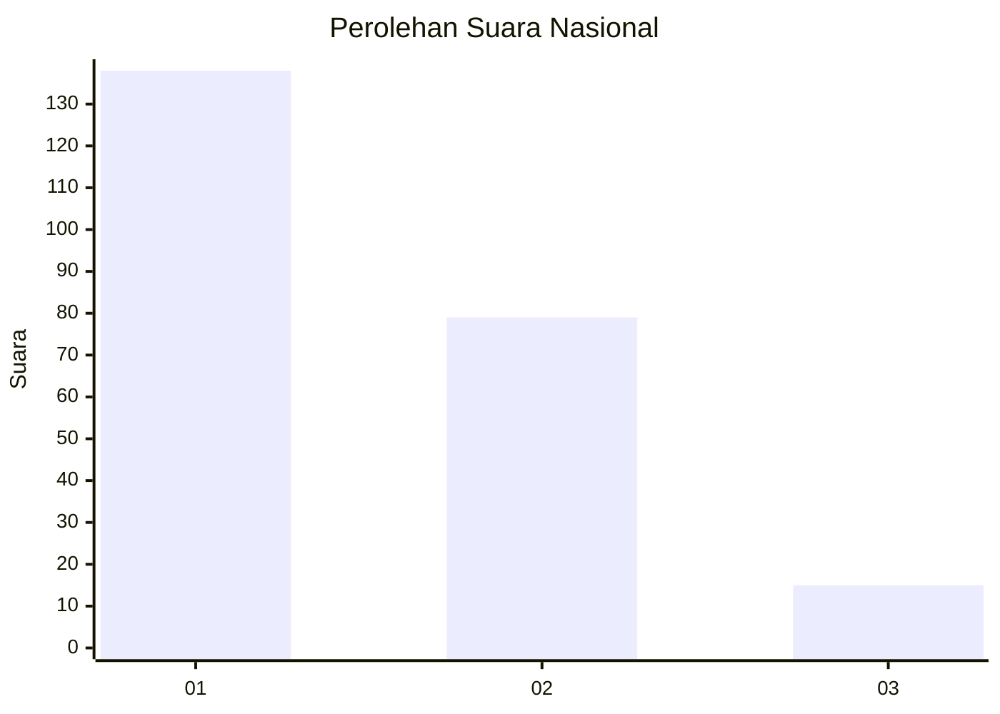
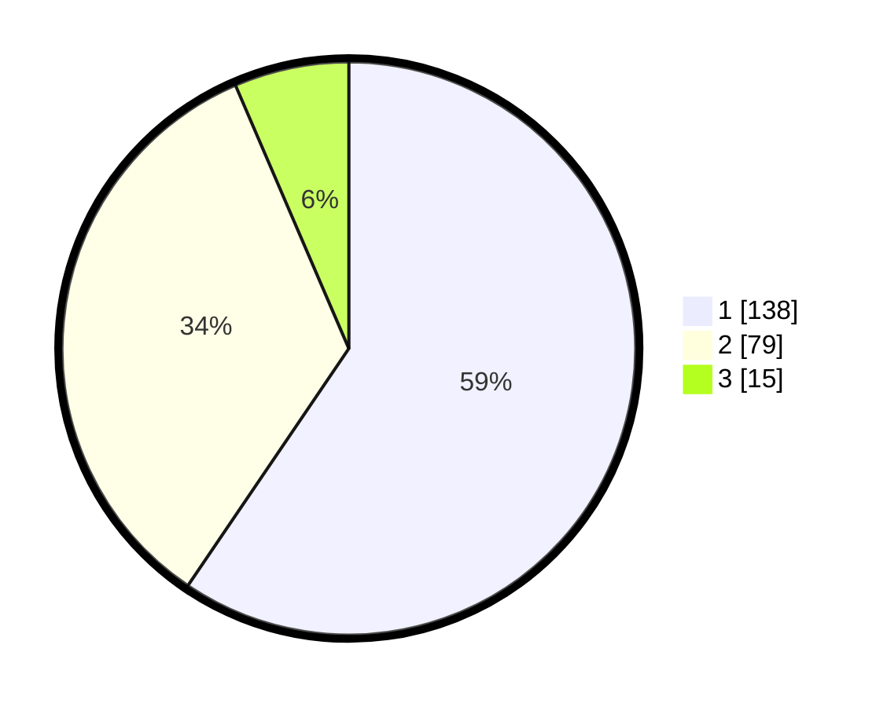

# Hasil

## Grafik

## Tabel

| No.    | Nama Paslon    | Suara | Suara (raw) | Persentase |
|:------ |:-------------- | -----:| -----------:| ----------:|
| 100025 | ANIES MUHAIMIN | 138   | [138][p-1]  | 59,48      |
| 100026 | PRABOWO GIBRAN | 79    | [79][p-2]   | 34,05      |
| 100027 | GANJAR MAHFUD  | 15    | [15][p-3]   | 6,47       |

[p-1]: https://github.com/gigit-pemilu/pemilu-2024/blob/main/pilpres/hitung-suara/sub/31-dki-jakarta/sub/75-jakarta-timur/sub/06-cakung/sub/1006-ujung-menteng/sub/021-tps/sub/paslon-1.txt
[p-2]: https://github.com/gigit-pemilu/pemilu-2024/blob/main/pilpres/hitung-suara/sub/31-dki-jakarta/sub/75-jakarta-timur/sub/06-cakung/sub/1006-ujung-menteng/sub/021-tps/sub/paslon-2.txt
[p-3]: https://github.com/gigit-pemilu/pemilu-2024/blob/main/pilpres/hitung-suara/sub/31-dki-jakarta/sub/75-jakarta-timur/sub/06-cakung/sub/1006-ujung-menteng/sub/021-tps/sub/paslon-3.txt

## Foto C Plano

https://sirekap-obj-formc.kpu.go.id/0fdd/pemilu/ppwp/31/75/06/10/06/3175061006021-20240214-162208--9339358b-8127-427f-b5c3-ca967f9e38fa.jpg

https://sirekap-obj-formc.kpu.go.id/0fdd/pemilu/ppwp/31/75/06/10/06/3175061006021-20240214-192350--81bd6e9b-aad6-43e5-8e28-cd8b9ac745da.jpg

https://sirekap-obj-formc.kpu.go.id/0fdd/pemilu/ppwp/31/75/06/10/06/3175061006021-20240214-192411--b0a17de3-6cd5-4b0a-9178-5e1744ee45fd.jpg

## Metadata

| Key        | Value               |
| ---------- | ------------------- |
| Time Stamp | 2024-02-15 00:41:44 |

