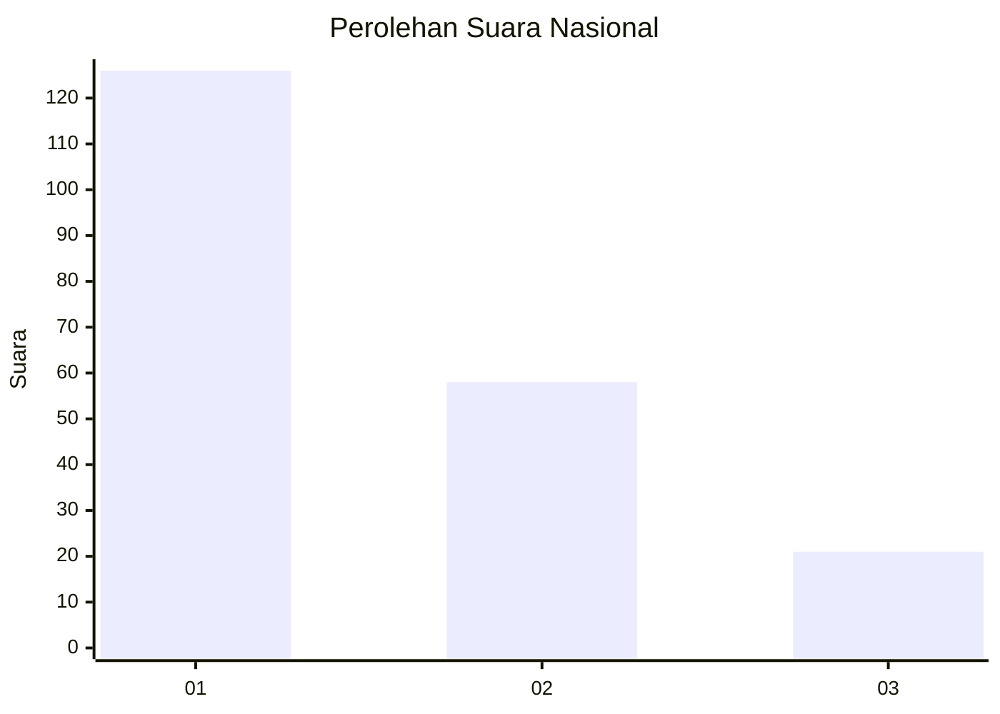
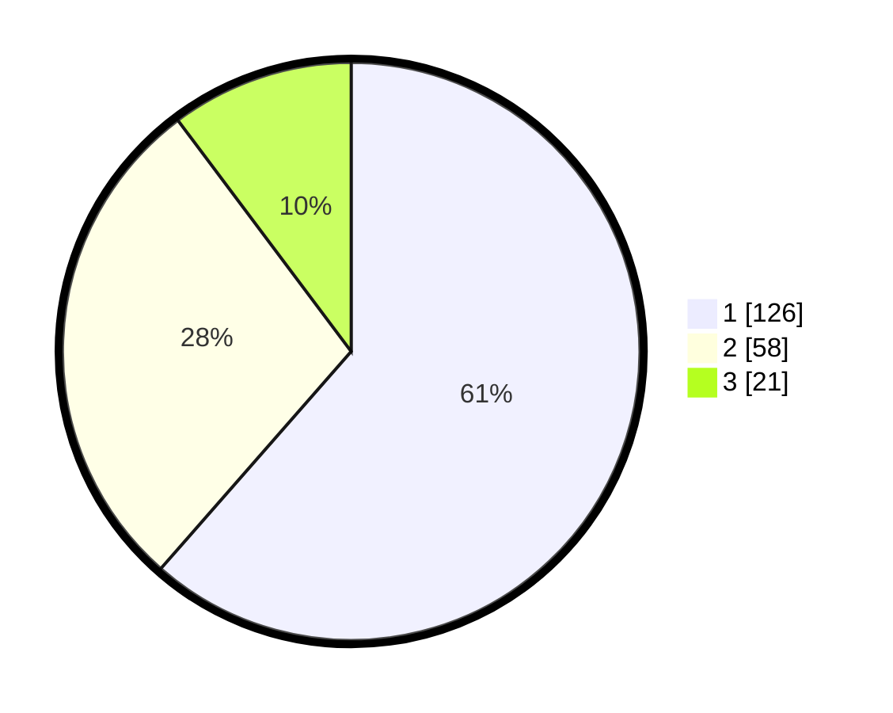

# Hasil

## Grafik

## Tabel

| No.    | Nama Paslon    | Suara | Suara (raw) | Persentase |
|:------ |:-------------- | -----:| -----------:| ----------:|
| 100025 | ANIES MUHAIMIN | 126   | [126][p-1]  | 61,46      |
| 100026 | PRABOWO GIBRAN | 58    | [58][p-2]   | 28,29      |
| 100027 | GANJAR MAHFUD  | 21    | [21][p-3]   | 10,24      |

[p-1]: https://github.com/gigit-pemilu/pemilu-2024/blob/main/pilpres/hitung-suara/sub/31-dki-jakarta/sub/75-jakarta-timur/sub/06-cakung/sub/1006-ujung-menteng/sub/037-tps/sub/paslon-1.txt
[p-2]: https://github.com/gigit-pemilu/pemilu-2024/blob/main/pilpres/hitung-suara/sub/31-dki-jakarta/sub/75-jakarta-timur/sub/06-cakung/sub/1006-ujung-menteng/sub/037-tps/sub/paslon-2.txt
[p-3]: https://github.com/gigit-pemilu/pemilu-2024/blob/main/pilpres/hitung-suara/sub/31-dki-jakarta/sub/75-jakarta-timur/sub/06-cakung/sub/1006-ujung-menteng/sub/037-tps/sub/paslon-3.txt

## Foto C Plano

https://sirekap-obj-formc.kpu.go.id/07e8/pemilu/ppwp/31/75/06/10/06/3175061006037-20240214-205356--67a32e4b-769f-488b-b7f9-a5cd0c92ee6d.jpg

https://sirekap-obj-formc.kpu.go.id/07e8/pemilu/ppwp/31/75/06/10/06/3175061006037-20240214-205446--c41f7c63-d26c-4232-a5cc-a3c9bd730365.jpg

https://sirekap-obj-formc.kpu.go.id/07e8/pemilu/ppwp/31/75/06/10/06/3175061006037-20240214-223309--822f1ec7-66c6-469c-be47-ac759e607255.jpg

## Metadata

| Key        | Value               |
| ---------- | ------------------- |
| Time Stamp | 2024-02-24 22:31:28 |

