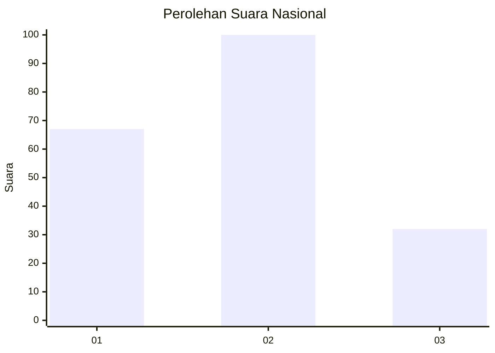
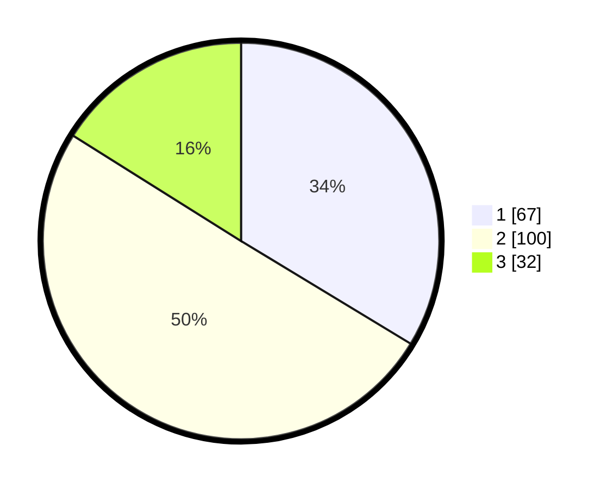

# Hasil

## Grafik

## Tabel

| No.    | Nama Paslon    | Suara | Suara (raw) | Persentase |
|:------ |:-------------- | -----:| -----------:| ----------:|
| 100025 | ANIES MUHAIMIN | 67    | [67][p-1]   | 33,67      |
| 100026 | PRABOWO GIBRAN | 100   | [100][p-2]  | 50,25      |
| 100027 | GANJAR MAHFUD  | 32    | [32][p-3]   | 16,08      |

[p-1]: https://github.com/gigit-pemilu/pemilu-2024/blob/main/pilpres/hitung-suara/sub/31-dki-jakarta/sub/75-jakarta-timur/sub/06-cakung/sub/1006-ujung-menteng/sub/039-tps/sub/paslon-1.txt
[p-2]: https://github.com/gigit-pemilu/pemilu-2024/blob/main/pilpres/hitung-suara/sub/31-dki-jakarta/sub/75-jakarta-timur/sub/06-cakung/sub/1006-ujung-menteng/sub/039-tps/sub/paslon-2.txt
[p-3]: https://github.com/gigit-pemilu/pemilu-2024/blob/main/pilpres/hitung-suara/sub/31-dki-jakarta/sub/75-jakarta-timur/sub/06-cakung/sub/1006-ujung-menteng/sub/039-tps/sub/paslon-3.txt

## Foto C Plano

https://sirekap-obj-formc.kpu.go.id/aaec/pemilu/ppwp/31/75/06/10/06/3175061006039-20240214-194345--99c37ab1-ef3f-446e-96bd-ac622a548a86.jpg

https://sirekap-obj-formc.kpu.go.id/aaec/pemilu/ppwp/31/75/06/10/06/3175061006039-20240214-194419--4399d99f-2cc6-4253-915f-26dba831b0df.jpg

https://sirekap-obj-formc.kpu.go.id/aaec/pemilu/ppwp/31/75/06/10/06/3175061006039-20240214-194449--e4d76f5c-b481-42f6-bb5d-fc8b8a73f567.jpg

## Metadata

| Key        | Value               |
| ---------- | ------------------- |
| Time Stamp | 2024-02-20 11:00:00 |

