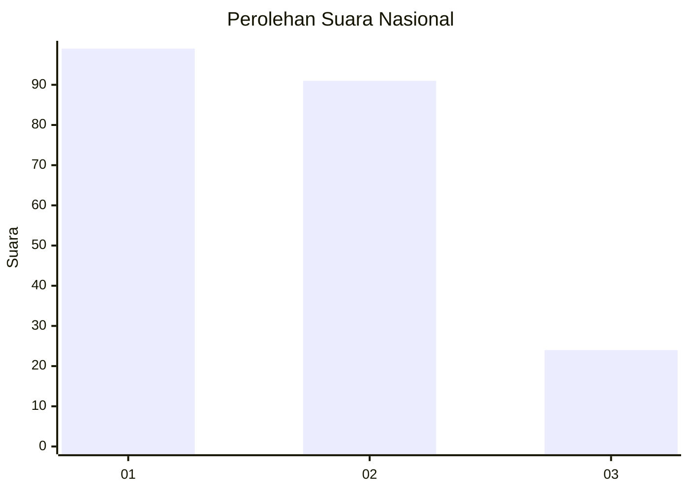
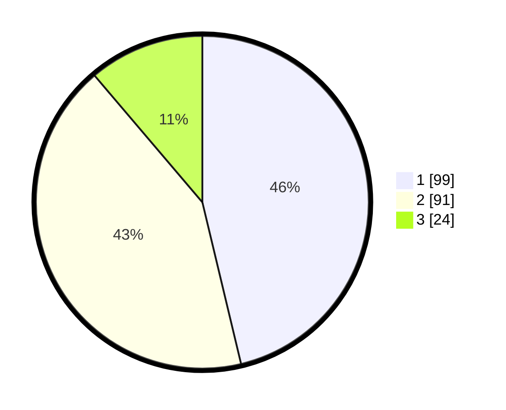

# Hasil

## Grafik

## Tabel

| No.    | Nama Paslon    | Suara | Suara (raw) | Persentase |
|:------ |:-------------- | -----:| -----------:| ----------:|
| 100025 | ANIES MUHAIMIN | 99    | [99][p-1]   | 46,26      |
| 100026 | PRABOWO GIBRAN | 91    | [91][p-2]   | 42,52      |
| 100027 | GANJAR MAHFUD  | 24    | [24][p-3]   | 11,21      |

[p-1]: https://github.com/gigit-pemilu/pemilu-2024/blob/main/pilpres/hitung-suara/sub/31-dki-jakarta/sub/75-jakarta-timur/sub/06-cakung/sub/1006-ujung-menteng/sub/059-tps/sub/paslon-1.txt
[p-2]: https://github.com/gigit-pemilu/pemilu-2024/blob/main/pilpres/hitung-suara/sub/31-dki-jakarta/sub/75-jakarta-timur/sub/06-cakung/sub/1006-ujung-menteng/sub/059-tps/sub/paslon-2.txt
[p-3]: https://github.com/gigit-pemilu/pemilu-2024/blob/main/pilpres/hitung-suara/sub/31-dki-jakarta/sub/75-jakarta-timur/sub/06-cakung/sub/1006-ujung-menteng/sub/059-tps/sub/paslon-3.txt

## Foto C Plano

https://sirekap-obj-formc.kpu.go.id/7863/pemilu/ppwp/31/75/06/10/06/3175061006059-20240215-023729--d4f9a929-9b96-4055-9536-c0c86f364c8a.jpg

https://sirekap-obj-formc.kpu.go.id/7863/pemilu/ppwp/31/75/06/10/06/3175061006059-20240215-023832--d862f621-701e-4594-a745-2082fcc3a9c2.jpg

https://sirekap-obj-formc.kpu.go.id/7863/pemilu/ppwp/31/75/06/10/06/3175061006059-20240215-023942--1ba0642c-9fa8-4358-9727-b797b5f81c16.jpg

## Metadata

| Key        | Value               |
| ---------- | ------------------- |
| Time Stamp | 2024-02-24 22:31:28 |

