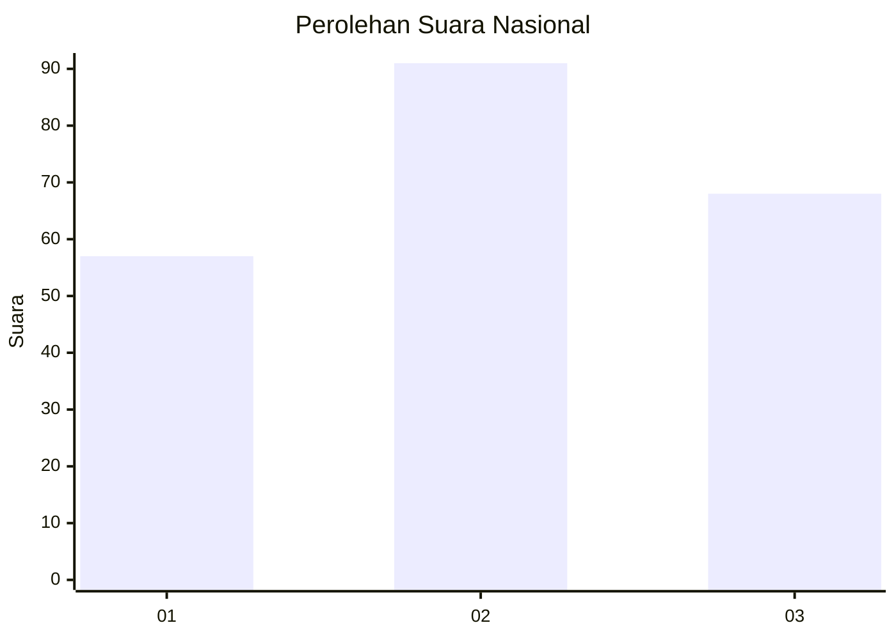
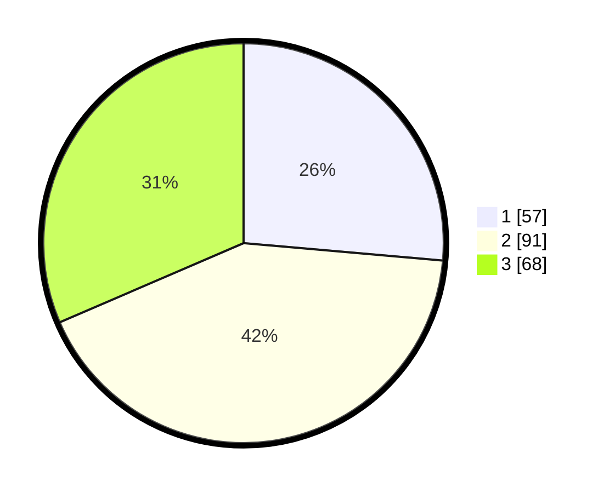

# Hasil

## Grafik

## Tabel

| No.    | Nama Paslon    | Suara | Suara (raw) | Persentase |
|:------ |:-------------- | -----:| -----------:| ----------:|
| 100025 | ANIES MUHAIMIN | 57    | [57][p-1]   | 26,39      |
| 100026 | PRABOWO GIBRAN | 91    | [91][p-2]   | 42,13      |
| 100027 | GANJAR MAHFUD  | 68    | [68][p-3]   | 31,48      |

[p-1]: https://github.com/gigit-pemilu/pemilu-2024/blob/main/pilpres/hitung-suara/sub/31-dki-jakarta/sub/75-jakarta-timur/sub/06-cakung/sub/1006-ujung-menteng/sub/082-tps/sub/paslon-1.txt
[p-2]: https://github.com/gigit-pemilu/pemilu-2024/blob/main/pilpres/hitung-suara/sub/31-dki-jakarta/sub/75-jakarta-timur/sub/06-cakung/sub/1006-ujung-menteng/sub/082-tps/sub/paslon-2.txt
[p-3]: https://github.com/gigit-pemilu/pemilu-2024/blob/main/pilpres/hitung-suara/sub/31-dki-jakarta/sub/75-jakarta-timur/sub/06-cakung/sub/1006-ujung-menteng/sub/082-tps/sub/paslon-3.txt

## Foto C Plano

https://sirekap-obj-formc.kpu.go.id/436a/pemilu/ppwp/31/75/06/10/06/3175061006082-20240214-210808--82c3f198-67fe-4220-a3bd-1f61910c4b9d.jpg

https://sirekap-obj-formc.kpu.go.id/436a/pemilu/ppwp/31/75/06/10/06/3175061006082-20240214-211422--62b93734-c670-44b3-a633-dd45a4b9fbea.jpg

https://sirekap-obj-formc.kpu.go.id/436a/pemilu/ppwp/31/75/06/10/06/3175061006082-20240214-211542--ff6eba5a-4361-46c3-a2f5-a73b35f286c2.jpg

## Metadata

| Key        | Value               |
| ---------- | ------------------- |
| Time Stamp | 2024-02-25 09:00:00 |

