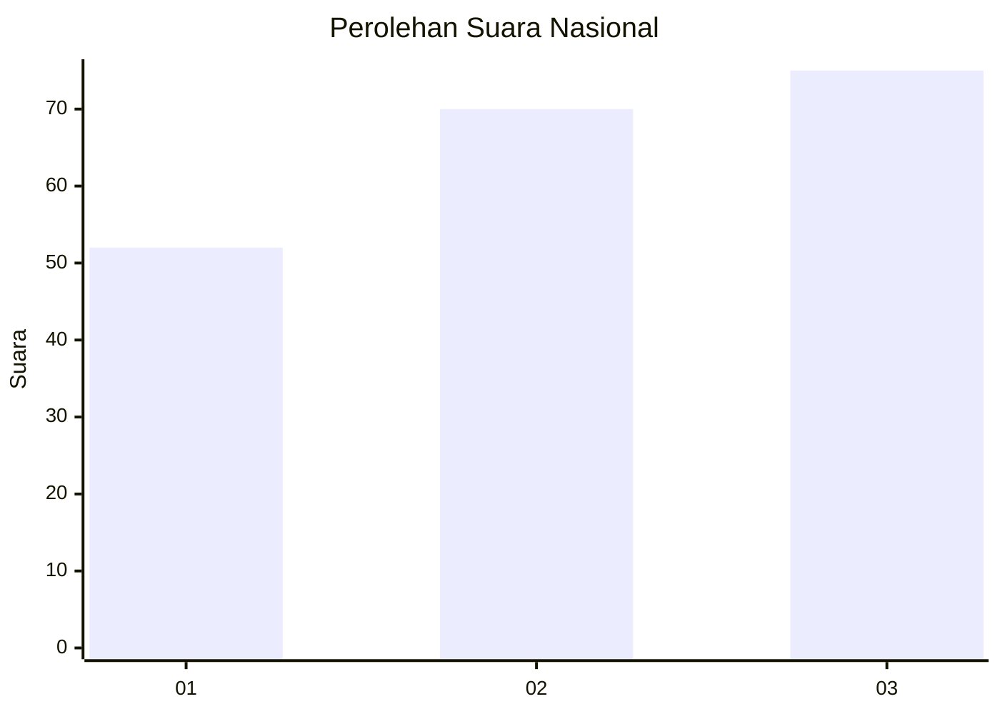
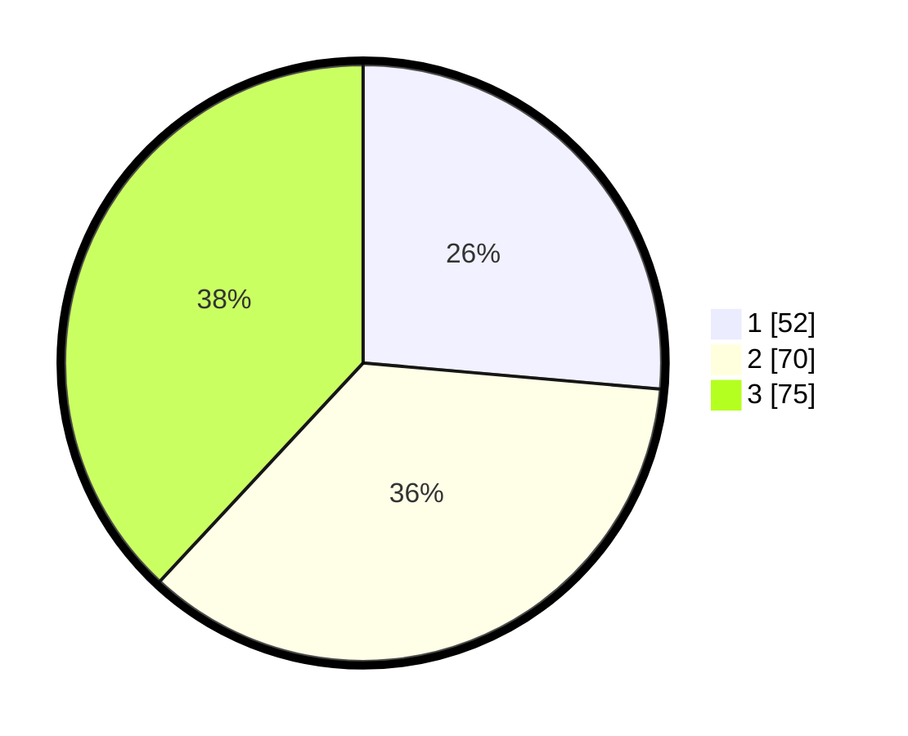

# Hasil

## Grafik

## Tabel

| No.    | Nama Paslon    | Suara | Suara (raw) | Persentase |
|:------ |:-------------- | -----:| -----------:| ----------:|
| 100025 | ANIES MUHAIMIN | 52    | [52][p-1]   | 26,40      |
| 100026 | PRABOWO GIBRAN | 70    | [70][p-2]   | 35,53      |
| 100027 | GANJAR MAHFUD  | 75    | [75][p-3]   | 38,07      |

[p-1]: https://github.com/gigit-pemilu/pemilu-2024/blob/main/pilpres/hitung-suara/sub/31-dki-jakarta/sub/75-jakarta-timur/sub/06-cakung/sub/1006-ujung-menteng/sub/092-tps/sub/paslon-1.txt
[p-2]: https://github.com/gigit-pemilu/pemilu-2024/blob/main/pilpres/hitung-suara/sub/31-dki-jakarta/sub/75-jakarta-timur/sub/06-cakung/sub/1006-ujung-menteng/sub/092-tps/sub/paslon-2.txt
[p-3]: https://github.com/gigit-pemilu/pemilu-2024/blob/main/pilpres/hitung-suara/sub/31-dki-jakarta/sub/75-jakarta-timur/sub/06-cakung/sub/1006-ujung-menteng/sub/092-tps/sub/paslon-3.txt

## Foto C Plano

https://sirekap-obj-formc.kpu.go.id/acf4/pemilu/ppwp/31/75/06/10/06/3175061006092-20240214-190901--79078d9c-e882-4bf1-8fc8-c3a1d6e4cfcb.jpg

https://sirekap-obj-formc.kpu.go.id/acf4/pemilu/ppwp/31/75/06/10/06/3175061006092-20240214-190908--de74f1b0-9f2b-4e1c-b29a-91467dafbcad.jpg

https://sirekap-obj-formc.kpu.go.id/acf4/pemilu/ppwp/31/75/06/10/06/3175061006092-20240214-190914--779c3ac6-4387-4f32-885c-62b660cadc18.jpg

## Metadata

| Key        | Value               |
| ---------- | ------------------- |
| Time Stamp | 2024-02-20 11:00:00 |

