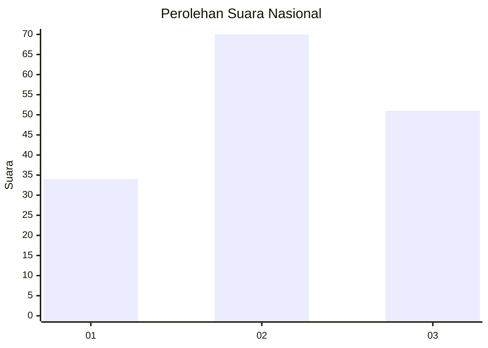
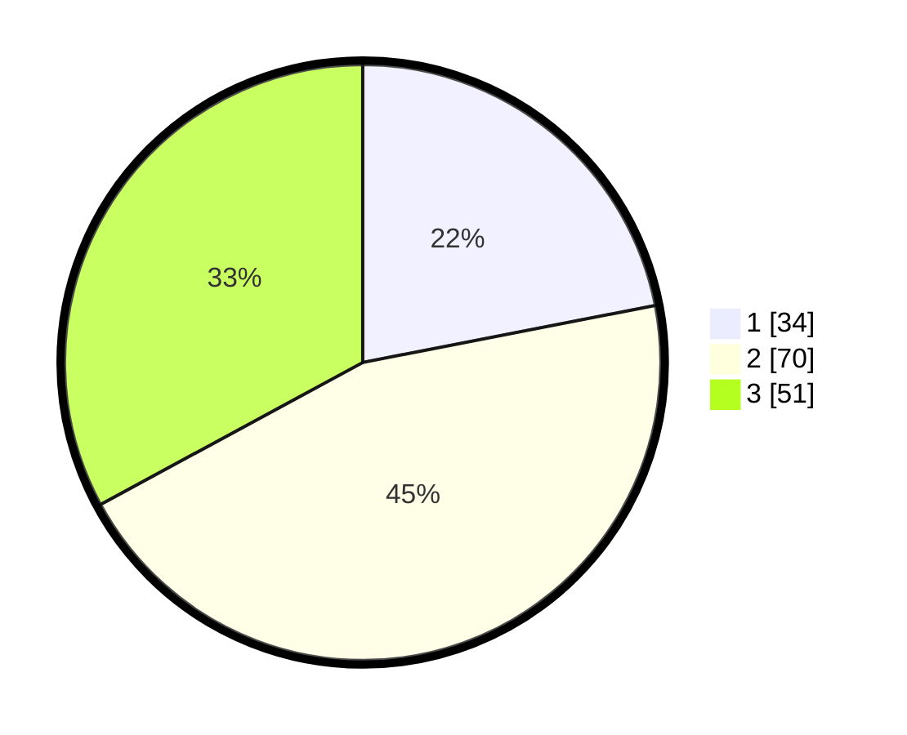

# Hasil

## Grafik

## Tabel

| No.    | Nama Paslon    | Suara | Suara (raw) | Persentase |
|:------ |:-------------- | -----:| -----------:| ----------:|
| 100025 | ANIES MUHAIMIN | 34    | [34][p-1]   | 21,94      |
| 100026 | PRABOWO GIBRAN | 70    | [70][p-2]   | 45,16      |
| 100027 | GANJAR MAHFUD  | 51    | [51][p-3]   | 32,90      |

[p-1]: https://github.com/gigit-pemilu/pemilu-2024/blob/main/pilpres/hitung-suara/sub/31-dki-jakarta/sub/75-jakarta-timur/sub/06-cakung/sub/1006-ujung-menteng/sub/094-tps/sub/paslon-1.txt
[p-2]: https://github.com/gigit-pemilu/pemilu-2024/blob/main/pilpres/hitung-suara/sub/31-dki-jakarta/sub/75-jakarta-timur/sub/06-cakung/sub/1006-ujung-menteng/sub/094-tps/sub/paslon-2.txt
[p-3]: https://github.com/gigit-pemilu/pemilu-2024/blob/main/pilpres/hitung-suara/sub/31-dki-jakarta/sub/75-jakarta-timur/sub/06-cakung/sub/1006-ujung-menteng/sub/094-tps/sub/paslon-3.txt

## Foto C Plano

https://sirekap-obj-formc.kpu.go.id/e365/pemilu/ppwp/31/75/06/10/06/3175061006094-20240218-214157--f0bc8bb5-7c7a-4b96-99a5-1abd2d7528e9.jpg

https://sirekap-obj-formc.kpu.go.id/e365/pemilu/ppwp/31/75/06/10/06/3175061006094-20240214-160139--216a666e-81ee-4199-bb1c-476b9cc0aebd.jpg

https://sirekap-obj-formc.kpu.go.id/e365/pemilu/ppwp/31/75/06/10/06/3175061006094-20240214-155520--59eabffe-4bc8-4eb1-992b-46dfb422343b.jpg

## Metadata

| Key        | Value               |
| ---------- | ------------------- |
| Time Stamp | 2024-02-25 15:00:00 |

