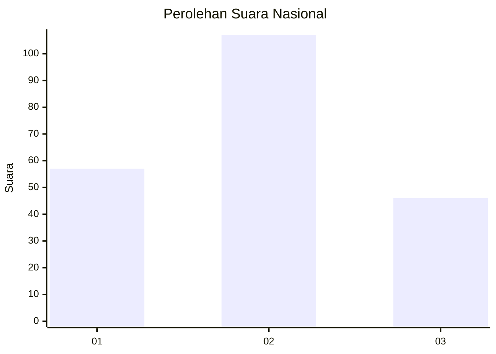
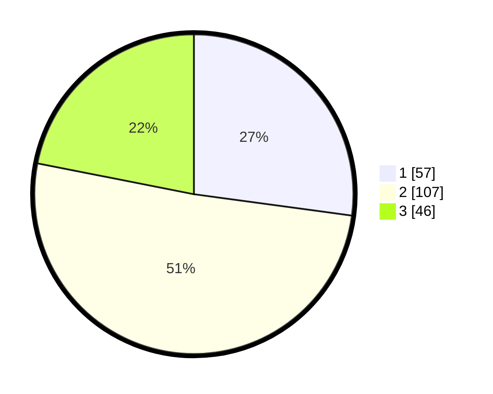

# Hasil

## Grafik

## Tabel

| No.    | Nama Paslon    | Suara | Suara (raw) | Persentase |
|:------ |:-------------- | -----:| -----------:| ----------:|
| 100025 | ANIES MUHAIMIN | 57    | [57][p-1]   | 27,14      |
| 100026 | PRABOWO GIBRAN | 107   | [107][p-2]  | 50,95      |
| 100027 | GANJAR MAHFUD  | 46    | [46][p-3]   | 21,90      |

[p-1]: https://github.com/gigit-pemilu/pemilu-2024/blob/main/pilpres/hitung-suara/sub/31-dki-jakarta/sub/75-jakarta-timur/sub/06-cakung/sub/1006-ujung-menteng/sub/103-tps/sub/paslon-1.txt
[p-2]: https://github.com/gigit-pemilu/pemilu-2024/blob/main/pilpres/hitung-suara/sub/31-dki-jakarta/sub/75-jakarta-timur/sub/06-cakung/sub/1006-ujung-menteng/sub/103-tps/sub/paslon-2.txt
[p-3]: https://github.com/gigit-pemilu/pemilu-2024/blob/main/pilpres/hitung-suara/sub/31-dki-jakarta/sub/75-jakarta-timur/sub/06-cakung/sub/1006-ujung-menteng/sub/103-tps/sub/paslon-3.txt

## Foto C Plano

https://sirekap-obj-formc.kpu.go.id/0920/pemilu/ppwp/31/75/06/10/06/3175061006103-20240214-234648--252ab04b-beb9-4449-897f-0fc4eef270ea.jpg

https://sirekap-obj-formc.kpu.go.id/0920/pemilu/ppwp/31/75/06/10/06/3175061006103-20240214-234804--80bb5597-108f-4656-91c0-adf89ddbd2f9.jpg

https://sirekap-obj-formc.kpu.go.id/0920/pemilu/ppwp/31/75/06/10/06/3175061006103-20240214-234910--758e0234-2a8e-4c19-abca-3c219ca06994.jpg

## Metadata

| Key        | Value               |
| ---------- | ------------------- |
| Time Stamp | 2024-02-20 11:00:00 |

