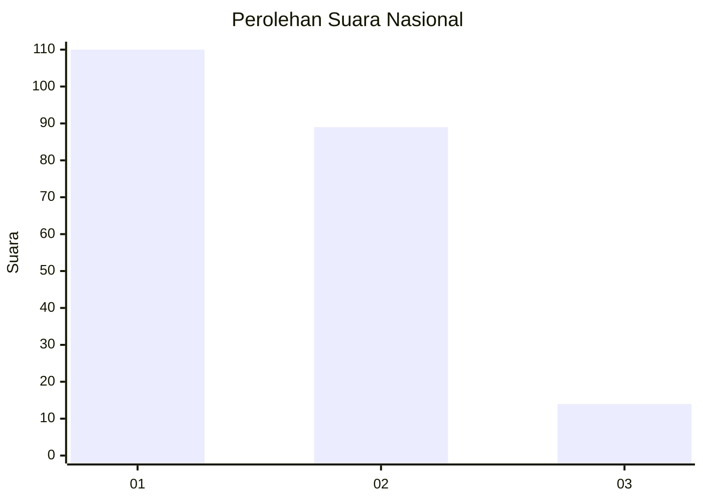
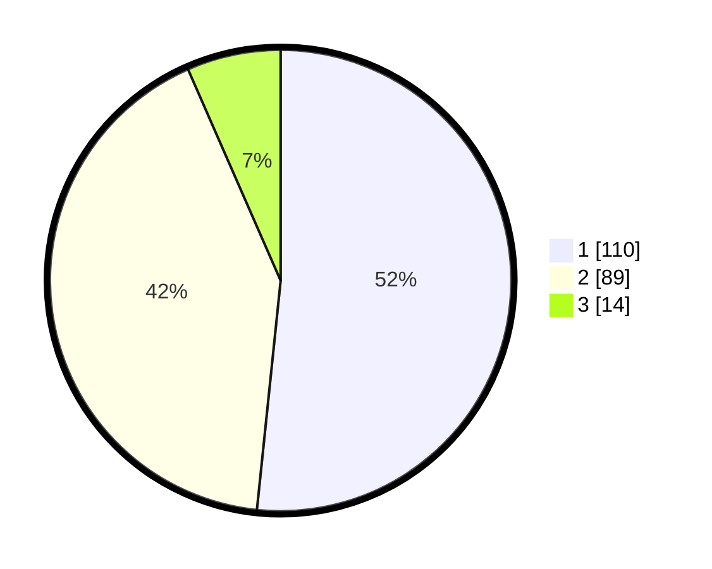

# Hasil

## Grafik

## Tabel

| No.    | Nama Paslon    | Suara | Suara (raw) | Persentase |
|:------ |:-------------- | -----:| -----------:| ----------:|
| 100025 | ANIES MUHAIMIN | 110   | [110][p-1]  | 51,64      |
| 100026 | PRABOWO GIBRAN | 89    | [89][p-2]   | 41,78      |
| 100027 | GANJAR MAHFUD  | 14    | [14][p-3]   | 6,57       |

[p-1]: https://github.com/gigit-pemilu/pemilu-2024/blob/main/pilpres/hitung-suara/sub/31-dki-jakarta/sub/75-jakarta-timur/sub/06-cakung/sub/1007-cakung-barat/sub/004-tps/sub/paslon-1.txt
[p-2]: https://github.com/gigit-pemilu/pemilu-2024/blob/main/pilpres/hitung-suara/sub/31-dki-jakarta/sub/75-jakarta-timur/sub/06-cakung/sub/1007-cakung-barat/sub/004-tps/sub/paslon-2.txt
[p-3]: https://github.com/gigit-pemilu/pemilu-2024/blob/main/pilpres/hitung-suara/sub/31-dki-jakarta/sub/75-jakarta-timur/sub/06-cakung/sub/1007-cakung-barat/sub/004-tps/sub/paslon-3.txt

## Foto C Plano

https://sirekap-obj-formc.kpu.go.id/ce45/pemilu/ppwp/31/75/06/10/07/3175061007004-20240214-222945--cd9e1385-e2e1-4e47-924d-e33864b5c104.jpg

https://sirekap-obj-formc.kpu.go.id/ce45/pemilu/ppwp/31/75/06/10/07/3175061007004-20240214-223059--5a40fe40-ec29-40bb-8ee9-6105fec614cb.jpg

https://sirekap-obj-formc.kpu.go.id/ce45/pemilu/ppwp/31/75/06/10/07/3175061007004-20240214-223141--cf59b044-8046-4f54-bcc2-8dac95f20ef9.jpg

## Metadata

| Key        | Value               |
| ---------- | ------------------- |
| Time Stamp | 2024-02-15 17:30:25 |

