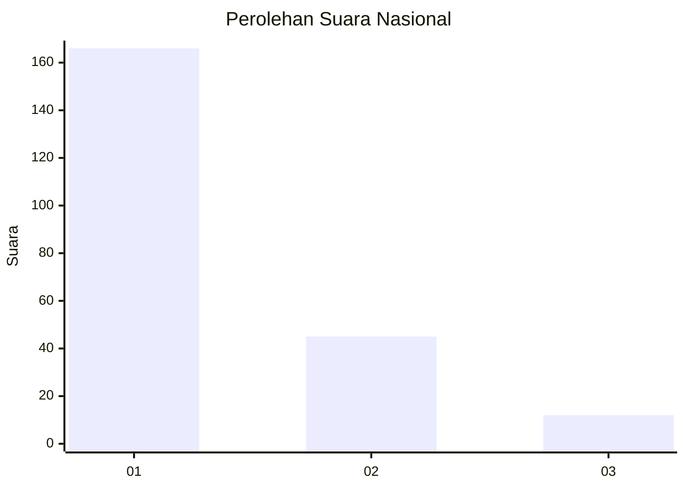
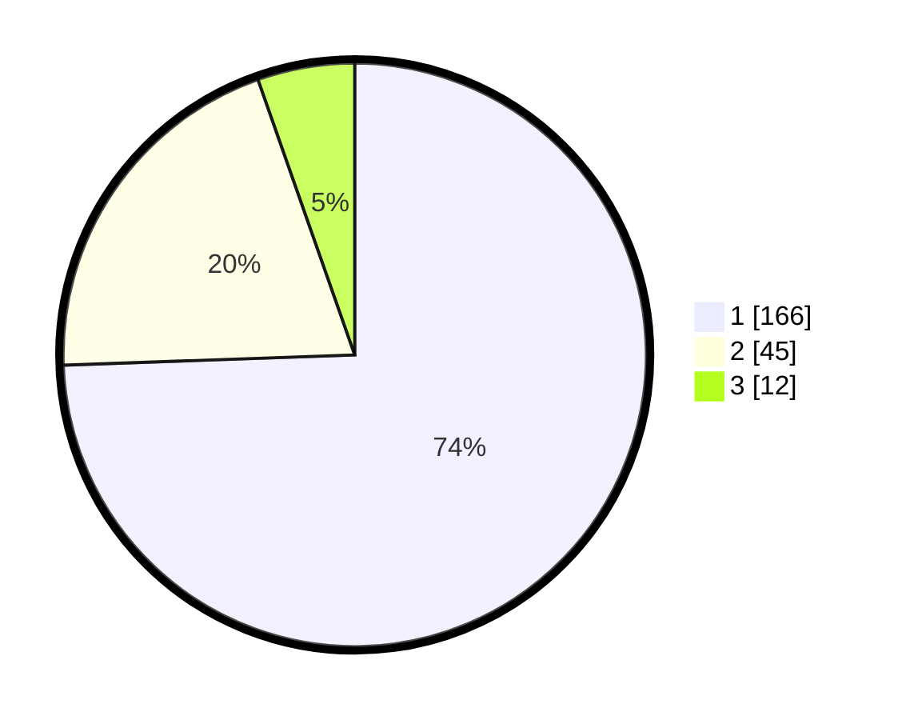

# Hasil

## Grafik

## Tabel

| No.    | Nama Paslon    | Suara | Suara (raw) | Persentase |
|:------ |:-------------- | -----:| -----------:| ----------:|
| 100025 | ANIES MUHAIMIN | 166   | [166][p-1]  | 74,44      |
| 100026 | PRABOWO GIBRAN | 45    | [45][p-2]   | 20,18      |
| 100027 | GANJAR MAHFUD  | 12    | [12][p-3]   | 5,38       |

[p-1]: https://github.com/gigit-pemilu/pemilu-2024/blob/main/pilpres/hitung-suara/sub/31-dki-jakarta/sub/75-jakarta-timur/sub/06-cakung/sub/1007-cakung-barat/sub/016-tps/sub/paslon-1.txt
[p-2]: https://github.com/gigit-pemilu/pemilu-2024/blob/main/pilpres/hitung-suara/sub/31-dki-jakarta/sub/75-jakarta-timur/sub/06-cakung/sub/1007-cakung-barat/sub/016-tps/sub/paslon-2.txt
[p-3]: https://github.com/gigit-pemilu/pemilu-2024/blob/main/pilpres/hitung-suara/sub/31-dki-jakarta/sub/75-jakarta-timur/sub/06-cakung/sub/1007-cakung-barat/sub/016-tps/sub/paslon-3.txt

## Foto C Plano

https://sirekap-obj-formc.kpu.go.id/8c12/pemilu/ppwp/31/75/06/10/07/3175061007016-20240220-212257--7c179095-8ce9-4e6f-b5d4-0d4b7c9c0e70.jpg

https://sirekap-obj-formc.kpu.go.id/8c12/pemilu/ppwp/31/75/06/10/07/3175061007016-20240214-232151--6f6865d5-002e-4059-8809-ca604a6103dd.jpg

https://sirekap-obj-formc.kpu.go.id/8c12/pemilu/ppwp/31/75/06/10/07/3175061007016-20240214-221923--a45f70ec-09ba-4af0-8096-5f13cf7b7f5e.jpg

## Metadata

| Key        | Value               |
| ---------- | ------------------- |
| Time Stamp | 2024-02-20 22:00:00 |

