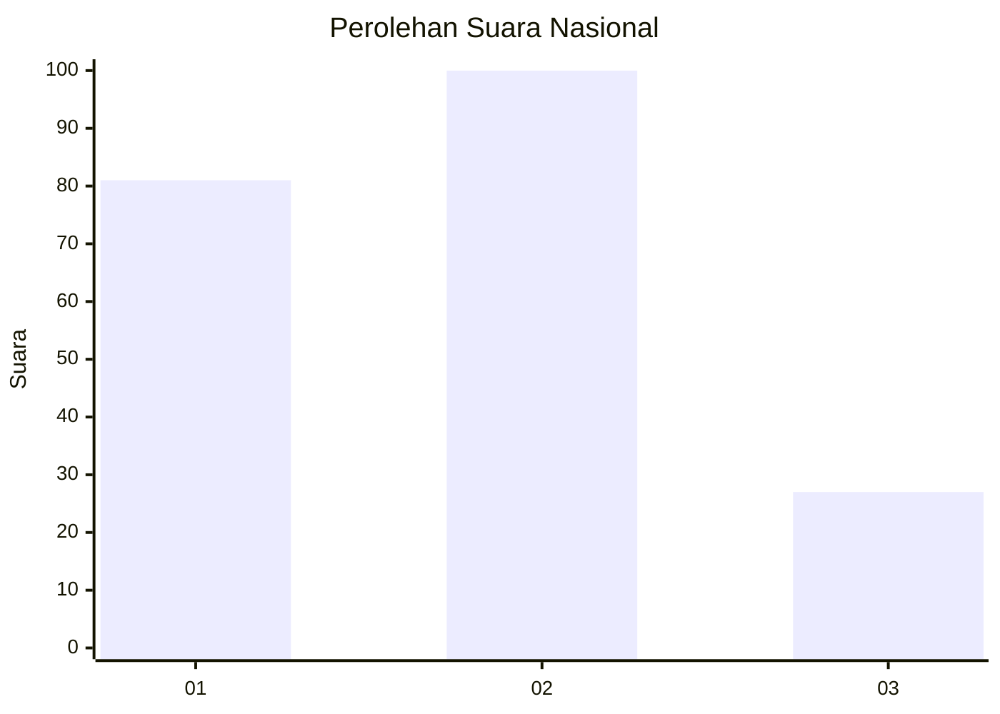
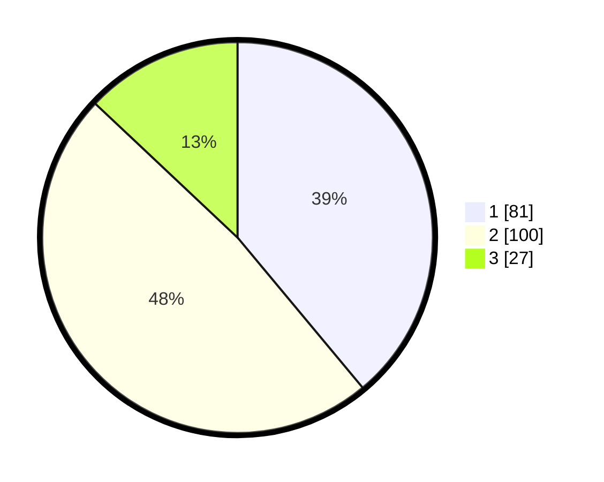

# Hasil

## Grafik

## Tabel

| No.    | Nama Paslon    | Suara | Suara (raw) | Persentase |
|:------ |:-------------- | -----:| -----------:| ----------:|
| 100025 | ANIES MUHAIMIN | 81    | [81][p-1]   | 38,94      |
| 100026 | PRABOWO GIBRAN | 100   | [100][p-2]  | 48,08      |
| 100027 | GANJAR MAHFUD  | 27    | [27][p-3]   | 12,98      |

[p-1]: https://github.com/gigit-pemilu/pemilu-2024/blob/main/pilpres/hitung-suara/sub/31-dki-jakarta/sub/75-jakarta-timur/sub/06-cakung/sub/1007-cakung-barat/sub/038-tps/sub/paslon-1.txt
[p-2]: https://github.com/gigit-pemilu/pemilu-2024/blob/main/pilpres/hitung-suara/sub/31-dki-jakarta/sub/75-jakarta-timur/sub/06-cakung/sub/1007-cakung-barat/sub/038-tps/sub/paslon-2.txt
[p-3]: https://github.com/gigit-pemilu/pemilu-2024/blob/main/pilpres/hitung-suara/sub/31-dki-jakarta/sub/75-jakarta-timur/sub/06-cakung/sub/1007-cakung-barat/sub/038-tps/sub/paslon-3.txt

## Foto C Plano

https://sirekap-obj-formc.kpu.go.id/b893/pemilu/ppwp/31/75/06/10/07/3175061007038-20240215-000008--cc852a7e-f2c5-4a18-8f35-8a6b9e1288e8.jpg

https://sirekap-obj-formc.kpu.go.id/b893/pemilu/ppwp/31/75/06/10/07/3175061007038-20240215-000054--0b6d452a-31f5-4a35-8852-d1d303d7bf4e.jpg

https://sirekap-obj-formc.kpu.go.id/b893/pemilu/ppwp/31/75/06/10/07/3175061007038-20240215-000125--46d65af4-21ed-4eb2-828c-6d811013b715.jpg

## Metadata

| Key        | Value               |
| ---------- | ------------------- |
| Time Stamp | 2024-02-17 10:30:03 |

