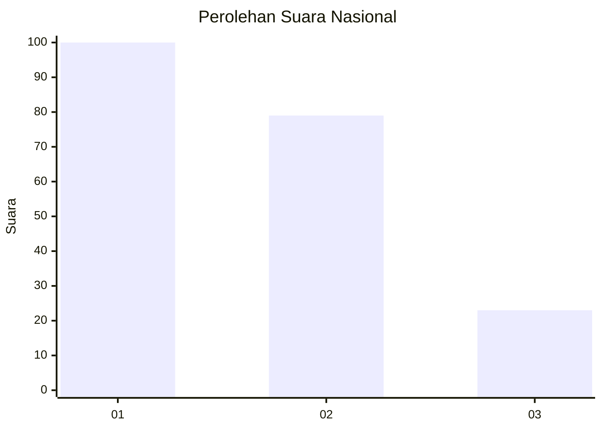
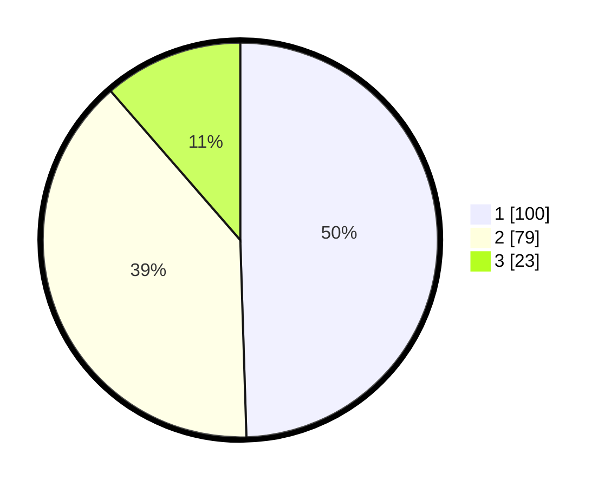

# Hasil

## Grafik

## Tabel

| No.    | Nama Paslon    | Suara | Suara (raw) | Persentase |
|:------ |:-------------- | -----:| -----------:| ----------:|
| 100025 | ANIES MUHAIMIN | 100   | [100][p-1]  | 49,50      |
| 100026 | PRABOWO GIBRAN | 79    | [79][p-2]   | 39,11      |
| 100027 | GANJAR MAHFUD  | 23    | [23][p-3]   | 11,39      |

[p-1]: https://github.com/gigit-pemilu/pemilu-2024/blob/main/pilpres/hitung-suara/sub/31-dki-jakarta/sub/75-jakarta-timur/sub/06-cakung/sub/1007-cakung-barat/sub/050-tps/sub/paslon-1.txt
[p-2]: https://github.com/gigit-pemilu/pemilu-2024/blob/main/pilpres/hitung-suara/sub/31-dki-jakarta/sub/75-jakarta-timur/sub/06-cakung/sub/1007-cakung-barat/sub/050-tps/sub/paslon-2.txt
[p-3]: https://github.com/gigit-pemilu/pemilu-2024/blob/main/pilpres/hitung-suara/sub/31-dki-jakarta/sub/75-jakarta-timur/sub/06-cakung/sub/1007-cakung-barat/sub/050-tps/sub/paslon-3.txt

## Foto C Plano

https://sirekap-obj-formc.kpu.go.id/dfc9/pemilu/ppwp/31/75/06/10/07/3175061007050-20240215-001453--06a93b3d-1878-4bbf-b8ce-a148aa830972.jpg

https://sirekap-obj-formc.kpu.go.id/dfc9/pemilu/ppwp/31/75/06/10/07/3175061007050-20240215-001719--455d8fb4-9b25-4045-bd76-a8fc2897f845.jpg

https://sirekap-obj-formc.kpu.go.id/dfc9/pemilu/ppwp/31/75/06/10/07/3175061007050-20240215-001913--8af320c6-28f0-41ba-b262-f997c778b16e.jpg

## Metadata

| Key        | Value               |
| ---------- | ------------------- |
| Time Stamp | 2024-02-17 10:30:03 |

