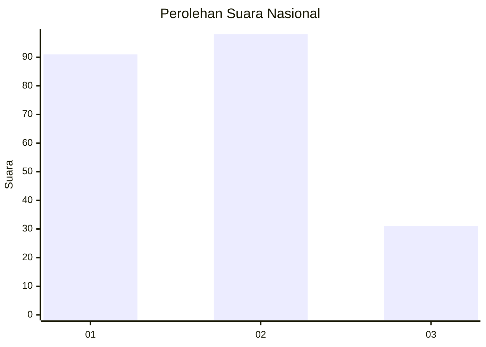
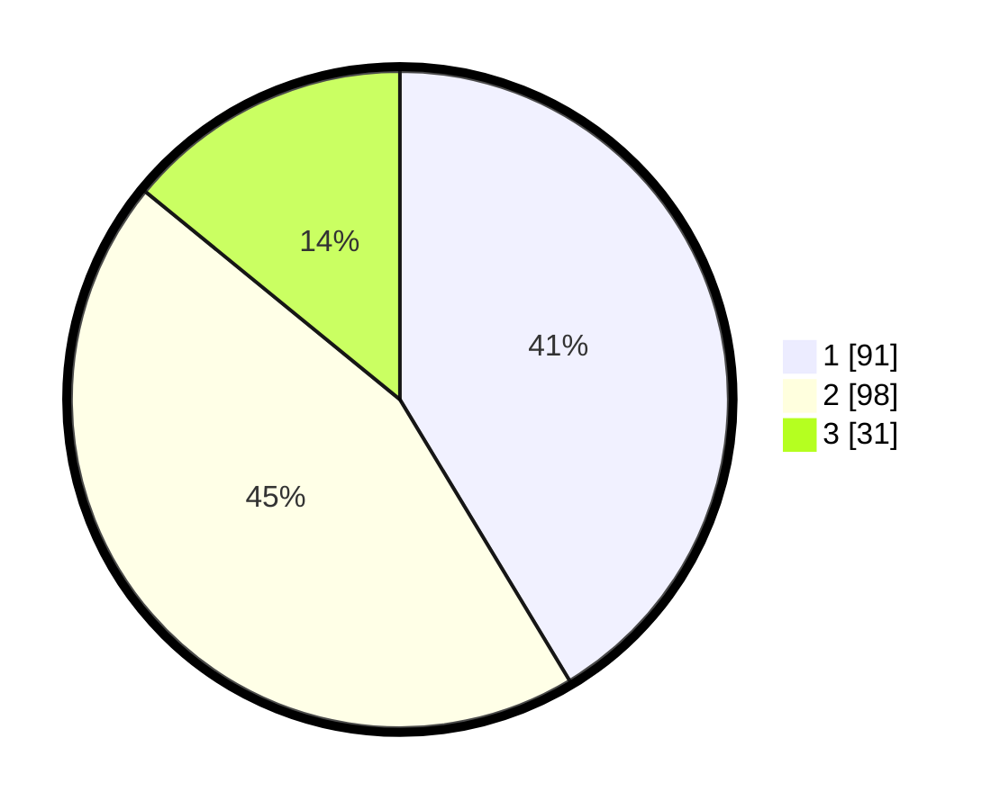

# Hasil

## Grafik

## Tabel

| No.    | Nama Paslon    | Suara | Suara (raw) | Persentase |
|:------ |:-------------- | -----:| -----------:| ----------:|
| 100025 | ANIES MUHAIMIN | 91    | [91][p-1]   | 41,36      |
| 100026 | PRABOWO GIBRAN | 98    | [98][p-2]   | 44,55      |
| 100027 | GANJAR MAHFUD  | 31    | [31][p-3]   | 14,09      |

[p-1]: https://github.com/gigit-pemilu/pemilu-2024/blob/main/pilpres/hitung-suara/sub/31-dki-jakarta/sub/75-jakarta-timur/sub/06-cakung/sub/1007-cakung-barat/sub/054-tps/sub/paslon-1.txt
[p-2]: https://github.com/gigit-pemilu/pemilu-2024/blob/main/pilpres/hitung-suara/sub/31-dki-jakarta/sub/75-jakarta-timur/sub/06-cakung/sub/1007-cakung-barat/sub/054-tps/sub/paslon-2.txt
[p-3]: https://github.com/gigit-pemilu/pemilu-2024/blob/main/pilpres/hitung-suara/sub/31-dki-jakarta/sub/75-jakarta-timur/sub/06-cakung/sub/1007-cakung-barat/sub/054-tps/sub/paslon-3.txt

## Foto C Plano

https://sirekap-obj-formc.kpu.go.id/438e/pemilu/ppwp/31/75/06/10/07/3175061007054-20240214-212753--e1a4c5fb-b9f0-4394-ad86-dbb2bedc9fae.jpg

https://sirekap-obj-formc.kpu.go.id/438e/pemilu/ppwp/31/75/06/10/07/3175061007054-20240214-213055--3f5352a5-d696-4aaf-b383-fb99aa4b69ff.jpg

https://sirekap-obj-formc.kpu.go.id/438e/pemilu/ppwp/31/75/06/10/07/3175061007054-20240214-212939--8933a19f-395a-4128-bbfa-ff073ce5bb4f.jpg

## Metadata

| Key        | Value               |
| ---------- | ------------------- |
| Time Stamp | 2024-02-17 10:30:03 |

