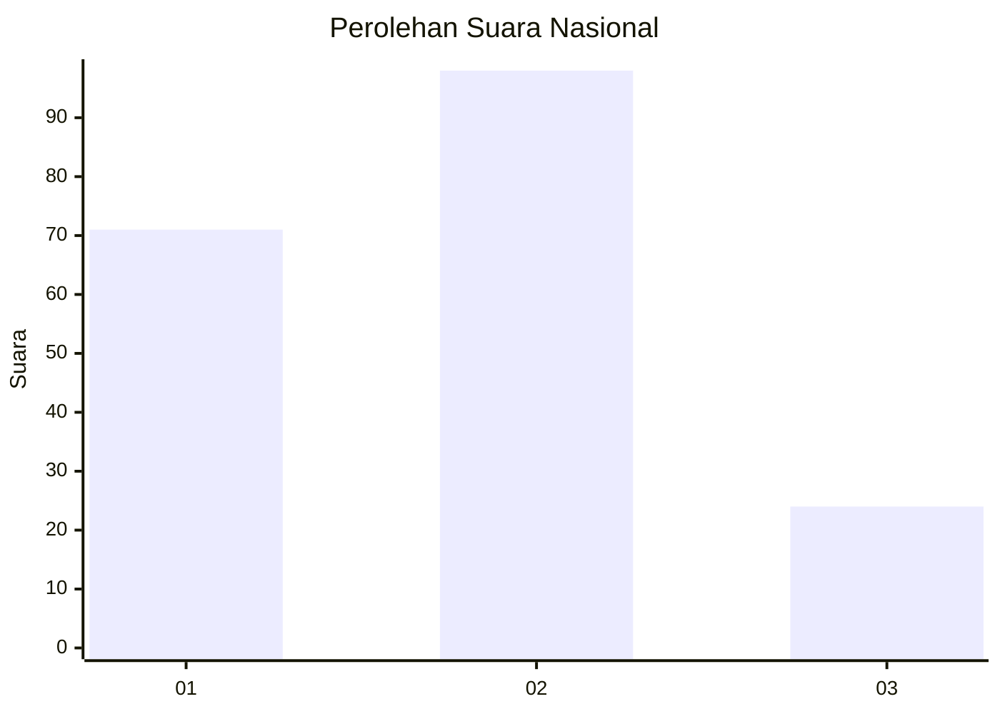
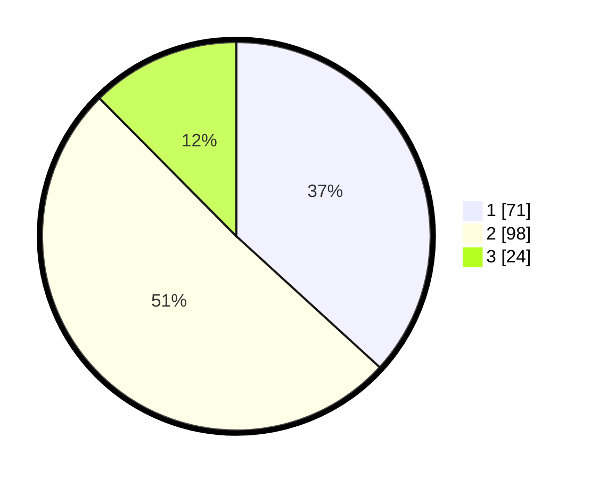

# Hasil

## Grafik

## Tabel

| No.    | Nama Paslon    | Suara | Suara (raw) | Persentase |
|:------ |:-------------- | -----:| -----------:| ----------:|
| 100025 | ANIES MUHAIMIN | 71    | [71][p-1]   | 36,79      |
| 100026 | PRABOWO GIBRAN | 98    | [98][p-2]   | 50,78      |
| 100027 | GANJAR MAHFUD  | 24    | [24][p-3]   | 12,44      |

[p-1]: https://github.com/gigit-pemilu/pemilu-2024/blob/main/pilpres/hitung-suara/sub/31-dki-jakarta/sub/75-jakarta-timur/sub/06-cakung/sub/1007-cakung-barat/sub/066-tps/sub/paslon-1.txt
[p-2]: https://github.com/gigit-pemilu/pemilu-2024/blob/main/pilpres/hitung-suara/sub/31-dki-jakarta/sub/75-jakarta-timur/sub/06-cakung/sub/1007-cakung-barat/sub/066-tps/sub/paslon-2.txt
[p-3]: https://github.com/gigit-pemilu/pemilu-2024/blob/main/pilpres/hitung-suara/sub/31-dki-jakarta/sub/75-jakarta-timur/sub/06-cakung/sub/1007-cakung-barat/sub/066-tps/sub/paslon-3.txt

## Foto C Plano

https://sirekap-obj-formc.kpu.go.id/80f1/pemilu/ppwp/31/75/06/10/07/3175061007066-20240215-001040--641fc765-d595-4ef1-9e1e-92042b767fa2.jpg

https://sirekap-obj-formc.kpu.go.id/80f1/pemilu/ppwp/31/75/06/10/07/3175061007066-20240215-001305--71d14ff4-5f47-46c2-a8f6-7814dd36fc32.jpg

https://sirekap-obj-formc.kpu.go.id/80f1/pemilu/ppwp/31/75/06/10/07/3175061007066-20240215-001724--171a4ec4-ffae-4f2f-b73f-126b30948537.jpg

## Metadata

| Key        | Value               |
| ---------- | ------------------- |
| Time Stamp | 2024-02-24 22:31:28 |

