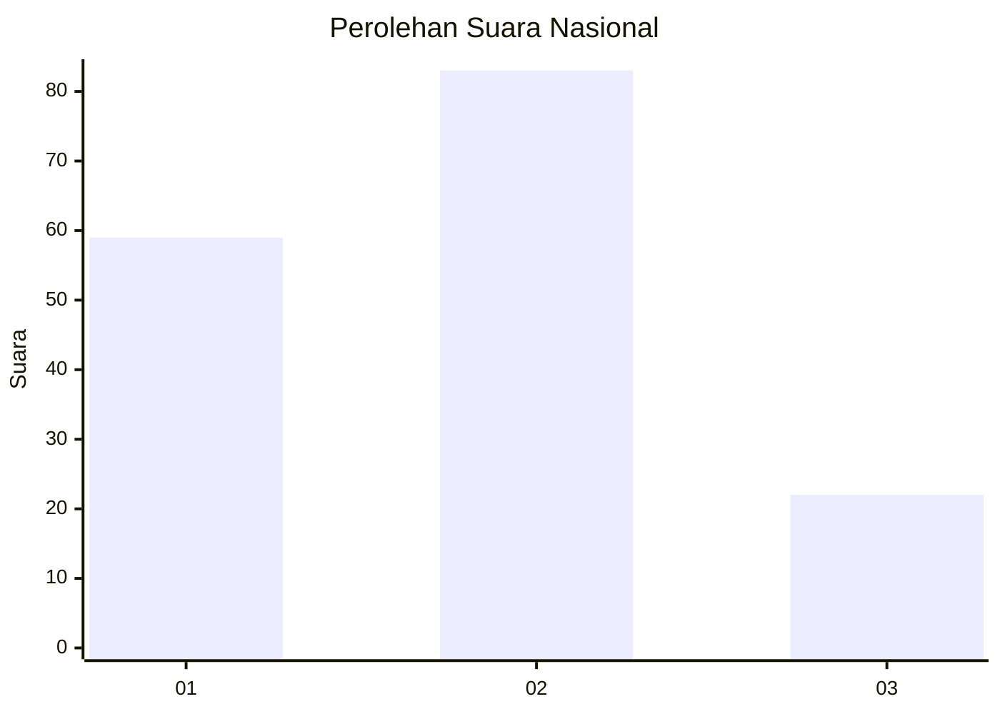
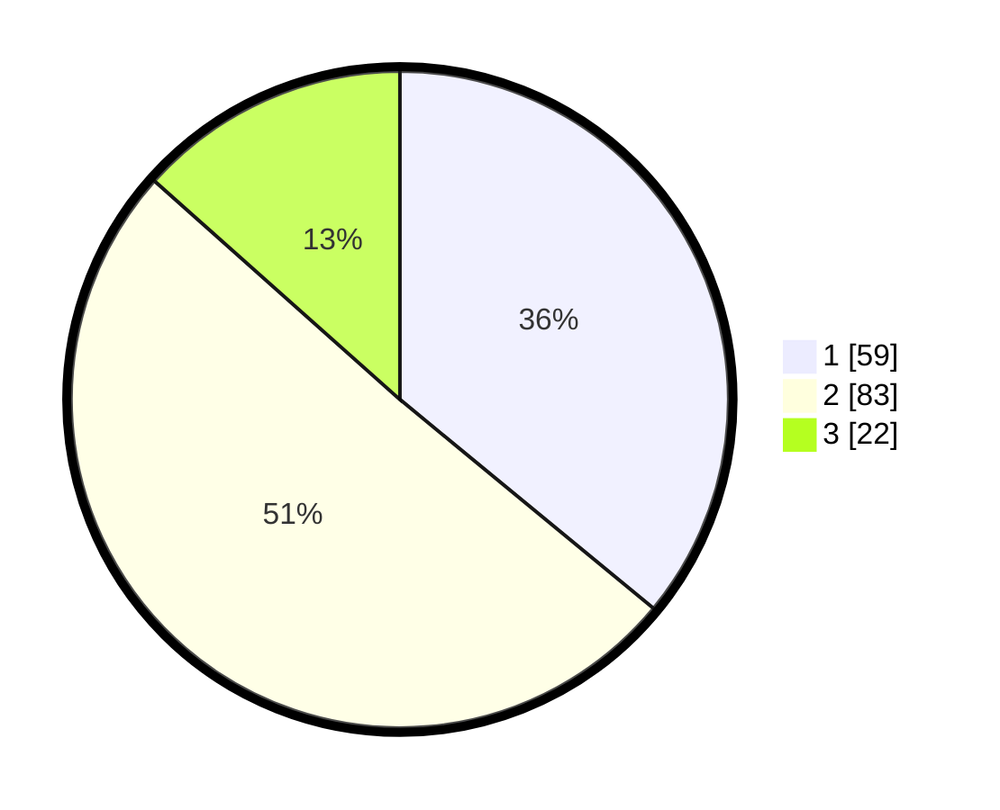

# Hasil

## Grafik

## Tabel

| No.    | Nama Paslon    | Suara | Suara (raw) | Persentase |
|:------ |:-------------- | -----:| -----------:| ----------:|
| 100025 | ANIES MUHAIMIN | 59    | [59][p-1]   | 35,98      |
| 100026 | PRABOWO GIBRAN | 83    | [83][p-2]   | 50,61      |
| 100027 | GANJAR MAHFUD  | 22    | [22][p-3]   | 13,41      |

[p-1]: https://github.com/gigit-pemilu/pemilu-2024/blob/main/pilpres/hitung-suara/sub/31-dki-jakarta/sub/75-jakarta-timur/sub/06-cakung/sub/1007-cakung-barat/sub/081-tps/sub/paslon-1.txt
[p-2]: https://github.com/gigit-pemilu/pemilu-2024/blob/main/pilpres/hitung-suara/sub/31-dki-jakarta/sub/75-jakarta-timur/sub/06-cakung/sub/1007-cakung-barat/sub/081-tps/sub/paslon-2.txt
[p-3]: https://github.com/gigit-pemilu/pemilu-2024/blob/main/pilpres/hitung-suara/sub/31-dki-jakarta/sub/75-jakarta-timur/sub/06-cakung/sub/1007-cakung-barat/sub/081-tps/sub/paslon-3.txt

## Foto C Plano

https://sirekap-obj-formc.kpu.go.id/1ee5/pemilu/ppwp/31/75/06/10/07/3175061007081-20240214-231312--4840ff72-0573-4918-a762-5c3c4a16ca4b.jpg

https://sirekap-obj-formc.kpu.go.id/1ee5/pemilu/ppwp/31/75/06/10/07/3175061007081-20240215-000408--241c00a8-ed4e-4f92-a7ca-064cafbbe1f4.jpg

https://sirekap-obj-formc.kpu.go.id/1ee5/pemilu/ppwp/31/75/06/10/07/3175061007081-20240215-000834--55d1fef3-c91a-4f88-9a32-982827905d7b.jpg

## Metadata

| Key        | Value               |
| ---------- | ------------------- |
| Time Stamp | 2024-02-17 10:30:03 |

