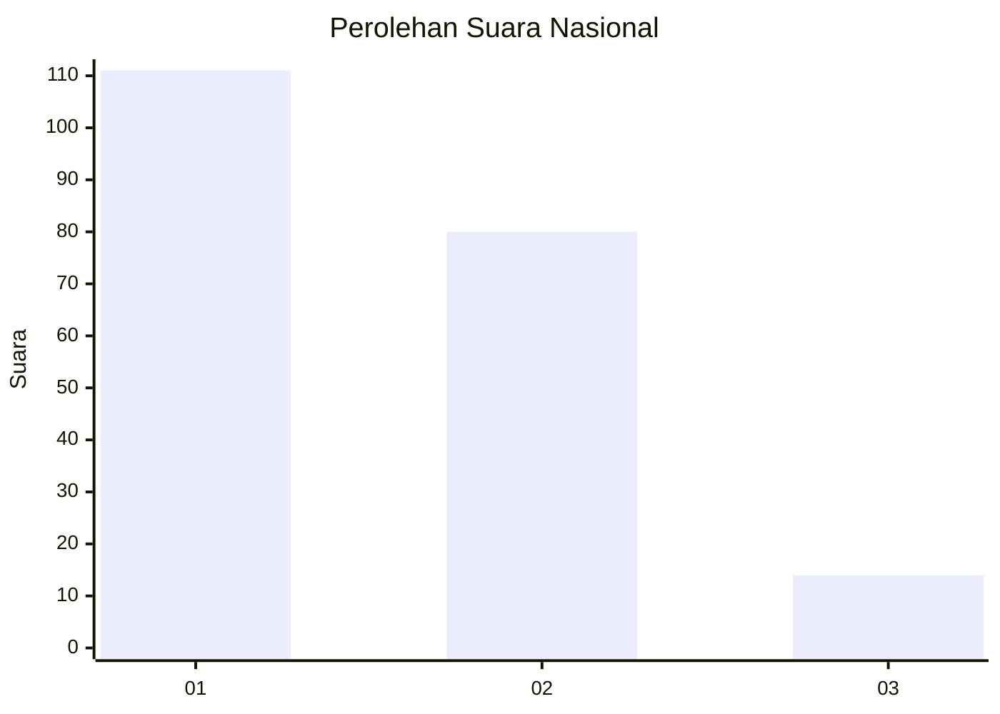
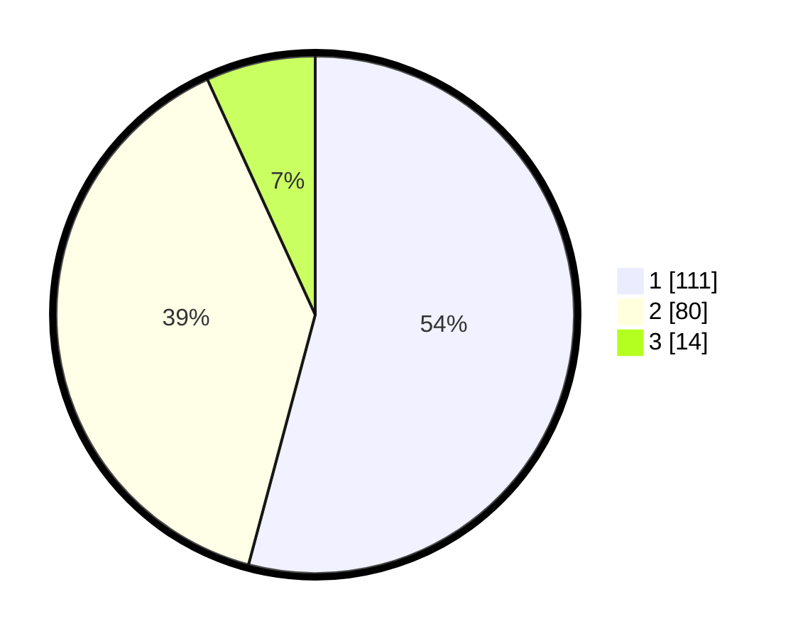

# Hasil

## Grafik

## Tabel

| No.    | Nama Paslon    | Suara | Suara (raw) | Persentase |
|:------ |:-------------- | -----:| -----------:| ----------:|
| 100025 | ANIES MUHAIMIN | 111   | [111][p-1]  | 54,15      |
| 100026 | PRABOWO GIBRAN | 80    | [80][p-2]   | 39,02      |
| 100027 | GANJAR MAHFUD  | 14    | [14][p-3]   | 6,83       |

[p-1]: https://github.com/gigit-pemilu/pemilu-2024/blob/main/pilpres/hitung-suara/sub/31-dki-jakarta/sub/75-jakarta-timur/sub/06-cakung/sub/1007-cakung-barat/sub/130-tps/sub/paslon-1.txt
[p-2]: https://github.com/gigit-pemilu/pemilu-2024/blob/main/pilpres/hitung-suara/sub/31-dki-jakarta/sub/75-jakarta-timur/sub/06-cakung/sub/1007-cakung-barat/sub/130-tps/sub/paslon-2.txt
[p-3]: https://github.com/gigit-pemilu/pemilu-2024/blob/main/pilpres/hitung-suara/sub/31-dki-jakarta/sub/75-jakarta-timur/sub/06-cakung/sub/1007-cakung-barat/sub/130-tps/sub/paslon-3.txt

## Foto C Plano

https://sirekap-obj-formc.kpu.go.id/da3b/pemilu/ppwp/31/75/06/10/07/3175061007130-20240215-011144--9ea47c92-2917-4fb6-8ed5-d3f688c78231.jpg

https://sirekap-obj-formc.kpu.go.id/da3b/pemilu/ppwp/31/75/06/10/07/3175061007130-20240215-011102--38fb7f98-8dc8-4326-bbe0-01006a0858a0.jpg

https://sirekap-obj-formc.kpu.go.id/da3b/pemilu/ppwp/31/75/06/10/07/3175061007130-20240214-204822--c4588648-4aef-4490-857b-ffdfa92c3ddd.jpg

## Metadata

| Key        | Value               |
| ---------- | ------------------- |
| Time Stamp | 2024-02-17 11:00:02 |

