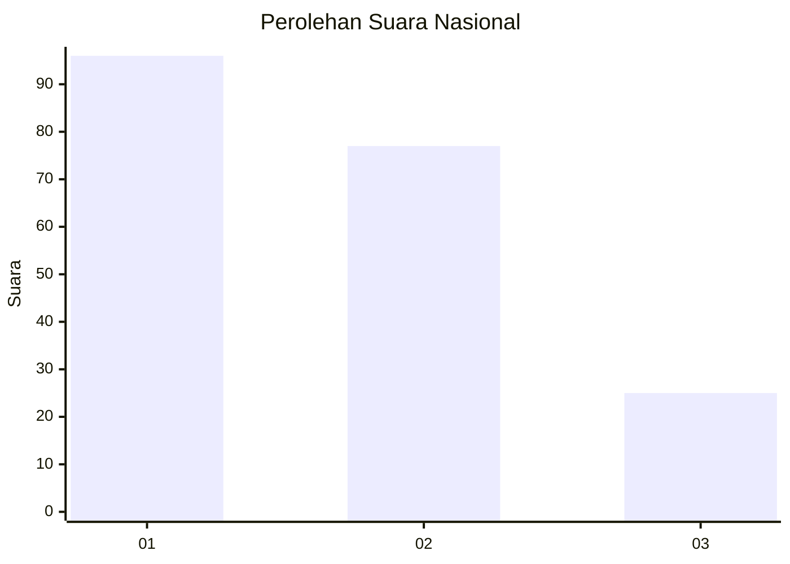
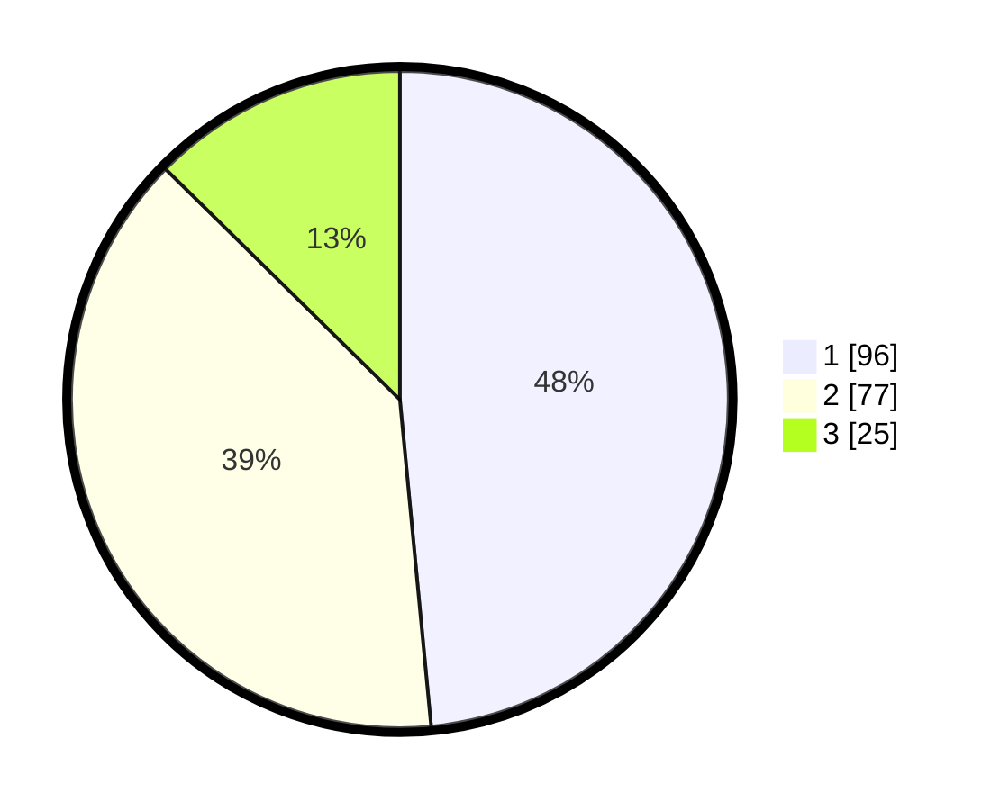

# Hasil

## Grafik

## Tabel

| No.    | Nama Paslon    | Suara | Suara (raw) | Persentase |
|:------ |:-------------- | -----:| -----------:| ----------:|
| 100025 | ANIES MUHAIMIN | 96    | [96][p-1]   | 48,48      |
| 100026 | PRABOWO GIBRAN | 77    | [77][p-2]   | 38,89      |
| 100027 | GANJAR MAHFUD  | 25    | [25][p-3]   | 12,63      |

[p-1]: https://github.com/gigit-pemilu/pemilu-2024/blob/main/pilpres/hitung-suara/sub/31-dki-jakarta/sub/75-jakarta-timur/sub/06-cakung/sub/1007-cakung-barat/sub/131-tps/sub/paslon-1.txt
[p-2]: https://github.com/gigit-pemilu/pemilu-2024/blob/main/pilpres/hitung-suara/sub/31-dki-jakarta/sub/75-jakarta-timur/sub/06-cakung/sub/1007-cakung-barat/sub/131-tps/sub/paslon-2.txt
[p-3]: https://github.com/gigit-pemilu/pemilu-2024/blob/main/pilpres/hitung-suara/sub/31-dki-jakarta/sub/75-jakarta-timur/sub/06-cakung/sub/1007-cakung-barat/sub/131-tps/sub/paslon-3.txt

## Foto C Plano

https://sirekap-obj-formc.kpu.go.id/9440/pemilu/ppwp/31/75/06/10/07/3175061007131-20240215-011221--6e20be03-5552-4e5c-be8e-c8d8285f4a02.jpg

https://sirekap-obj-formc.kpu.go.id/9440/pemilu/ppwp/31/75/06/10/07/3175061007131-20240215-011144--ea5419fc-2946-4d57-a3dc-0f8fc5c66c8f.jpg

https://sirekap-obj-formc.kpu.go.id/9440/pemilu/ppwp/31/75/06/10/07/3175061007131-20240215-011238--fb6db58d-35f4-4821-a135-8033546717aa.jpg

## Metadata

| Key        | Value               |
| ---------- | ------------------- |
| Time Stamp | 2024-02-17 11:00:02 |

