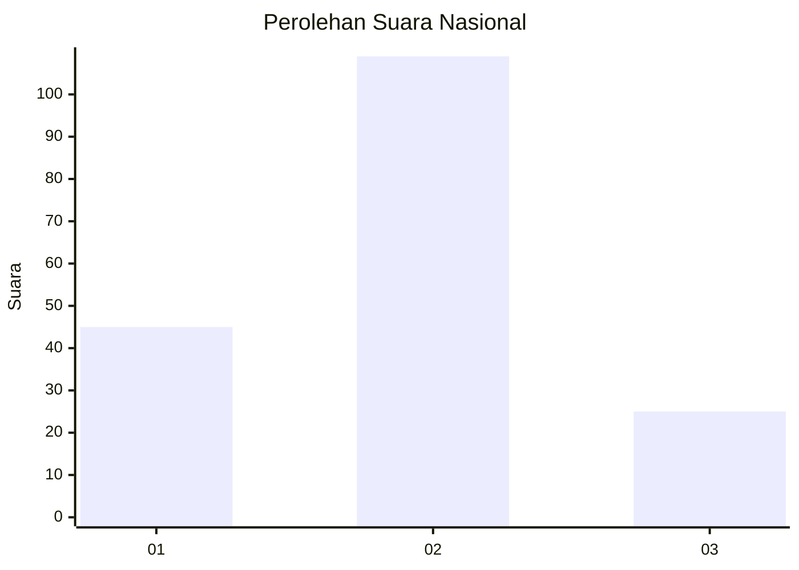
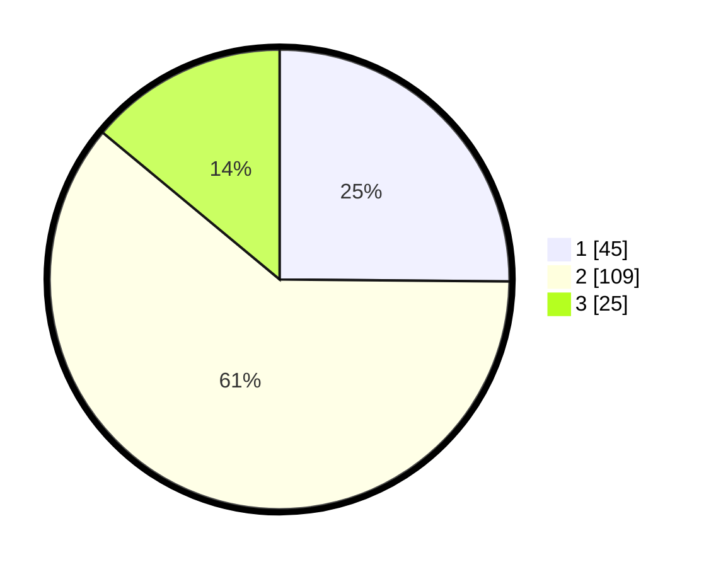

# Hasil

## Grafik

## Tabel

| No.    | Nama Paslon    | Suara | Suara (raw) | Persentase |
|:------ |:-------------- | -----:| -----------:| ----------:|
| 100025 | ANIES MUHAIMIN | 45    | [45][p-1]   | 25,14      |
| 100026 | PRABOWO GIBRAN | 109   | [109][p-2]  | 60,89      |
| 100027 | GANJAR MAHFUD  | 25    | [25][p-3]   | 13,97      |

[p-1]: https://github.com/gigit-pemilu/pemilu-2024/blob/main/pilpres/hitung-suara/sub/31-dki-jakarta/sub/75-jakarta-timur/sub/06-cakung/sub/1007-cakung-barat/sub/144-tps/sub/paslon-1.txt
[p-2]: https://github.com/gigit-pemilu/pemilu-2024/blob/main/pilpres/hitung-suara/sub/31-dki-jakarta/sub/75-jakarta-timur/sub/06-cakung/sub/1007-cakung-barat/sub/144-tps/sub/paslon-2.txt
[p-3]: https://github.com/gigit-pemilu/pemilu-2024/blob/main/pilpres/hitung-suara/sub/31-dki-jakarta/sub/75-jakarta-timur/sub/06-cakung/sub/1007-cakung-barat/sub/144-tps/sub/paslon-3.txt

## Foto C Plano

https://sirekap-obj-formc.kpu.go.id/651f/pemilu/ppwp/31/75/06/10/07/3175061007144-20240214-224659--16eceeb5-f842-4034-993d-78db327ec8cb.jpg

https://sirekap-obj-formc.kpu.go.id/651f/pemilu/ppwp/31/75/06/10/07/3175061007144-20240214-224829--827edb61-8934-40d8-a452-887303f8d941.jpg

https://sirekap-obj-formc.kpu.go.id/651f/pemilu/ppwp/31/75/06/10/07/3175061007144-20240214-204940--b199e9eb-64ad-4aae-8bd0-dcba0a0738c4.jpg

## Metadata

| Key        | Value               |
| ---------- | ------------------- |
| Time Stamp | 2024-02-17 11:00:02 |

