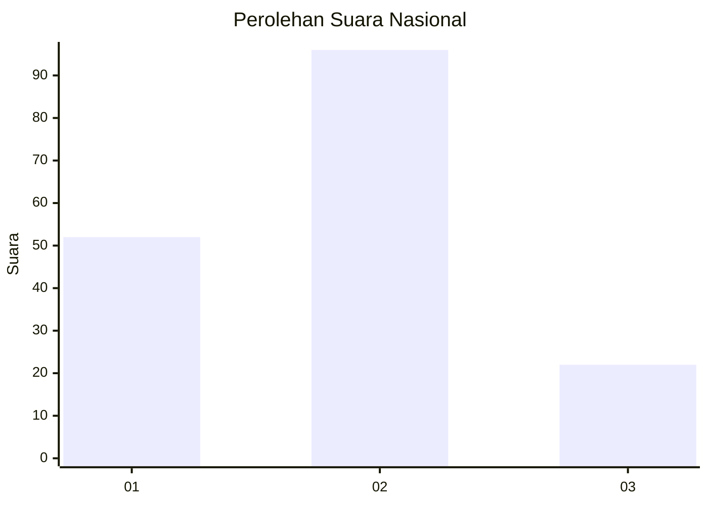
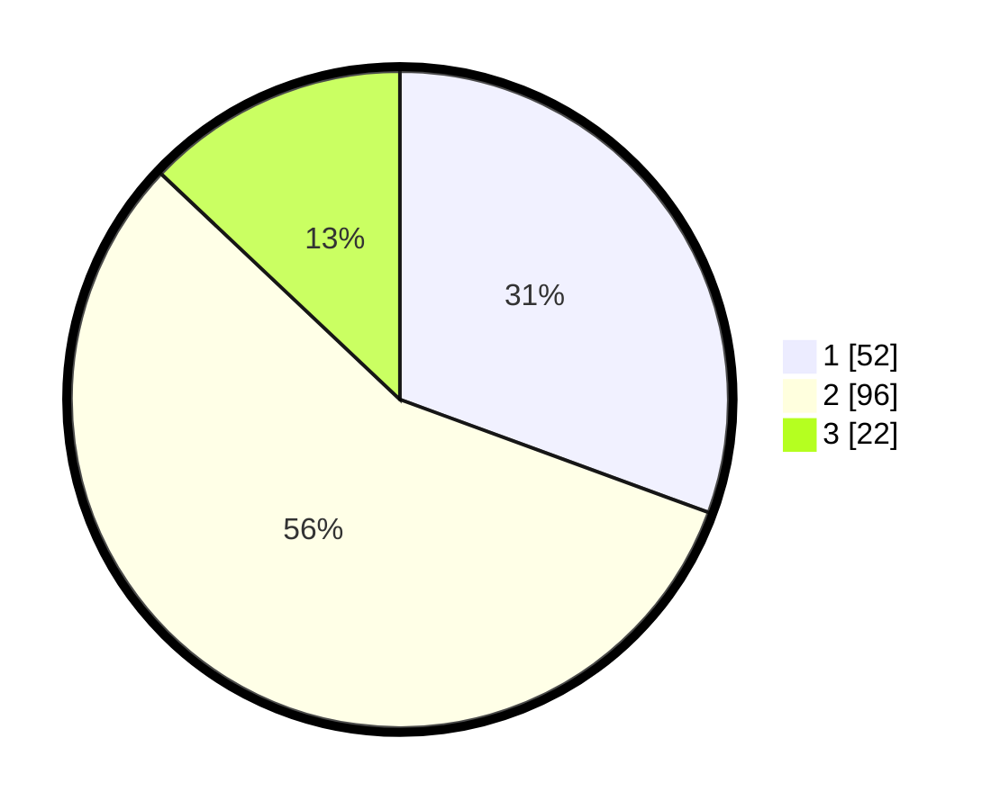

# Hasil

## Grafik

## Tabel

| No.    | Nama Paslon    | Suara | Suara (raw) | Persentase |
|:------ |:-------------- | -----:| -----------:| ----------:|
| 100025 | ANIES MUHAIMIN | 52    | [52][p-1]   | 30,59      |
| 100026 | PRABOWO GIBRAN | 96    | [96][p-2]   | 56,47      |
| 100027 | GANJAR MAHFUD  | 22    | [22][p-3]   | 12,94      |

[p-1]: https://github.com/gigit-pemilu/pemilu-2024/blob/main/pilpres/hitung-suara/sub/31-dki-jakarta/sub/75-jakarta-timur/sub/06-cakung/sub/1007-cakung-barat/sub/147-tps/sub/paslon-1.txt
[p-2]: https://github.com/gigit-pemilu/pemilu-2024/blob/main/pilpres/hitung-suara/sub/31-dki-jakarta/sub/75-jakarta-timur/sub/06-cakung/sub/1007-cakung-barat/sub/147-tps/sub/paslon-2.txt
[p-3]: https://github.com/gigit-pemilu/pemilu-2024/blob/main/pilpres/hitung-suara/sub/31-dki-jakarta/sub/75-jakarta-timur/sub/06-cakung/sub/1007-cakung-barat/sub/147-tps/sub/paslon-3.txt

## Foto C Plano

https://sirekap-obj-formc.kpu.go.id/0100/pemilu/ppwp/31/75/06/10/07/3175061007147-20240215-000421--6cf6d193-a759-4faa-b8b4-ad3032d48595.jpg

https://sirekap-obj-formc.kpu.go.id/0100/pemilu/ppwp/31/75/06/10/07/3175061007147-20240215-001037--a99ff498-8d10-45d2-b194-abcc383d90d7.jpg

https://sirekap-obj-formc.kpu.go.id/0100/pemilu/ppwp/31/75/06/10/07/3175061007147-20240215-001204--115784c8-f2fc-43bd-8261-186e7fa2b29e.jpg

## Metadata

| Key        | Value               |
| ---------- | ------------------- |
| Time Stamp | 2024-02-17 10:30:03 |

