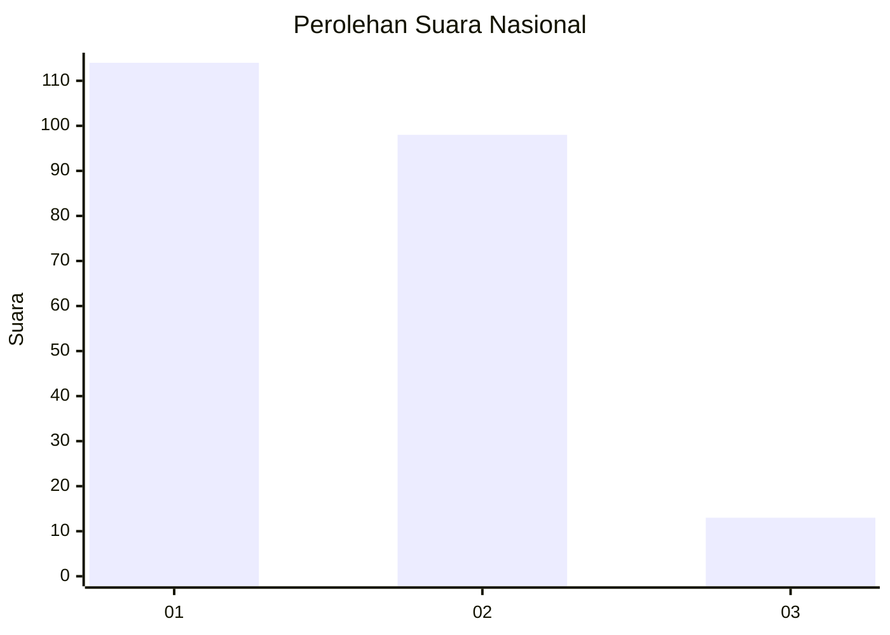
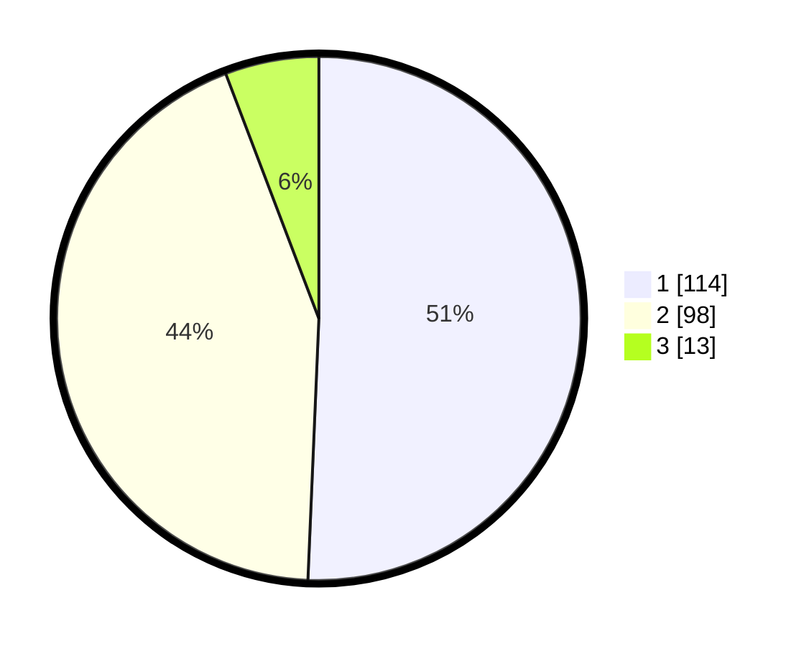

# Hasil

## Grafik

## Tabel

| No.    | Nama Paslon    | Suara | Suara (raw) | Persentase |
|:------ |:-------------- | -----:| -----------:| ----------:|
| 100025 | ANIES MUHAIMIN | 114   | [114][p-1]  | 50,67      |
| 100026 | PRABOWO GIBRAN | 98    | [98][p-2]   | 43,56      |
| 100027 | GANJAR MAHFUD  | 13    | [13][p-3]   | 5,78       |

[p-1]: https://github.com/gigit-pemilu/pemilu-2024/blob/main/pilpres/hitung-suara/sub/31-dki-jakarta/sub/75-jakarta-timur/sub/06-cakung/sub/1007-cakung-barat/sub/148-tps/sub/paslon-1.txt
[p-2]: https://github.com/gigit-pemilu/pemilu-2024/blob/main/pilpres/hitung-suara/sub/31-dki-jakarta/sub/75-jakarta-timur/sub/06-cakung/sub/1007-cakung-barat/sub/148-tps/sub/paslon-2.txt
[p-3]: https://github.com/gigit-pemilu/pemilu-2024/blob/main/pilpres/hitung-suara/sub/31-dki-jakarta/sub/75-jakarta-timur/sub/06-cakung/sub/1007-cakung-barat/sub/148-tps/sub/paslon-3.txt

## Foto C Plano

https://sirekap-obj-formc.kpu.go.id/bb06/pemilu/ppwp/31/75/06/10/07/3175061007148-20240214-232018--0a8e47c6-06d3-40b9-996f-6031a5783762.jpg

https://sirekap-obj-formc.kpu.go.id/bb06/pemilu/ppwp/31/75/06/10/07/3175061007148-20240214-232045--b8bfe612-7567-40f2-b2b9-4837efc7e608.jpg

https://sirekap-obj-formc.kpu.go.id/bb06/pemilu/ppwp/31/75/06/10/07/3175061007148-20240214-232113--4edf7828-8b19-41e4-a5f4-19d21e0df3da.jpg

## Metadata

| Key        | Value               |
| ---------- | ------------------- |
| Time Stamp | 2024-02-17 11:00:02 |

