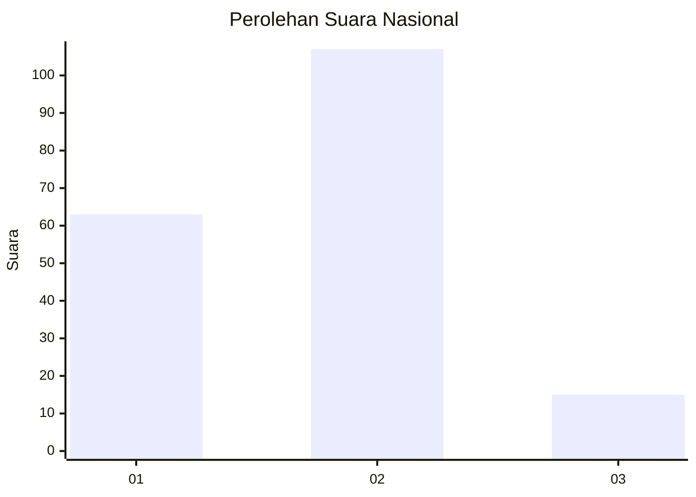
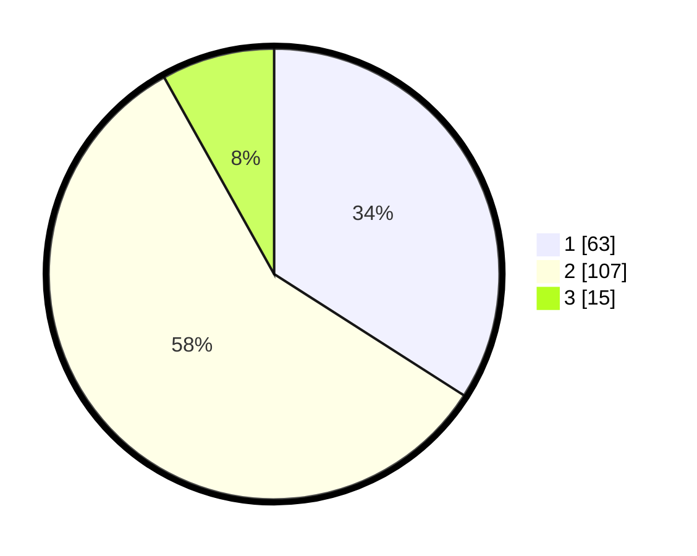

# Hasil

## Grafik

## Tabel

| No.    | Nama Paslon    | Suara | Suara (raw) | Persentase |
|:------ |:-------------- | -----:| -----------:| ----------:|
| 100025 | ANIES MUHAIMIN | 63    | [63][p-1]   | 34,05      |
| 100026 | PRABOWO GIBRAN | 107   | [107][p-2]  | 57,84      |
| 100027 | GANJAR MAHFUD  | 15    | [15][p-3]   | 8,11       |

[p-1]: https://github.com/gigit-pemilu/pemilu-2024/blob/main/pilpres/hitung-suara/sub/31-dki-jakarta/sub/75-jakarta-timur/sub/06-cakung/sub/1007-cakung-barat/sub/149-tps/sub/paslon-1.txt
[p-2]: https://github.com/gigit-pemilu/pemilu-2024/blob/main/pilpres/hitung-suara/sub/31-dki-jakarta/sub/75-jakarta-timur/sub/06-cakung/sub/1007-cakung-barat/sub/149-tps/sub/paslon-2.txt
[p-3]: https://github.com/gigit-pemilu/pemilu-2024/blob/main/pilpres/hitung-suara/sub/31-dki-jakarta/sub/75-jakarta-timur/sub/06-cakung/sub/1007-cakung-barat/sub/149-tps/sub/paslon-3.txt

## Foto C Plano

https://sirekap-obj-formc.kpu.go.id/3d12/pemilu/ppwp/31/75/06/10/07/3175061007149-20240215-000811--efd38772-2934-49c6-8144-d7ed3f274a86.jpg

https://sirekap-obj-formc.kpu.go.id/3d12/pemilu/ppwp/31/75/06/10/07/3175061007149-20240214-230413--061bdfae-b4b7-4f7a-8af7-e3a097000f3c.jpg

https://sirekap-obj-formc.kpu.go.id/3d12/pemilu/ppwp/31/75/06/10/07/3175061007149-20240214-230645--3e8dc0a2-2449-493a-85e3-ef3f74ca36d1.jpg

## Metadata

| Key        | Value               |
| ---------- | ------------------- |
| Time Stamp | 2024-02-24 22:31:28 |

