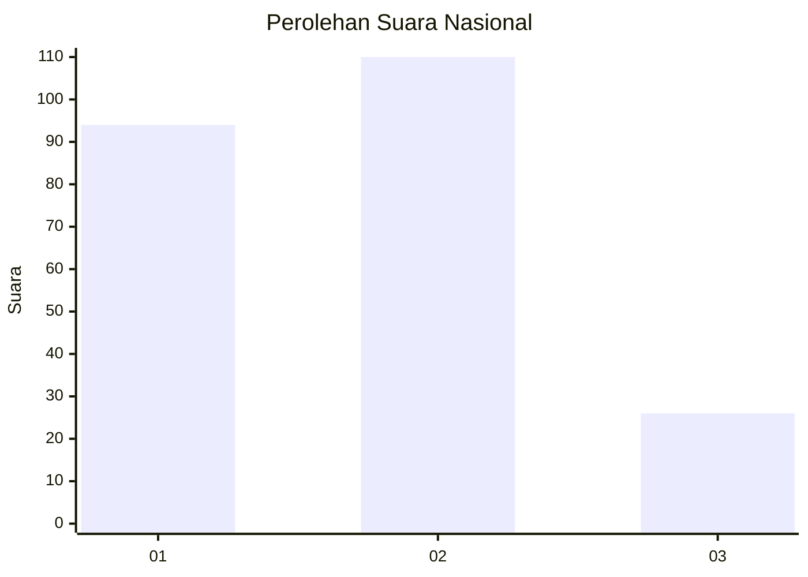
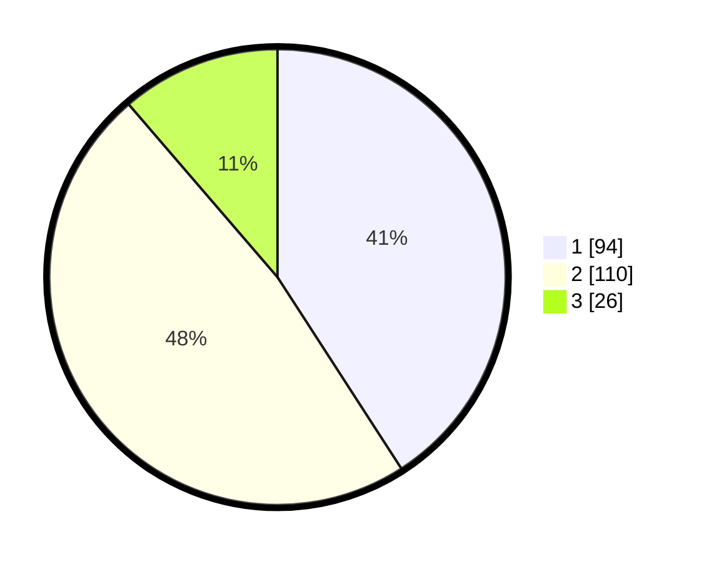

# Hasil

## Grafik

## Tabel

| No.    | Nama Paslon    | Suara | Suara (raw) | Persentase |
|:------ |:-------------- | -----:| -----------:| ----------:|
| 100025 | ANIES MUHAIMIN | 94    | [94][p-1]   | 40,87      |
| 100026 | PRABOWO GIBRAN | 110   | [110][p-2]  | 47,83      |
| 100027 | GANJAR MAHFUD  | 26    | [26][p-3]   | 11,30      |

[p-1]: https://github.com/gigit-pemilu/pemilu-2024/blob/main/pilpres/hitung-suara/sub/31-dki-jakarta/sub/75-jakarta-timur/sub/06-cakung/sub/1007-cakung-barat/sub/150-tps/sub/paslon-1.txt
[p-2]: https://github.com/gigit-pemilu/pemilu-2024/blob/main/pilpres/hitung-suara/sub/31-dki-jakarta/sub/75-jakarta-timur/sub/06-cakung/sub/1007-cakung-barat/sub/150-tps/sub/paslon-2.txt
[p-3]: https://github.com/gigit-pemilu/pemilu-2024/blob/main/pilpres/hitung-suara/sub/31-dki-jakarta/sub/75-jakarta-timur/sub/06-cakung/sub/1007-cakung-barat/sub/150-tps/sub/paslon-3.txt

## Foto C Plano

https://sirekap-obj-formc.kpu.go.id/1cc6/pemilu/ppwp/31/75/06/10/07/3175061007150-20240214-203543--5824160f-b27a-43e6-8d08-f8370f691f61.jpg

https://sirekap-obj-formc.kpu.go.id/1cc6/pemilu/ppwp/31/75/06/10/07/3175061007150-20240214-205016--3e4e73c5-464c-4a64-ba87-a3dd1c03cdac.jpg

https://sirekap-obj-formc.kpu.go.id/1cc6/pemilu/ppwp/31/75/06/10/07/3175061007150-20240214-205215--83c5788e-b402-4d89-8df7-aa5b016f82ed.jpg

## Metadata

| Key        | Value               |
| ---------- | ------------------- |
| Time Stamp | 2024-02-17 11:00:02 |

