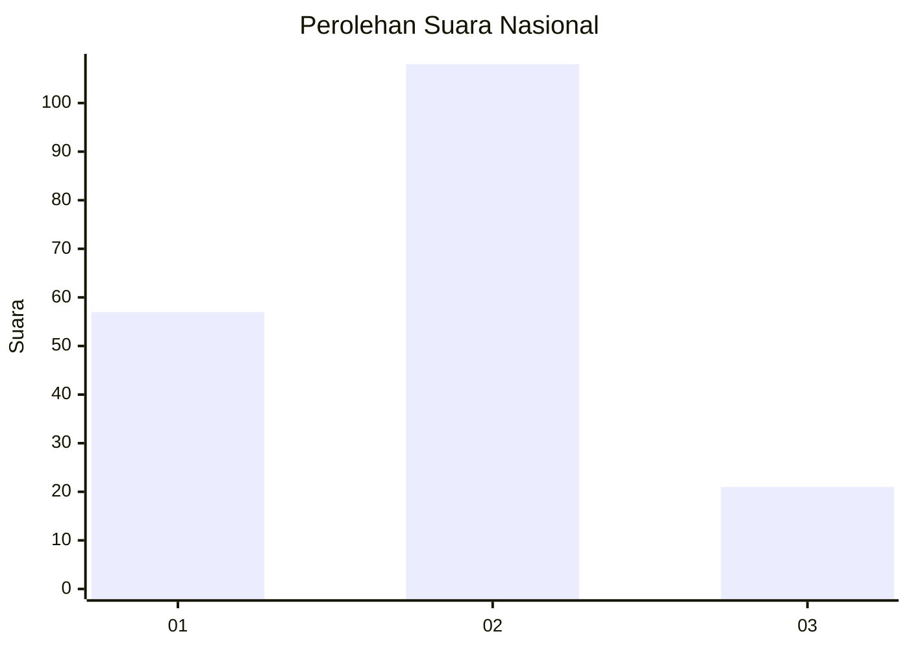
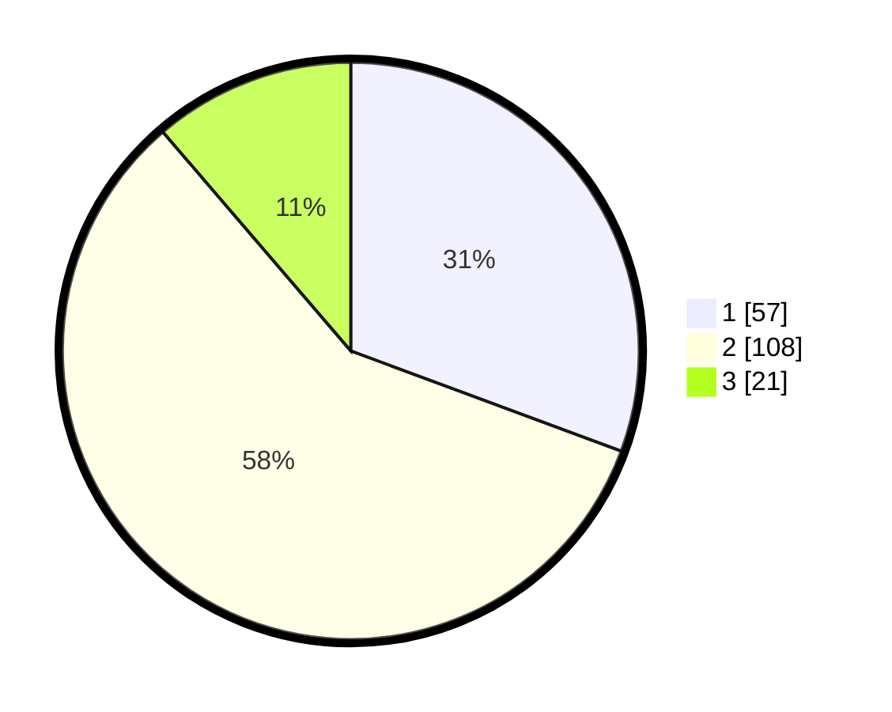

# Hasil

## Grafik

## Tabel

| No.    | Nama Paslon    | Suara | Suara (raw) | Persentase |
|:------ |:-------------- | -----:| -----------:| ----------:|
| 100025 | ANIES MUHAIMIN | 57    | [57][p-1]   | 30,65      |
| 100026 | PRABOWO GIBRAN | 108   | [108][p-2]  | 58,06      |
| 100027 | GANJAR MAHFUD  | 21    | [21][p-3]   | 11,29      |

[p-1]: https://github.com/gigit-pemilu/pemilu-2024/blob/main/pilpres/hitung-suara/sub/31-dki-jakarta/sub/75-jakarta-timur/sub/06-cakung/sub/1007-cakung-barat/sub/160-tps/sub/paslon-1.txt
[p-2]: https://github.com/gigit-pemilu/pemilu-2024/blob/main/pilpres/hitung-suara/sub/31-dki-jakarta/sub/75-jakarta-timur/sub/06-cakung/sub/1007-cakung-barat/sub/160-tps/sub/paslon-2.txt
[p-3]: https://github.com/gigit-pemilu/pemilu-2024/blob/main/pilpres/hitung-suara/sub/31-dki-jakarta/sub/75-jakarta-timur/sub/06-cakung/sub/1007-cakung-barat/sub/160-tps/sub/paslon-3.txt

## Foto C Plano

https://sirekap-obj-formc.kpu.go.id/2062/pemilu/ppwp/31/75/06/10/07/3175061007160-20240214-214255--24fd24a0-f872-48c8-8bf5-38b21d13933d.jpg

https://sirekap-obj-formc.kpu.go.id/2062/pemilu/ppwp/31/75/06/10/07/3175061007160-20240214-214359--13e3010a-3411-4c2f-82f5-8a8161d4112a.jpg

https://sirekap-obj-formc.kpu.go.id/2062/pemilu/ppwp/31/75/06/10/07/3175061007160-20240214-214511--3de01c01-d3a8-49d2-93cd-530650feb0d2.jpg

## Metadata

| Key        | Value               |
| ---------- | ------------------- |
| Time Stamp | 2024-02-17 11:00:02 |

