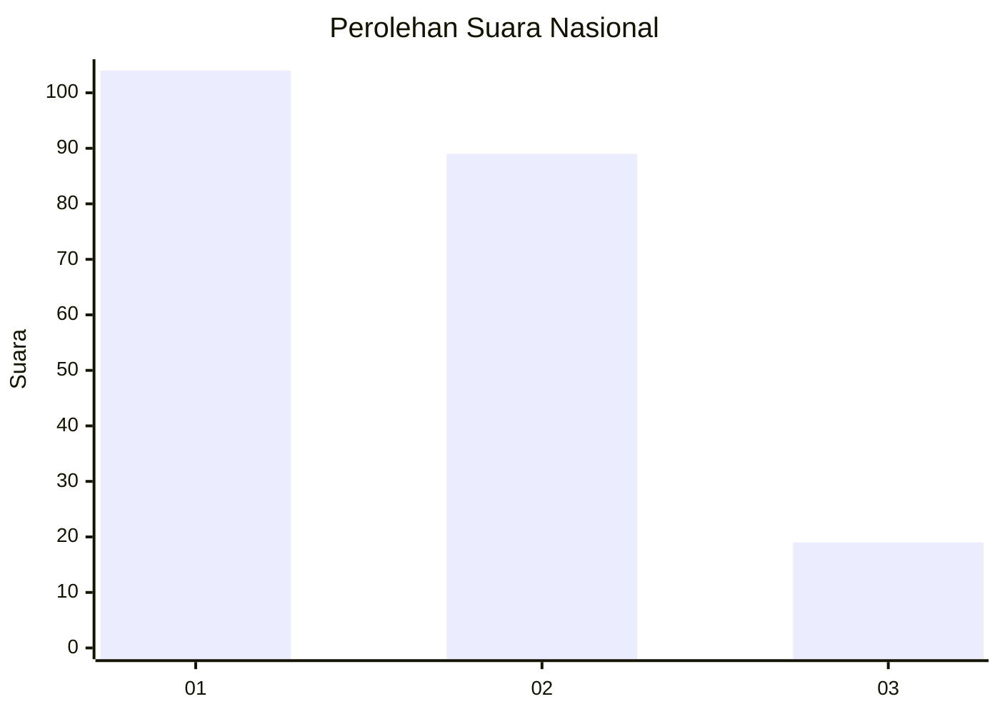
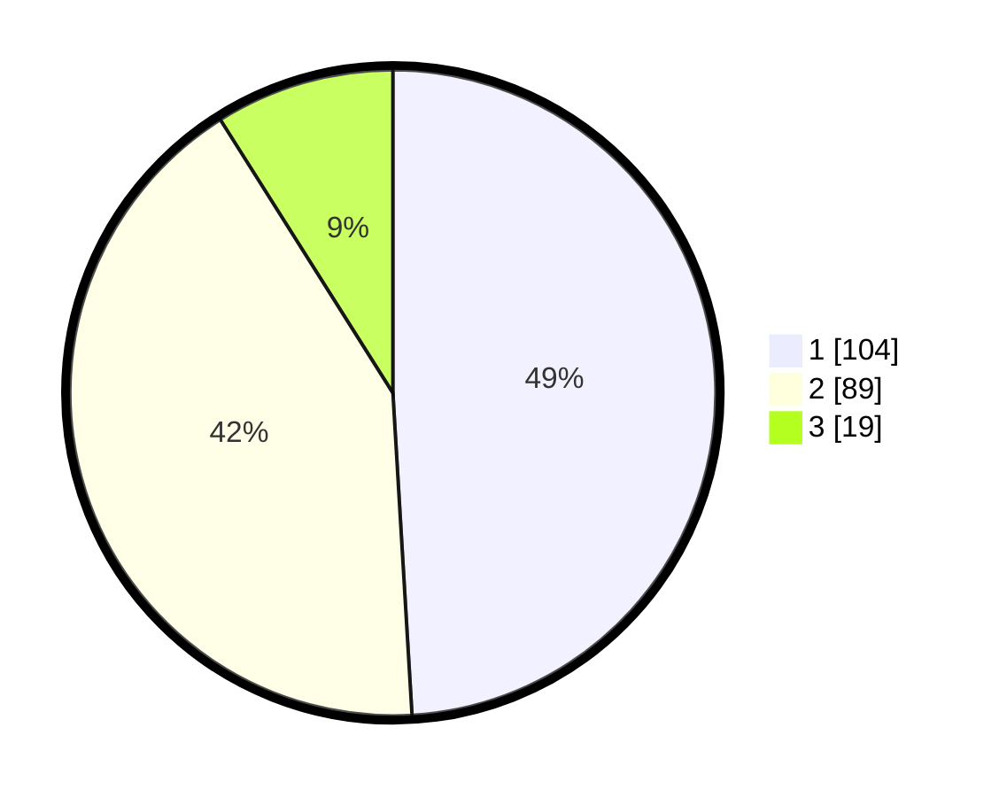

# Hasil

## Grafik

## Tabel

| No.    | Nama Paslon    | Suara | Suara (raw) | Persentase |
|:------ |:-------------- | -----:| -----------:| ----------:|
| 100025 | ANIES MUHAIMIN | 104   | [104][p-1]  | 49,06      |
| 100026 | PRABOWO GIBRAN | 89    | [89][p-2]   | 41,98      |
| 100027 | GANJAR MAHFUD  | 19    | [19][p-3]   | 8,96       |

[p-1]: https://github.com/gigit-pemilu/pemilu-2024/blob/main/pilpres/hitung-suara/sub/31-dki-jakarta/sub/75-jakarta-timur/sub/06-cakung/sub/1007-cakung-barat/sub/173-tps/sub/paslon-1.txt
[p-2]: https://github.com/gigit-pemilu/pemilu-2024/blob/main/pilpres/hitung-suara/sub/31-dki-jakarta/sub/75-jakarta-timur/sub/06-cakung/sub/1007-cakung-barat/sub/173-tps/sub/paslon-2.txt
[p-3]: https://github.com/gigit-pemilu/pemilu-2024/blob/main/pilpres/hitung-suara/sub/31-dki-jakarta/sub/75-jakarta-timur/sub/06-cakung/sub/1007-cakung-barat/sub/173-tps/sub/paslon-3.txt

## Foto C Plano

https://sirekap-obj-formc.kpu.go.id/8beb/pemilu/ppwp/31/75/06/10/07/3175061007173-20240214-213025--05d326a2-0ee5-45ec-9bc0-d7ea7df9d296.jpg

https://sirekap-obj-formc.kpu.go.id/8beb/pemilu/ppwp/31/75/06/10/07/3175061007173-20240215-004602--86db455a-920d-4b57-ba41-7020265c36b5.jpg

https://sirekap-obj-formc.kpu.go.id/8beb/pemilu/ppwp/31/75/06/10/07/3175061007173-20240214-213221--3f755221-c843-4248-bebb-a3b8893e9fe6.jpg

## Metadata

| Key        | Value               |
| ---------- | ------------------- |
| Time Stamp | 2024-02-24 22:31:28 |

