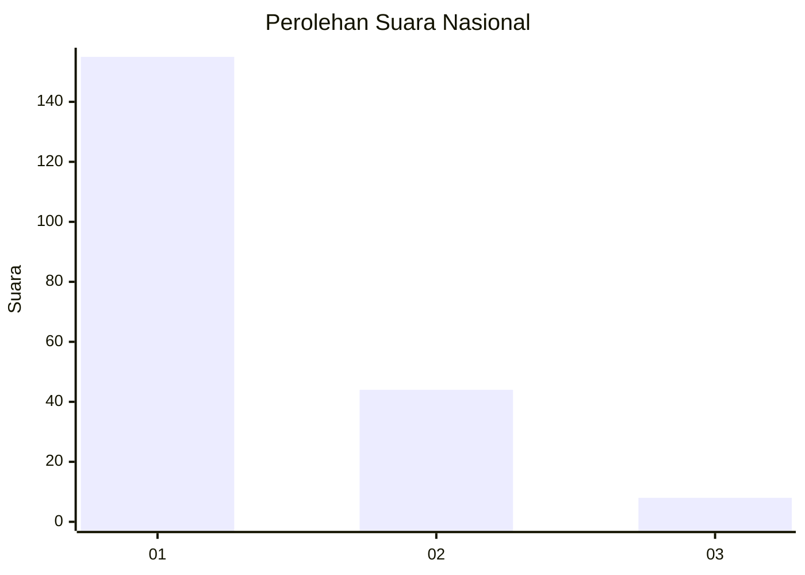
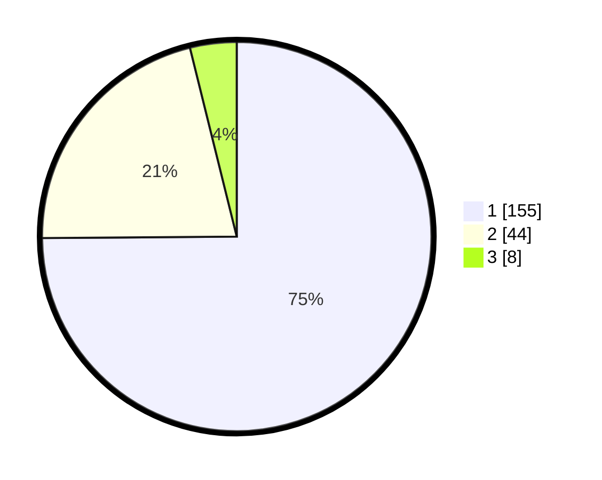

# Hasil

## Grafik

## Tabel

| No. | Nama Paslon    | Suara | Suara (raw) | Persentase |
|:--- |:-------------- | -----:| -----------:| ----------:|
| 1   | ANIES MUHAIMIN | 155   | [155][p-1]  | 74,88      |
| 2   | PRABOWO GIBRAN | 44    | [44][p-2]   | 21,26      |
| 3   | GANJAR MAHFUD  | 8     | [8][p-3]    | 3,86       |

[p-1]: https://github.com/gigit-pemilu/pemilu-2024/blob/main/pilpres/hitung-suara/sub/31-dki-jakarta/sub/75-jakarta-timur/sub/06-cakung/sub/1007-cakung-barat/sub/188-tps/sub/paslon-1.txt
[p-2]: https://github.com/gigit-pemilu/pemilu-2024/blob/main/pilpres/hitung-suara/sub/31-dki-jakarta/sub/75-jakarta-timur/sub/06-cakung/sub/1007-cakung-barat/sub/188-tps/sub/paslon-2.txt
[p-3]: https://github.com/gigit-pemilu/pemilu-2024/blob/main/pilpres/hitung-suara/sub/31-dki-jakarta/sub/75-jakarta-timur/sub/06-cakung/sub/1007-cakung-barat/sub/188-tps/sub/paslon-3.txt

## Foto C Plano

https://sirekap-obj-formc.kpu.go.id/2947/pemilu/ppwp/31/75/06/10/07/3175061007188-20240214-230149--77e51403-d9f8-4b65-bfa0-ed55e5c48788.jpg

https://sirekap-obj-formc.kpu.go.id/2947/pemilu/ppwp/31/75/06/10/07/3175061007188-20240214-230202--cd3f47cc-2b69-48c3-b8e7-f5fc1f38325c.jpg

https://sirekap-obj-formc.kpu.go.id/2947/pemilu/ppwp/31/75/06/10/07/3175061007188-20240214-230207--b20b9cba-5bce-4d7f-a1bb-80e423095c11.jpg

## Metadata

| Key        | Value               |
| ---------- | ------------------- |
| Time Stamp | 2024-02-17 11:00:02 |

