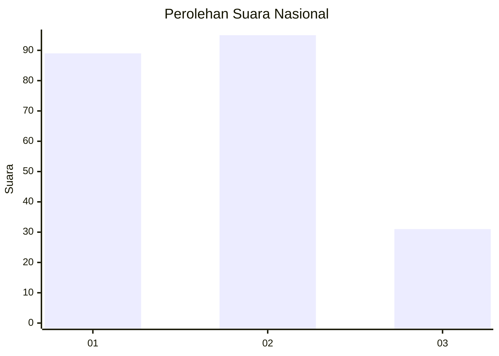
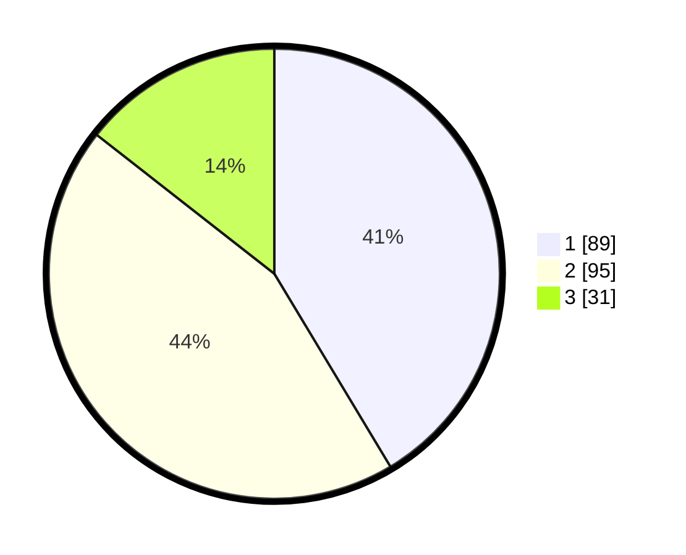

# Hasil

## Grafik

## Tabel

| No.    | Nama Paslon    | Suara | Suara (raw) | Persentase |
|:------ |:-------------- | -----:| -----------:| ----------:|
| 100025 | ANIES MUHAIMIN | 89    | [89][p-1]   | 41,40      |
| 100026 | PRABOWO GIBRAN | 95    | [95][p-2]   | 44,19      |
| 100027 | GANJAR MAHFUD  | 31    | [31][p-3]   | 14,42      |

[p-1]: https://github.com/gigit-pemilu/pemilu-2024/blob/main/pilpres/hitung-suara/sub/31-dki-jakarta/sub/75-jakarta-timur/sub/07-duren-sawit/sub/1001-duren-sawit/sub/001-tps/sub/paslon-1.txt
[p-2]: https://github.com/gigit-pemilu/pemilu-2024/blob/main/pilpres/hitung-suara/sub/31-dki-jakarta/sub/75-jakarta-timur/sub/07-duren-sawit/sub/1001-duren-sawit/sub/001-tps/sub/paslon-2.txt
[p-3]: https://github.com/gigit-pemilu/pemilu-2024/blob/main/pilpres/hitung-suara/sub/31-dki-jakarta/sub/75-jakarta-timur/sub/07-duren-sawit/sub/1001-duren-sawit/sub/001-tps/sub/paslon-3.txt

## Foto C Plano

https://sirekap-obj-formc.kpu.go.id/3da0/pemilu/ppwp/31/75/07/10/01/3175071001001-20240214-201736--f29517ba-0bf6-4fec-9f0a-a423e2675bfe.jpg

https://sirekap-obj-formc.kpu.go.id/3da0/pemilu/ppwp/31/75/07/10/01/3175071001001-20240214-201911--ec97ecea-8767-448a-99e2-868fe555170a.jpg

https://sirekap-obj-formc.kpu.go.id/3da0/pemilu/ppwp/31/75/07/10/01/3175071001001-20240214-202205--a1a453e2-b14f-4172-b8c6-4c66188a5c96.jpg

## Metadata

| Key        | Value               |
| ---------- | ------------------- |
| Time Stamp | 2024-02-15 12:00:28 |

