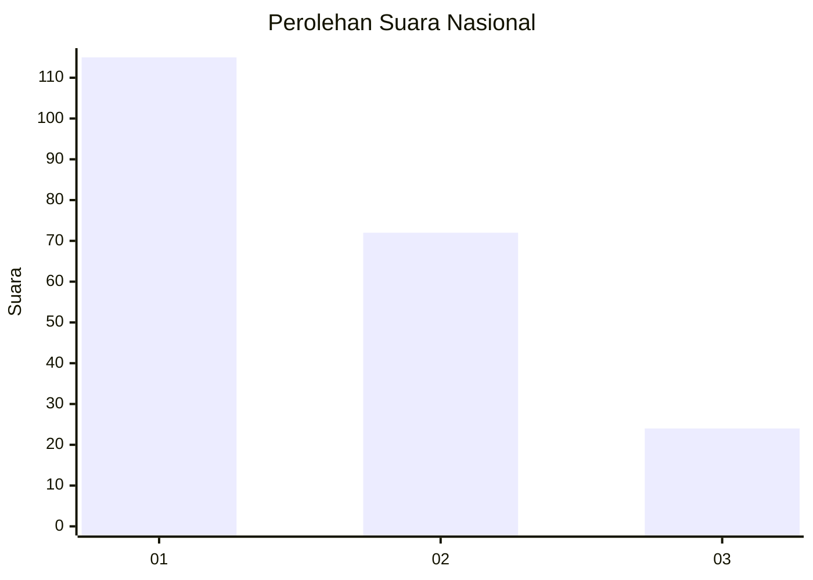
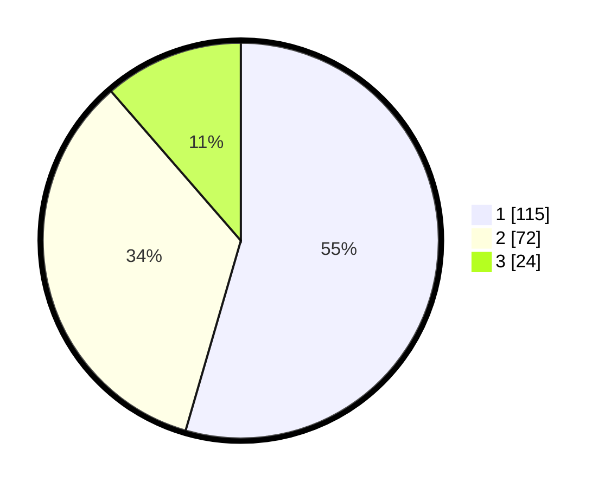

# Hasil

## Grafik

## Tabel

| No.    | Nama Paslon    | Suara | Suara (raw) | Persentase |
|:------ |:-------------- | -----:| -----------:| ----------:|
| 100025 | ANIES MUHAIMIN | 115   | [115][p-1]  | 54,50      |
| 100026 | PRABOWO GIBRAN | 72    | [72][p-2]   | 34,12      |
| 100027 | GANJAR MAHFUD  | 24    | [24][p-3]   | 11,37      |

[p-1]: https://github.com/gigit-pemilu/pemilu-2024/blob/main/pilpres/hitung-suara/sub/31-dki-jakarta/sub/75-jakarta-timur/sub/07-duren-sawit/sub/1001-duren-sawit/sub/007-tps/sub/paslon-1.txt
[p-2]: https://github.com/gigit-pemilu/pemilu-2024/blob/main/pilpres/hitung-suara/sub/31-dki-jakarta/sub/75-jakarta-timur/sub/07-duren-sawit/sub/1001-duren-sawit/sub/007-tps/sub/paslon-2.txt
[p-3]: https://github.com/gigit-pemilu/pemilu-2024/blob/main/pilpres/hitung-suara/sub/31-dki-jakarta/sub/75-jakarta-timur/sub/07-duren-sawit/sub/1001-duren-sawit/sub/007-tps/sub/paslon-3.txt

## Foto C Plano

https://sirekap-obj-formc.kpu.go.id/7fe7/pemilu/ppwp/31/75/07/10/01/3175071001007-20240215-001342--6ee0e274-6a4e-4489-810e-f741fd8dd7ec.jpg

https://sirekap-obj-formc.kpu.go.id/7fe7/pemilu/ppwp/31/75/07/10/01/3175071001007-20240215-001404--ddb9851a-1fef-4c55-ac8d-f5eebfcc6a9c.jpg

https://sirekap-obj-formc.kpu.go.id/7fe7/pemilu/ppwp/31/75/07/10/01/3175071001007-20240215-001610--76f0cc5f-7060-4322-85cf-105ee26c5b36.jpg

## Metadata

| Key        | Value               |
| ---------- | ------------------- |
| Time Stamp | 2024-02-15 22:00:27 |

