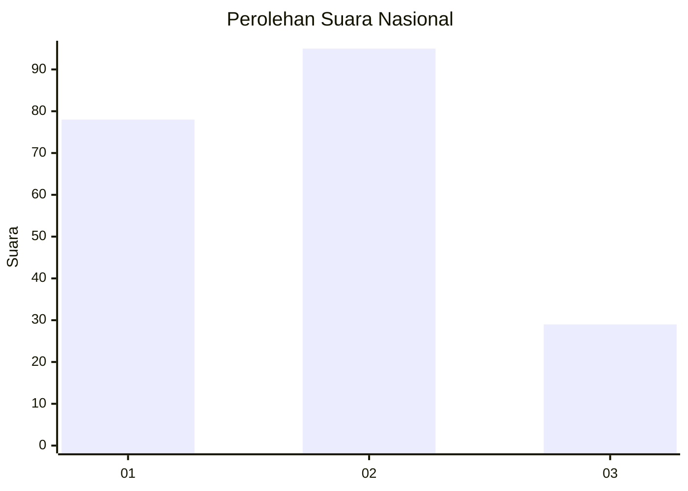
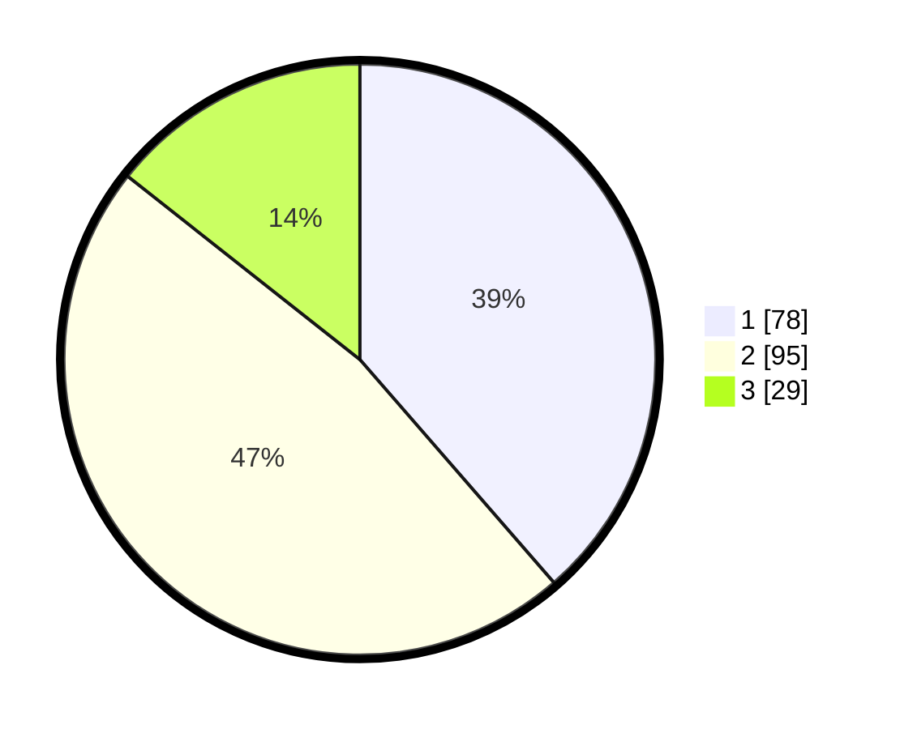

# Hasil

## Grafik

## Tabel

| No.    | Nama Paslon    | Suara | Suara (raw) | Persentase |
|:------ |:-------------- | -----:| -----------:| ----------:|
| 100025 | ANIES MUHAIMIN | 78    | [78][p-1]   | 38,61      |
| 100026 | PRABOWO GIBRAN | 95    | [95][p-2]   | 47,03      |
| 100027 | GANJAR MAHFUD  | 29    | [29][p-3]   | 14,36      |

[p-1]: https://github.com/gigit-pemilu/pemilu-2024/blob/main/pilpres/hitung-suara/sub/31-dki-jakarta/sub/75-jakarta-timur/sub/07-duren-sawit/sub/1001-duren-sawit/sub/011-tps/sub/paslon-1.txt
[p-2]: https://github.com/gigit-pemilu/pemilu-2024/blob/main/pilpres/hitung-suara/sub/31-dki-jakarta/sub/75-jakarta-timur/sub/07-duren-sawit/sub/1001-duren-sawit/sub/011-tps/sub/paslon-2.txt
[p-3]: https://github.com/gigit-pemilu/pemilu-2024/blob/main/pilpres/hitung-suara/sub/31-dki-jakarta/sub/75-jakarta-timur/sub/07-duren-sawit/sub/1001-duren-sawit/sub/011-tps/sub/paslon-3.txt

## Foto C Plano

https://sirekap-obj-formc.kpu.go.id/47d0/pemilu/ppwp/31/75/07/10/01/3175071001011-20240215-001101--c02e2178-e94d-4fd4-8899-47bd2b3923a1.jpg

https://sirekap-obj-formc.kpu.go.id/47d0/pemilu/ppwp/31/75/07/10/01/3175071001011-20240215-001215--05cfa9a4-8814-4d04-ba38-c1260fa4ff6f.jpg

https://sirekap-obj-formc.kpu.go.id/47d0/pemilu/ppwp/31/75/07/10/01/3175071001011-20240215-001304--2ead23d0-2383-4075-aa48-fd40c570f46a.jpg

## Metadata

| Key        | Value               |
| ---------- | ------------------- |
| Time Stamp | 2024-02-15 22:30:27 |

