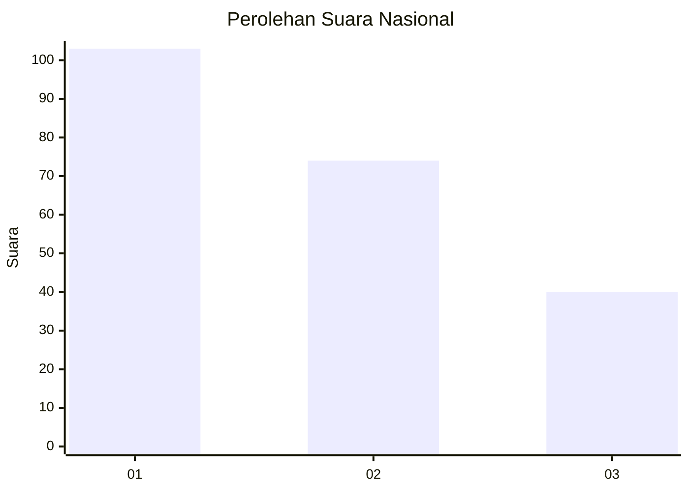
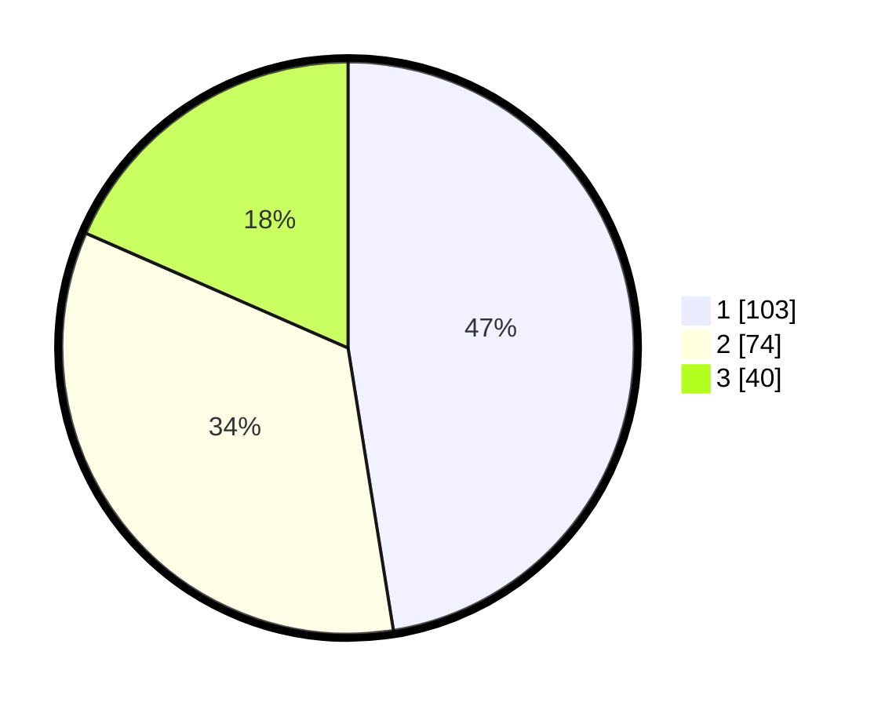

# Hasil

## Grafik

## Tabel

| No.    | Nama Paslon    | Suara | Suara (raw) | Persentase |
|:------ |:-------------- | -----:| -----------:| ----------:|
| 100025 | ANIES MUHAIMIN | 103   | [103][p-1]  | 47,47      |
| 100026 | PRABOWO GIBRAN | 74    | [74][p-2]   | 34,10      |
| 100027 | GANJAR MAHFUD  | 40    | [40][p-3]   | 18,43      |

[p-1]: https://github.com/gigit-pemilu/pemilu-2024/blob/main/pilpres/hitung-suara/sub/31-dki-jakarta/sub/75-jakarta-timur/sub/07-duren-sawit/sub/1001-duren-sawit/sub/036-tps/sub/paslon-1.txt
[p-2]: https://github.com/gigit-pemilu/pemilu-2024/blob/main/pilpres/hitung-suara/sub/31-dki-jakarta/sub/75-jakarta-timur/sub/07-duren-sawit/sub/1001-duren-sawit/sub/036-tps/sub/paslon-2.txt
[p-3]: https://github.com/gigit-pemilu/pemilu-2024/blob/main/pilpres/hitung-suara/sub/31-dki-jakarta/sub/75-jakarta-timur/sub/07-duren-sawit/sub/1001-duren-sawit/sub/036-tps/sub/paslon-3.txt

## Foto C Plano

https://sirekap-obj-formc.kpu.go.id/1568/pemilu/ppwp/31/75/07/10/01/3175071001036-20240214-224922--d31908ab-a7ef-485d-a86c-72d954ed937b.jpg

https://sirekap-obj-formc.kpu.go.id/1568/pemilu/ppwp/31/75/07/10/01/3175071001036-20240214-225021--61270adc-811c-4074-8ec7-93c765cc64d6.jpg

https://sirekap-obj-formc.kpu.go.id/1568/pemilu/ppwp/31/75/07/10/01/3175071001036-20240214-225121--ab007545-21a0-42c2-a081-b025ec5c57f9.jpg

## Metadata

| Key        | Value               |
| ---------- | ------------------- |
| Time Stamp | 2024-02-15 15:00:29 |

