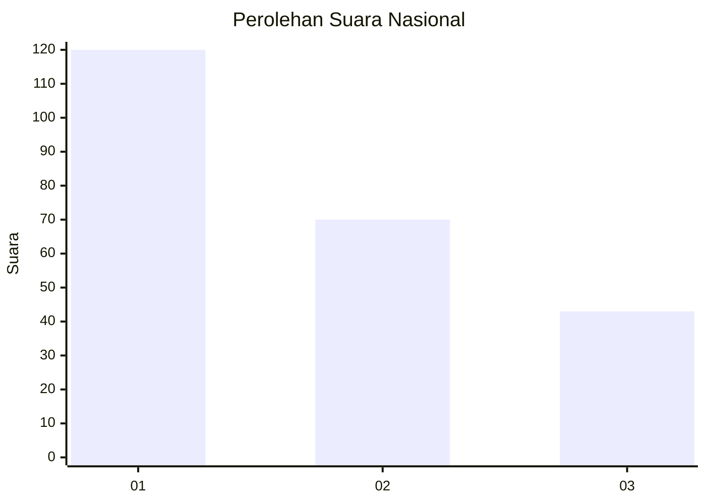
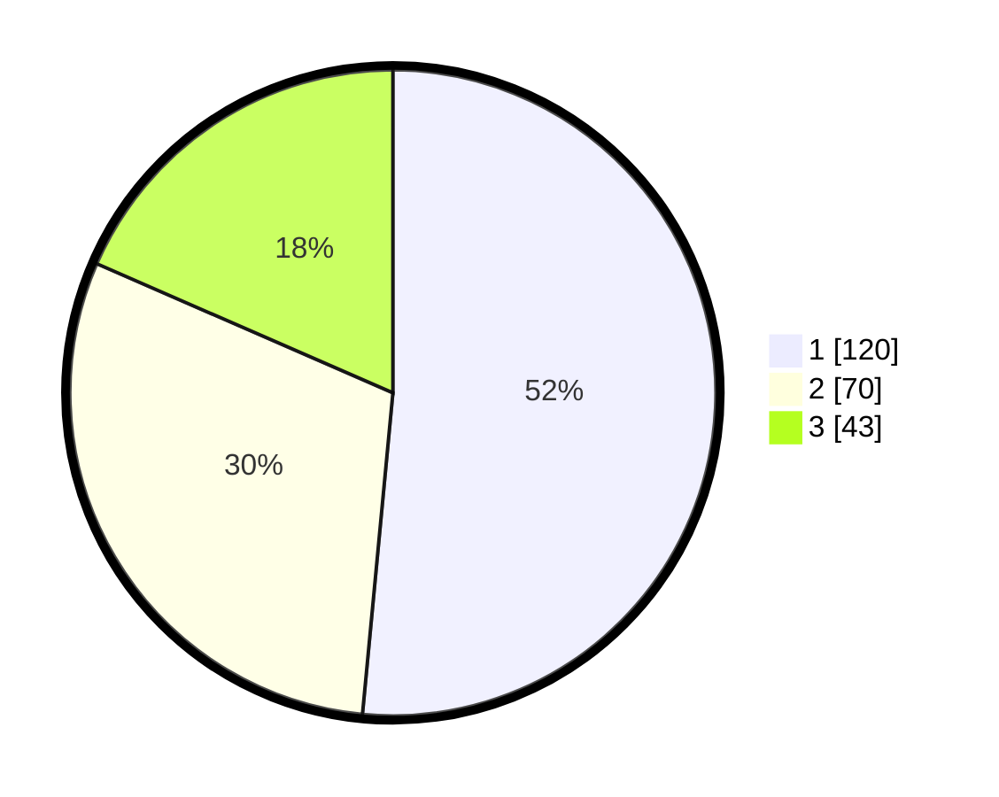

# Hasil

## Grafik

## Tabel

| No.    | Nama Paslon    | Suara | Suara (raw) | Persentase |
|:------ |:-------------- | -----:| -----------:| ----------:|
| 100025 | ANIES MUHAIMIN | 120   | [120][p-1]  | 51,50      |
| 100026 | PRABOWO GIBRAN | 70    | [70][p-2]   | 30,04      |
| 100027 | GANJAR MAHFUD  | 43    | [43][p-3]   | 18,45      |

[p-1]: https://github.com/gigit-pemilu/pemilu-2024/blob/main/pilpres/hitung-suara/sub/31-dki-jakarta/sub/75-jakarta-timur/sub/07-duren-sawit/sub/1001-duren-sawit/sub/041-tps/sub/paslon-1.txt
[p-2]: https://github.com/gigit-pemilu/pemilu-2024/blob/main/pilpres/hitung-suara/sub/31-dki-jakarta/sub/75-jakarta-timur/sub/07-duren-sawit/sub/1001-duren-sawit/sub/041-tps/sub/paslon-2.txt
[p-3]: https://github.com/gigit-pemilu/pemilu-2024/blob/main/pilpres/hitung-suara/sub/31-dki-jakarta/sub/75-jakarta-timur/sub/07-duren-sawit/sub/1001-duren-sawit/sub/041-tps/sub/paslon-3.txt

## Foto C Plano

https://sirekap-obj-formc.kpu.go.id/fcb8/pemilu/ppwp/31/75/07/10/01/3175071001041-20240214-223845--fd3a597c-3736-4916-93ac-c3dbbe01f89a.jpg

https://sirekap-obj-formc.kpu.go.id/fcb8/pemilu/ppwp/31/75/07/10/01/3175071001041-20240214-224047--19048937-f304-462a-8a1f-cd2e610aa704.jpg

https://sirekap-obj-formc.kpu.go.id/fcb8/pemilu/ppwp/31/75/07/10/01/3175071001041-20240214-224206--e7654897-c740-467d-ad4f-37e9bf9cc602.jpg

## Metadata

| Key        | Value               |
| ---------- | ------------------- |
| Time Stamp | 2024-02-21 08:00:00 |

