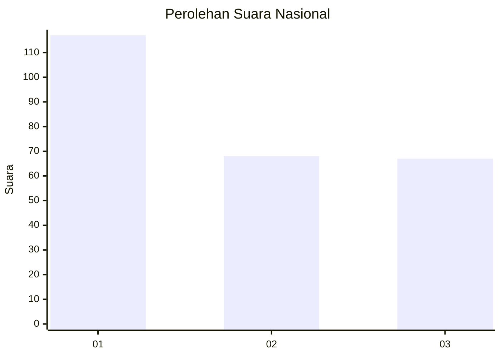
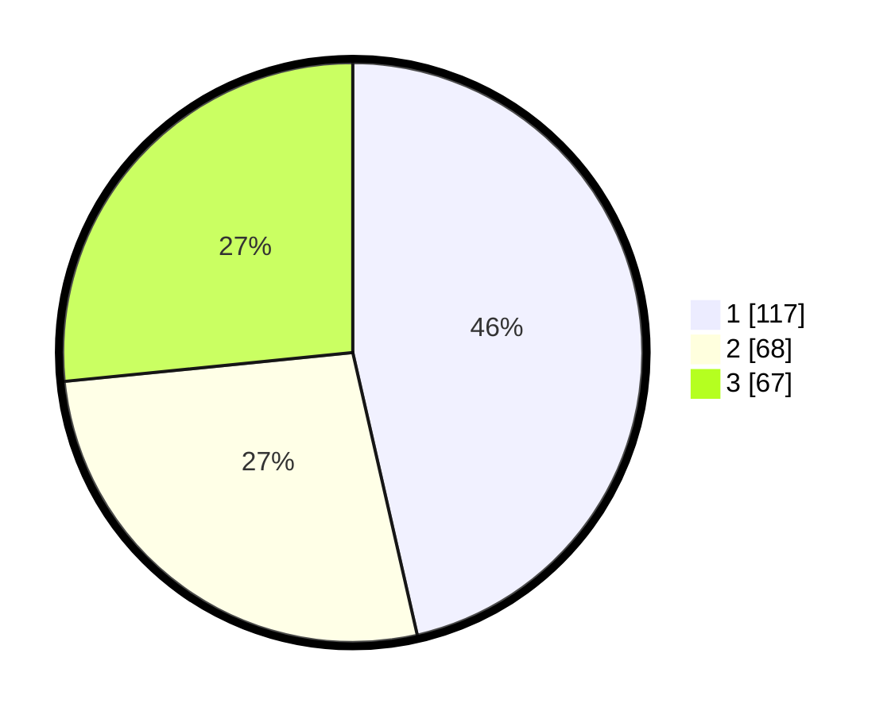

# Hasil

## Grafik

## Tabel

| No.    | Nama Paslon    | Suara | Suara (raw) | Persentase |
|:------ |:-------------- | -----:| -----------:| ----------:|
| 100025 | ANIES MUHAIMIN | 117   | [117][p-1]  | 46,43      |
| 100026 | PRABOWO GIBRAN | 68    | [68][p-2]   | 26,98      |
| 100027 | GANJAR MAHFUD  | 67    | [67][p-3]   | 26,59      |

[p-1]: https://github.com/gigit-pemilu/pemilu-2024/blob/main/pilpres/hitung-suara/sub/31-dki-jakarta/sub/75-jakarta-timur/sub/07-duren-sawit/sub/1001-duren-sawit/sub/045-tps/sub/paslon-1.txt
[p-2]: https://github.com/gigit-pemilu/pemilu-2024/blob/main/pilpres/hitung-suara/sub/31-dki-jakarta/sub/75-jakarta-timur/sub/07-duren-sawit/sub/1001-duren-sawit/sub/045-tps/sub/paslon-2.txt
[p-3]: https://github.com/gigit-pemilu/pemilu-2024/blob/main/pilpres/hitung-suara/sub/31-dki-jakarta/sub/75-jakarta-timur/sub/07-duren-sawit/sub/1001-duren-sawit/sub/045-tps/sub/paslon-3.txt

## Foto C Plano

https://sirekap-obj-formc.kpu.go.id/e378/pemilu/ppwp/31/75/07/10/01/3175071001045-20240214-211936--9a98f24d-3c2b-4e78-9385-a6ec94094d73.jpg

https://sirekap-obj-formc.kpu.go.id/e378/pemilu/ppwp/31/75/07/10/01/3175071001045-20240214-212040--e03b729f-3433-45f3-9740-b341ee1a861d.jpg

https://sirekap-obj-formc.kpu.go.id/e378/pemilu/ppwp/31/75/07/10/01/3175071001045-20240214-212122--4cd1090e-4a5c-4d03-a841-cedea64250fe.jpg

## Metadata

| Key        | Value               |
| ---------- | ------------------- |
| Time Stamp | 2024-02-15 20:30:46 |

