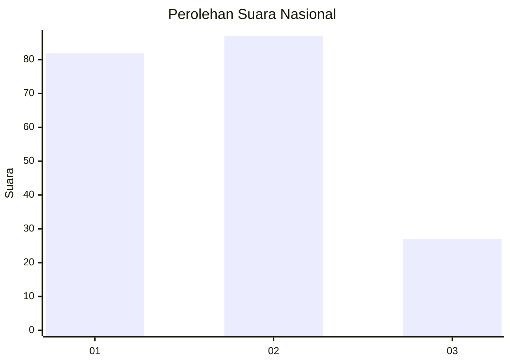
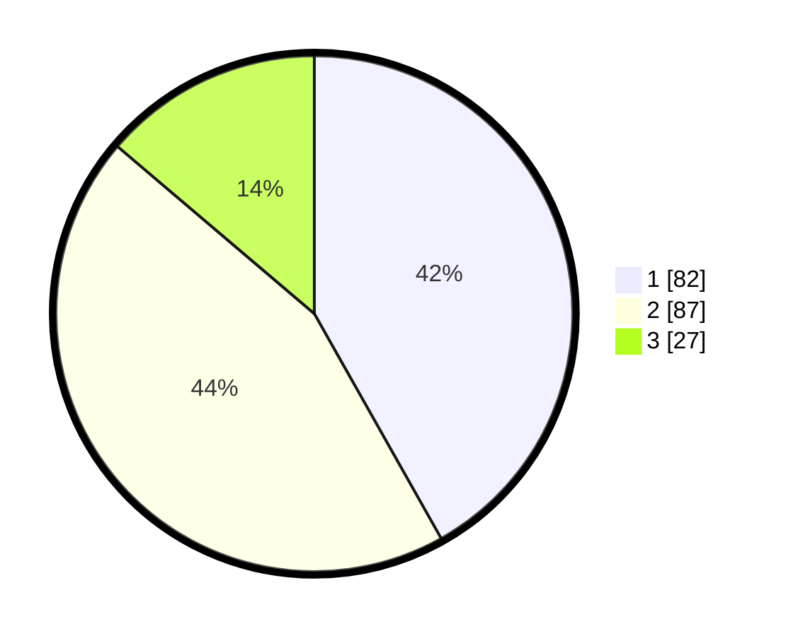

# Hasil

## Grafik

## Tabel

| No.    | Nama Paslon    | Suara | Suara (raw) | Persentase |
|:------ |:-------------- | -----:| -----------:| ----------:|
| 100025 | ANIES MUHAIMIN | 82    | [82][p-1]   | 41,84      |
| 100026 | PRABOWO GIBRAN | 87    | [87][p-2]   | 44,39      |
| 100027 | GANJAR MAHFUD  | 27    | [27][p-3]   | 13,78      |

[p-1]: https://github.com/gigit-pemilu/pemilu-2024/blob/main/pilpres/hitung-suara/sub/31-dki-jakarta/sub/75-jakarta-timur/sub/07-duren-sawit/sub/1001-duren-sawit/sub/060-tps/sub/paslon-1.txt
[p-2]: https://github.com/gigit-pemilu/pemilu-2024/blob/main/pilpres/hitung-suara/sub/31-dki-jakarta/sub/75-jakarta-timur/sub/07-duren-sawit/sub/1001-duren-sawit/sub/060-tps/sub/paslon-2.txt
[p-3]: https://github.com/gigit-pemilu/pemilu-2024/blob/main/pilpres/hitung-suara/sub/31-dki-jakarta/sub/75-jakarta-timur/sub/07-duren-sawit/sub/1001-duren-sawit/sub/060-tps/sub/paslon-3.txt

## Foto C Plano

https://sirekap-obj-formc.kpu.go.id/61f0/pemilu/ppwp/31/75/07/10/01/3175071001060-20240215-021403--6db2f6ab-3a06-4abe-8892-f2e4616f7a04.jpg

https://sirekap-obj-formc.kpu.go.id/61f0/pemilu/ppwp/31/75/07/10/01/3175071001060-20240215-021511--903005bf-878b-41ba-a001-8eb98a81097a.jpg

https://sirekap-obj-formc.kpu.go.id/61f0/pemilu/ppwp/31/75/07/10/01/3175071001060-20240215-021600--72666ac7-8588-407b-86f8-2146595c621c.jpg

## Metadata

| Key        | Value               |
| ---------- | ------------------- |
| Time Stamp | 2024-02-15 22:30:27 |

