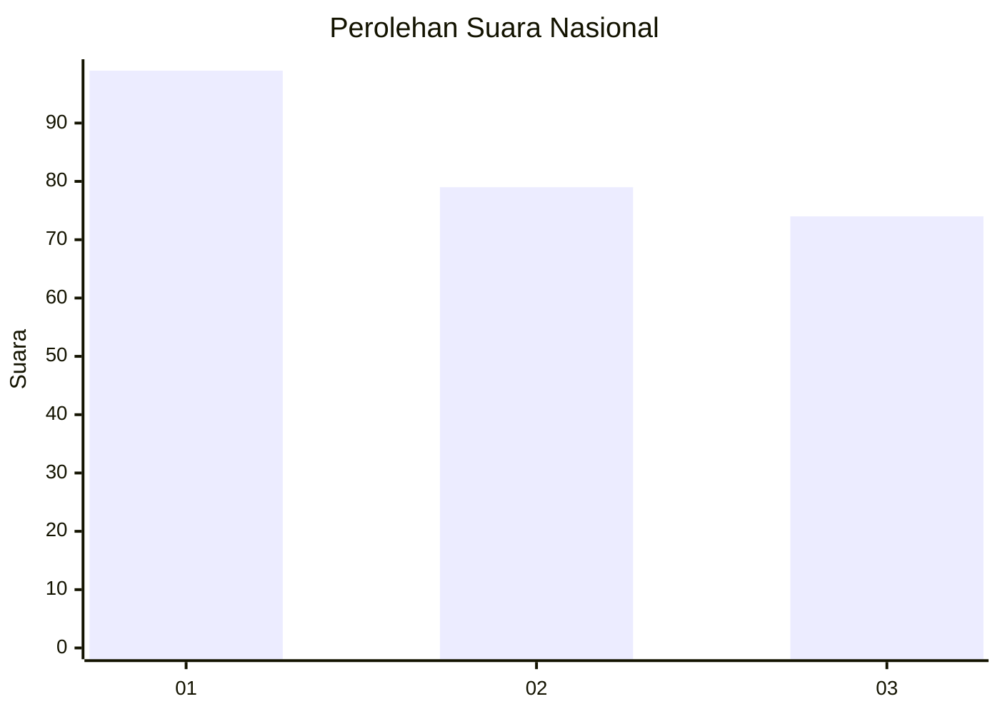
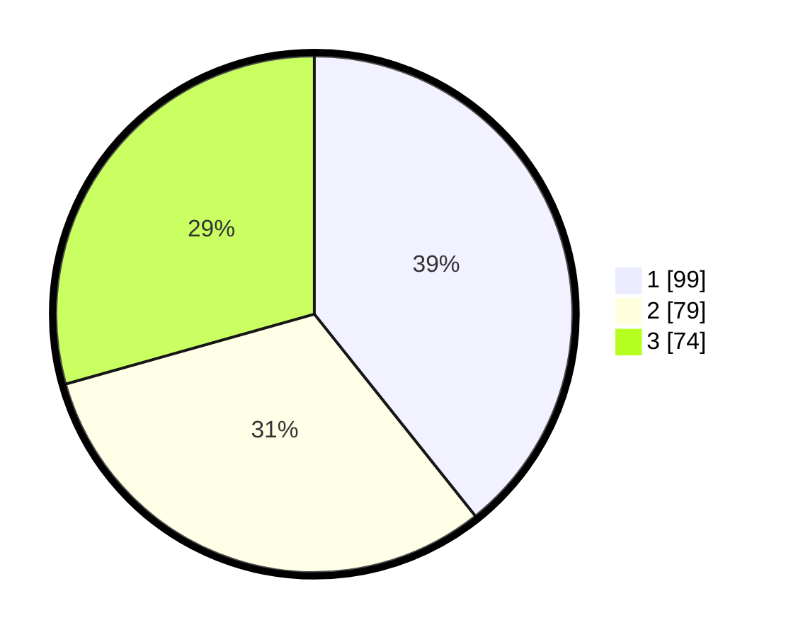

# Hasil

## Grafik

## Tabel

| No.    | Nama Paslon    | Suara | Suara (raw) | Persentase |
|:------ |:-------------- | -----:| -----------:| ----------:|
| 100025 | ANIES MUHAIMIN | 99    | [99][p-1]   | 39,29      |
| 100026 | PRABOWO GIBRAN | 79    | [79][p-2]   | 31,35      |
| 100027 | GANJAR MAHFUD  | 74    | [74][p-3]   | 29,37      |

[p-1]: https://github.com/gigit-pemilu/pemilu-2024/blob/main/pilpres/hitung-suara/sub/31-dki-jakarta/sub/75-jakarta-timur/sub/07-duren-sawit/sub/1001-duren-sawit/sub/075-tps/sub/paslon-1.txt
[p-2]: https://github.com/gigit-pemilu/pemilu-2024/blob/main/pilpres/hitung-suara/sub/31-dki-jakarta/sub/75-jakarta-timur/sub/07-duren-sawit/sub/1001-duren-sawit/sub/075-tps/sub/paslon-2.txt
[p-3]: https://github.com/gigit-pemilu/pemilu-2024/blob/main/pilpres/hitung-suara/sub/31-dki-jakarta/sub/75-jakarta-timur/sub/07-duren-sawit/sub/1001-duren-sawit/sub/075-tps/sub/paslon-3.txt

## Foto C Plano

https://sirekap-obj-formc.kpu.go.id/1e9c/pemilu/ppwp/31/75/07/10/01/3175071001075-20240215-003831--02cb6de5-5615-48d4-bf68-b234998719b3.jpg

https://sirekap-obj-formc.kpu.go.id/1e9c/pemilu/ppwp/31/75/07/10/01/3175071001075-20240215-003917--76473aab-6367-408f-8878-521226b3d3e1.jpg

https://sirekap-obj-formc.kpu.go.id/1e9c/pemilu/ppwp/31/75/07/10/01/3175071001075-20240215-004000--3a3cbd32-0d90-4c15-88d4-c26711a1b2a0.jpg

## Metadata

| Key        | Value               |
| ---------- | ------------------- |
| Time Stamp | 2024-02-15 22:30:27 |

