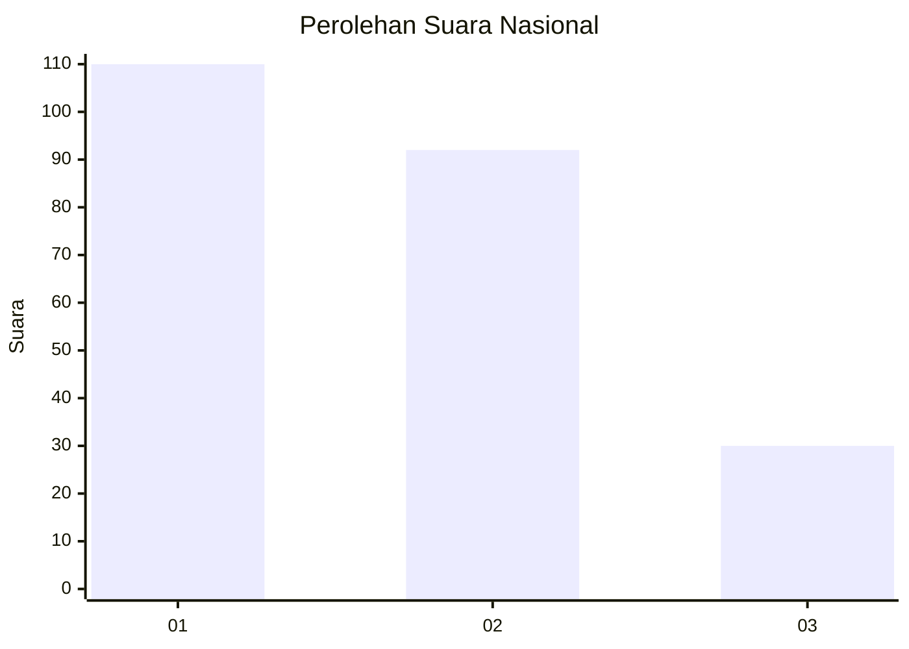
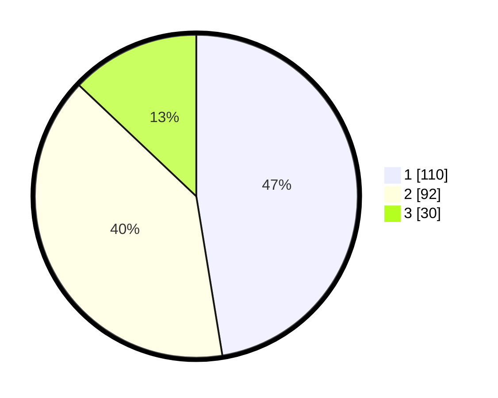

# Hasil

## Grafik

## Tabel

| No.    | Nama Paslon    | Suara | Suara (raw) | Persentase |
|:------ |:-------------- | -----:| -----------:| ----------:|
| 100025 | ANIES MUHAIMIN | 110   | [110][p-1]  | 47,41      |
| 100026 | PRABOWO GIBRAN | 92    | [92][p-2]   | 39,66      |
| 100027 | GANJAR MAHFUD  | 30    | [30][p-3]   | 12,93      |

[p-1]: https://github.com/gigit-pemilu/pemilu-2024/blob/main/pilpres/hitung-suara/sub/31-dki-jakarta/sub/75-jakarta-timur/sub/07-duren-sawit/sub/1001-duren-sawit/sub/085-tps/sub/paslon-1.txt
[p-2]: https://github.com/gigit-pemilu/pemilu-2024/blob/main/pilpres/hitung-suara/sub/31-dki-jakarta/sub/75-jakarta-timur/sub/07-duren-sawit/sub/1001-duren-sawit/sub/085-tps/sub/paslon-2.txt
[p-3]: https://github.com/gigit-pemilu/pemilu-2024/blob/main/pilpres/hitung-suara/sub/31-dki-jakarta/sub/75-jakarta-timur/sub/07-duren-sawit/sub/1001-duren-sawit/sub/085-tps/sub/paslon-3.txt

## Foto C Plano

https://sirekap-obj-formc.kpu.go.id/2c65/pemilu/ppwp/31/75/07/10/01/3175071001085-20240214-233822--ba168082-7ad0-4aa1-ac86-a00fa8ebd5e0.jpg

https://sirekap-obj-formc.kpu.go.id/2c65/pemilu/ppwp/31/75/07/10/01/3175071001085-20240215-021023--6d474a06-9003-4cd3-ab18-ef19bcb31896.jpg

https://sirekap-obj-formc.kpu.go.id/2c65/pemilu/ppwp/31/75/07/10/01/3175071001085-20240214-234413--8b3366d1-f808-4ae0-a5db-8fe7312d83dd.jpg

## Metadata

| Key        | Value               |
| ---------- | ------------------- |
| Time Stamp | 2024-02-15 22:30:27 |

