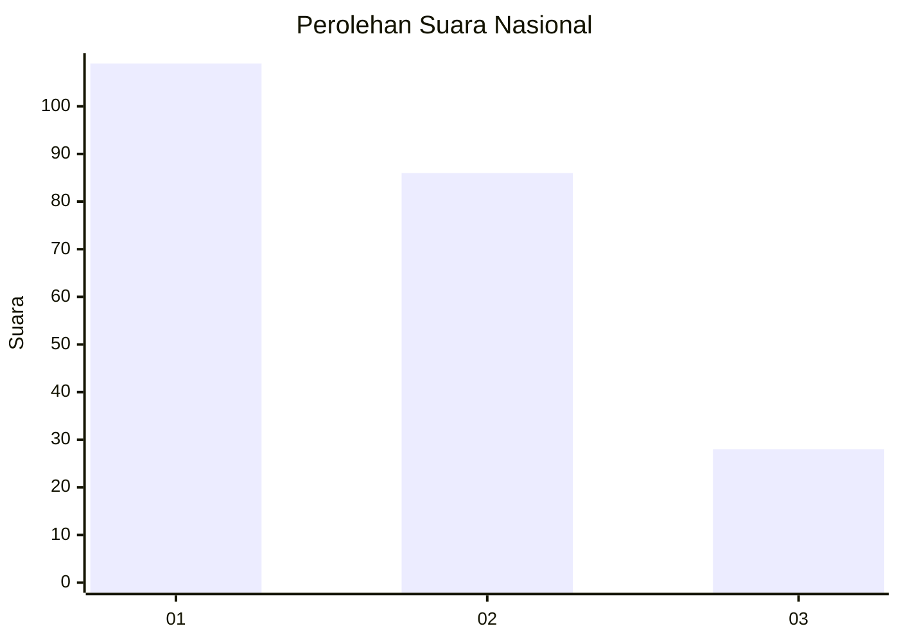
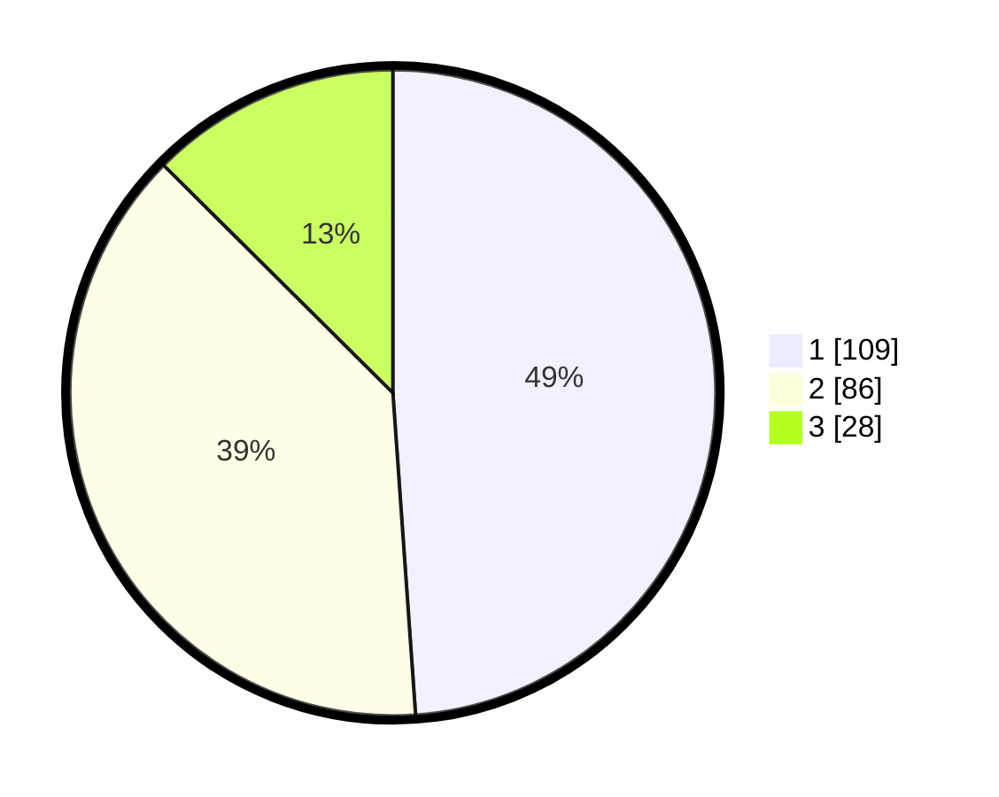

# Hasil

## Grafik

## Tabel

| No.    | Nama Paslon    | Suara | Suara (raw) | Persentase |
|:------ |:-------------- | -----:| -----------:| ----------:|
| 100025 | ANIES MUHAIMIN | 109   | [109][p-1]  | 48,88      |
| 100026 | PRABOWO GIBRAN | 86    | [86][p-2]   | 38,57      |
| 100027 | GANJAR MAHFUD  | 28    | [28][p-3]   | 12,56      |

[p-1]: https://github.com/gigit-pemilu/pemilu-2024/blob/main/pilpres/hitung-suara/sub/31-dki-jakarta/sub/75-jakarta-timur/sub/07-duren-sawit/sub/1001-duren-sawit/sub/099-tps/sub/paslon-1.txt
[p-2]: https://github.com/gigit-pemilu/pemilu-2024/blob/main/pilpres/hitung-suara/sub/31-dki-jakarta/sub/75-jakarta-timur/sub/07-duren-sawit/sub/1001-duren-sawit/sub/099-tps/sub/paslon-2.txt
[p-3]: https://github.com/gigit-pemilu/pemilu-2024/blob/main/pilpres/hitung-suara/sub/31-dki-jakarta/sub/75-jakarta-timur/sub/07-duren-sawit/sub/1001-duren-sawit/sub/099-tps/sub/paslon-3.txt

## Foto C Plano

https://sirekap-obj-formc.kpu.go.id/0188/pemilu/ppwp/31/75/07/10/01/3175071001099-20240214-195615--c92b9537-fe7a-4a3a-b35d-dcf61066726a.jpg

https://sirekap-obj-formc.kpu.go.id/0188/pemilu/ppwp/31/75/07/10/01/3175071001099-20240214-195439--53e05644-1c77-4b71-afb9-995f4c902cc2.jpg

https://sirekap-obj-formc.kpu.go.id/0188/pemilu/ppwp/31/75/07/10/01/3175071001099-20240214-195517--3a2cfa39-1a98-4c7b-8aa4-4c0e552b5915.jpg

## Metadata

| Key        | Value               |
| ---------- | ------------------- |
| Time Stamp | 2024-02-21 09:00:00 |

