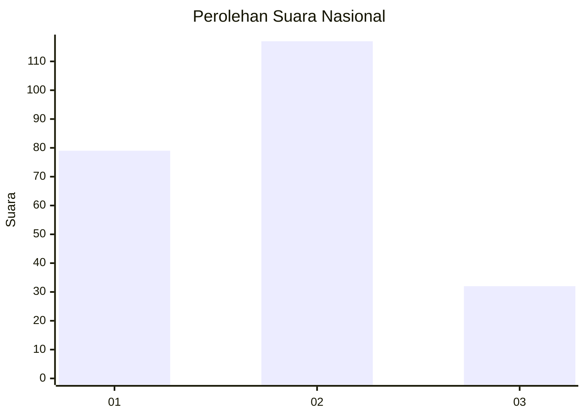
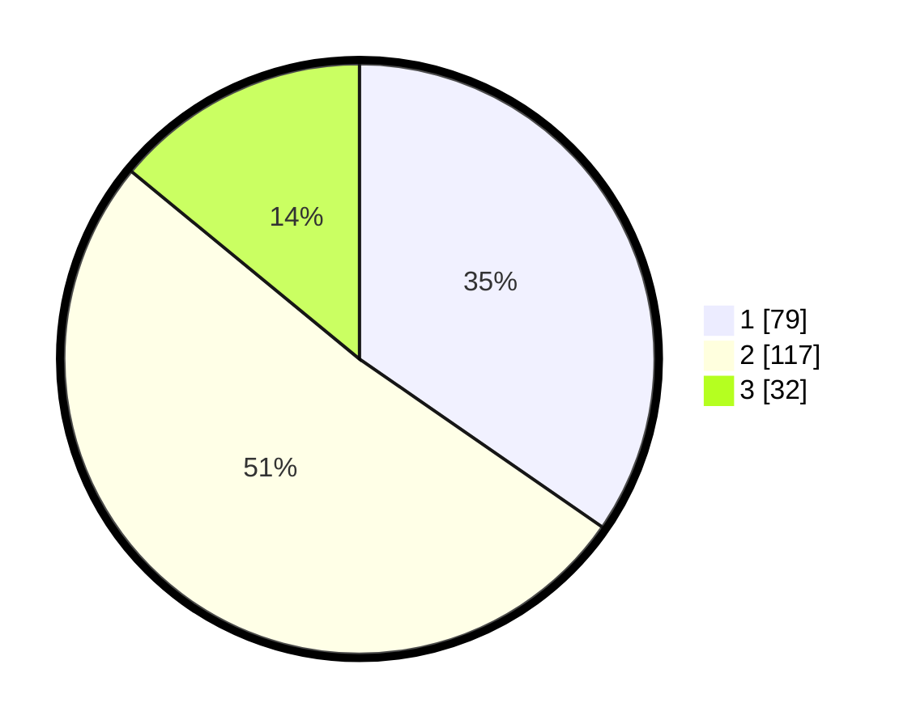

# Hasil

## Grafik

## Tabel

| No.    | Nama Paslon    | Suara | Suara (raw) | Persentase |
|:------ |:-------------- | -----:| -----------:| ----------:|
| 100025 | ANIES MUHAIMIN | 79    | [79][p-1]   | 34,65      |
| 100026 | PRABOWO GIBRAN | 117   | [117][p-2]  | 51,32      |
| 100027 | GANJAR MAHFUD  | 32    | [32][p-3]   | 14,04      |

[p-1]: https://github.com/gigit-pemilu/pemilu-2024/blob/main/pilpres/hitung-suara/sub/31-dki-jakarta/sub/75-jakarta-timur/sub/07-duren-sawit/sub/1001-duren-sawit/sub/141-tps/sub/paslon-1.txt
[p-2]: https://github.com/gigit-pemilu/pemilu-2024/blob/main/pilpres/hitung-suara/sub/31-dki-jakarta/sub/75-jakarta-timur/sub/07-duren-sawit/sub/1001-duren-sawit/sub/141-tps/sub/paslon-2.txt
[p-3]: https://github.com/gigit-pemilu/pemilu-2024/blob/main/pilpres/hitung-suara/sub/31-dki-jakarta/sub/75-jakarta-timur/sub/07-duren-sawit/sub/1001-duren-sawit/sub/141-tps/sub/paslon-3.txt

## Foto C Plano

https://sirekap-obj-formc.kpu.go.id/72cc/pemilu/ppwp/31/75/07/10/01/3175071001141-20240214-224026--756ef1e8-f80d-4b4e-aad4-c71122d293aa.jpg

https://sirekap-obj-formc.kpu.go.id/72cc/pemilu/ppwp/31/75/07/10/01/3175071001141-20240214-224053--bcd22e89-1070-4fae-b6c3-4a238e755efb.jpg

https://sirekap-obj-formc.kpu.go.id/72cc/pemilu/ppwp/31/75/07/10/01/3175071001141-20240214-224139--91dd32c1-81e0-4353-8466-a772f810427c.jpg

## Metadata

| Key        | Value               |
| ---------- | ------------------- |
| Time Stamp | 2024-02-21 09:00:00 |

