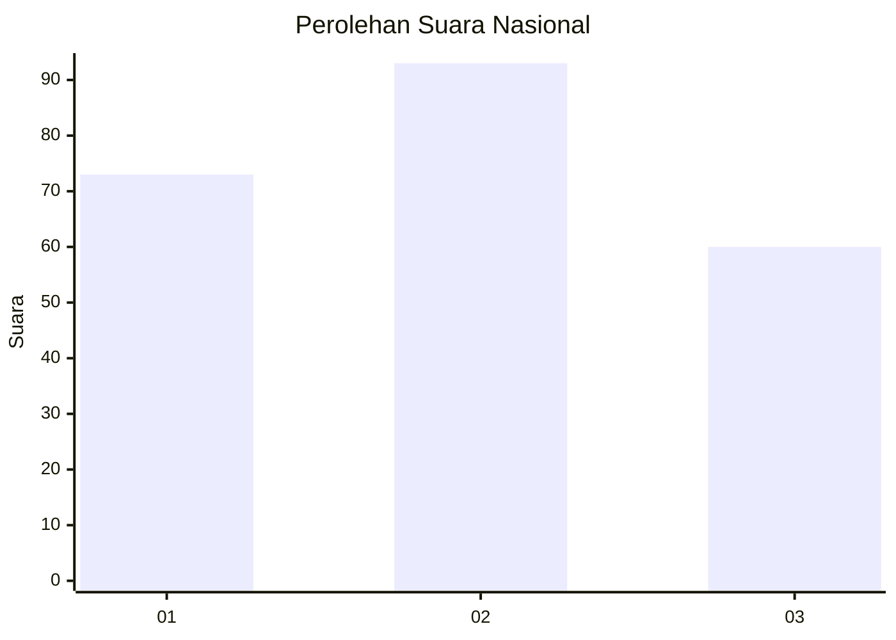
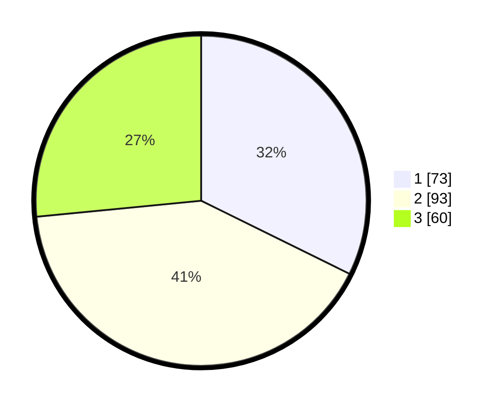

# Hasil

## Grafik

## Tabel

| No.    | Nama Paslon    | Suara | Suara (raw) | Persentase |
|:------ |:-------------- | -----:| -----------:| ----------:|
| 100025 | ANIES MUHAIMIN | 73    | [73][p-1]   | 32,30      |
| 100026 | PRABOWO GIBRAN | 93    | [93][p-2]   | 41,15      |
| 100027 | GANJAR MAHFUD  | 60    | [60][p-3]   | 26,55      |

[p-1]: https://github.com/gigit-pemilu/pemilu-2024/blob/main/pilpres/hitung-suara/sub/31-dki-jakarta/sub/75-jakarta-timur/sub/07-duren-sawit/sub/1001-duren-sawit/sub/143-tps/sub/paslon-1.txt
[p-2]: https://github.com/gigit-pemilu/pemilu-2024/blob/main/pilpres/hitung-suara/sub/31-dki-jakarta/sub/75-jakarta-timur/sub/07-duren-sawit/sub/1001-duren-sawit/sub/143-tps/sub/paslon-2.txt
[p-3]: https://github.com/gigit-pemilu/pemilu-2024/blob/main/pilpres/hitung-suara/sub/31-dki-jakarta/sub/75-jakarta-timur/sub/07-duren-sawit/sub/1001-duren-sawit/sub/143-tps/sub/paslon-3.txt

## Foto C Plano

https://sirekap-obj-formc.kpu.go.id/0338/pemilu/ppwp/31/75/07/10/01/3175071001143-20240216-004551--1e6c1be7-a59e-4cfc-8078-9611820d6d8a.jpg

https://sirekap-obj-formc.kpu.go.id/0338/pemilu/ppwp/31/75/07/10/01/3175071001143-20240215-231126--f7d7517b-f6c6-4d81-afcb-67847993a794.jpg

https://sirekap-obj-formc.kpu.go.id/0338/pemilu/ppwp/31/75/07/10/01/3175071001143-20240214-223400--d384628d-fd91-4fd7-805c-2e5ae3ec71c5.jpg

## Metadata

| Key        | Value               |
| ---------- | ------------------- |
| Time Stamp | 2024-02-16 16:25:10 |

