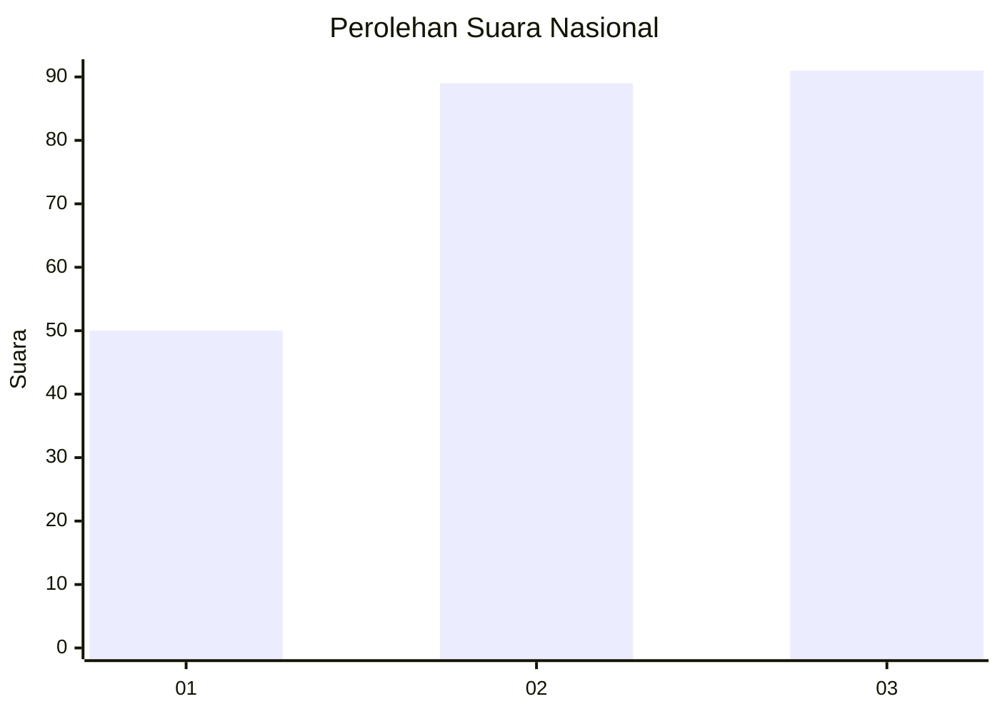
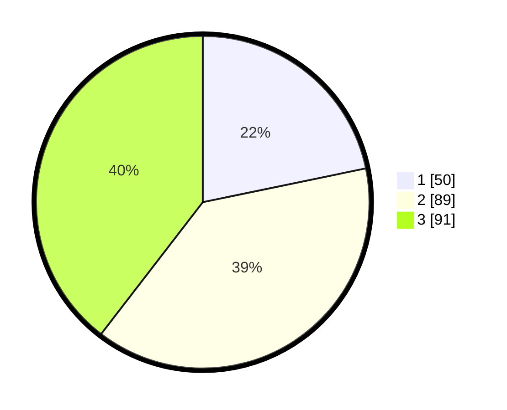

# Hasil

## Grafik

## Tabel

| No.    | Nama Paslon    | Suara | Suara (raw) | Persentase |
|:------ |:-------------- | -----:| -----------:| ----------:|
| 100025 | ANIES MUHAIMIN | 50    | [50][p-1]   | 21,74      |
| 100026 | PRABOWO GIBRAN | 89    | [89][p-2]   | 38,70      |
| 100027 | GANJAR MAHFUD  | 91    | [91][p-3]   | 39,57      |

[p-1]: https://github.com/gigit-pemilu/pemilu-2024/blob/main/pilpres/hitung-suara/sub/31-dki-jakarta/sub/75-jakarta-timur/sub/07-duren-sawit/sub/1001-duren-sawit/sub/146-tps/sub/paslon-1.txt
[p-2]: https://github.com/gigit-pemilu/pemilu-2024/blob/main/pilpres/hitung-suara/sub/31-dki-jakarta/sub/75-jakarta-timur/sub/07-duren-sawit/sub/1001-duren-sawit/sub/146-tps/sub/paslon-2.txt
[p-3]: https://github.com/gigit-pemilu/pemilu-2024/blob/main/pilpres/hitung-suara/sub/31-dki-jakarta/sub/75-jakarta-timur/sub/07-duren-sawit/sub/1001-duren-sawit/sub/146-tps/sub/paslon-3.txt

## Foto C Plano

https://sirekap-obj-formc.kpu.go.id/208f/pemilu/ppwp/31/75/07/10/01/3175071001146-20240214-230113--8a6104e6-229d-44b7-b21e-227dfe2d82e3.jpg

https://sirekap-obj-formc.kpu.go.id/208f/pemilu/ppwp/31/75/07/10/01/3175071001146-20240214-230141--b84baa99-b44b-4598-9626-f299d087ea46.jpg

https://sirekap-obj-formc.kpu.go.id/208f/pemilu/ppwp/31/75/07/10/01/3175071001146-20240214-230207--426912a4-58b1-4d44-85f8-a584b0e31451.jpg

## Metadata

| Key        | Value               |
| ---------- | ------------------- |
| Time Stamp | 2024-02-15 22:40:13 |

