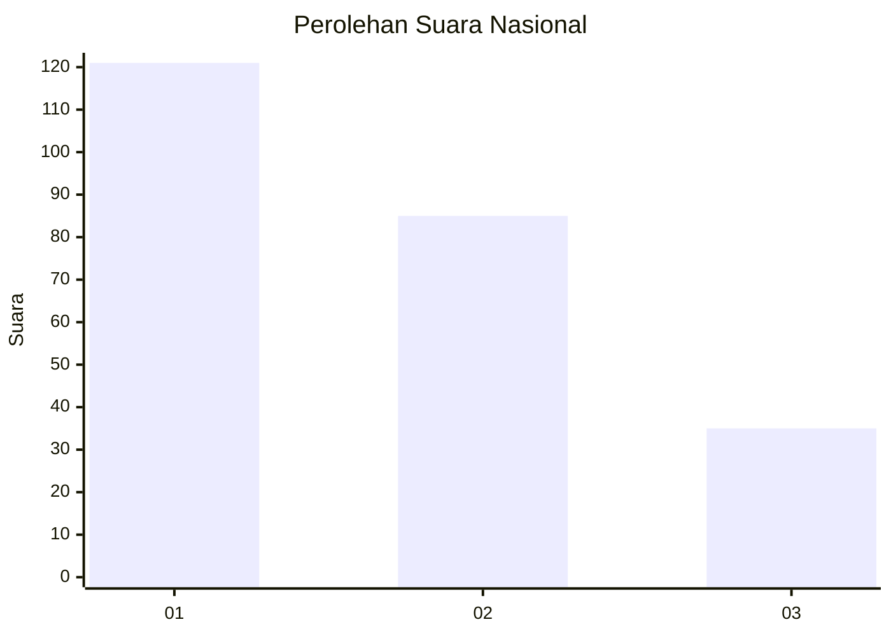
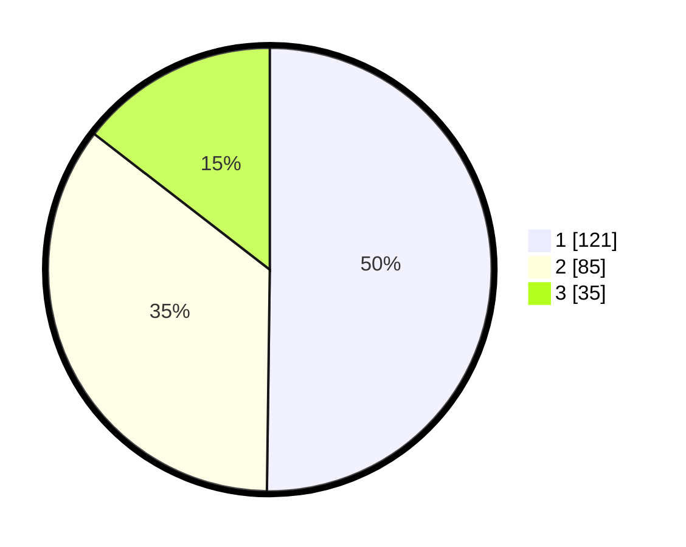

# Hasil

## Grafik

## Tabel

| No.    | Nama Paslon    | Suara | Suara (raw) | Persentase |
|:------ |:-------------- | -----:| -----------:| ----------:|
| 100025 | ANIES MUHAIMIN | 121   | [121][p-1]  | 50,21      |
| 100026 | PRABOWO GIBRAN | 85    | [85][p-2]   | 35,27      |
| 100027 | GANJAR MAHFUD  | 35    | [35][p-3]   | 14,52      |

[p-1]: https://github.com/gigit-pemilu/pemilu-2024/blob/main/pilpres/hitung-suara/sub/31-dki-jakarta/sub/75-jakarta-timur/sub/07-duren-sawit/sub/1001-duren-sawit/sub/149-tps/sub/paslon-1.txt
[p-2]: https://github.com/gigit-pemilu/pemilu-2024/blob/main/pilpres/hitung-suara/sub/31-dki-jakarta/sub/75-jakarta-timur/sub/07-duren-sawit/sub/1001-duren-sawit/sub/149-tps/sub/paslon-2.txt
[p-3]: https://github.com/gigit-pemilu/pemilu-2024/blob/main/pilpres/hitung-suara/sub/31-dki-jakarta/sub/75-jakarta-timur/sub/07-duren-sawit/sub/1001-duren-sawit/sub/149-tps/sub/paslon-3.txt

## Foto C Plano

https://sirekap-obj-formc.kpu.go.id/1bb3/pemilu/ppwp/31/75/07/10/01/3175071001149-20240215-004431--16622226-0ce0-49ee-9355-9b380ab5a451.jpg

https://sirekap-obj-formc.kpu.go.id/1bb3/pemilu/ppwp/31/75/07/10/01/3175071001149-20240215-004509--6af7f94e-b0ef-47a4-89b8-13c77bc655f8.jpg

https://sirekap-obj-formc.kpu.go.id/1bb3/pemilu/ppwp/31/75/07/10/01/3175071001149-20240215-004558--64d4c44f-5666-4319-bab3-7637075690da.jpg

## Metadata

| Key        | Value               |
| ---------- | ------------------- |
| Time Stamp | 2024-02-21 09:00:00 |

