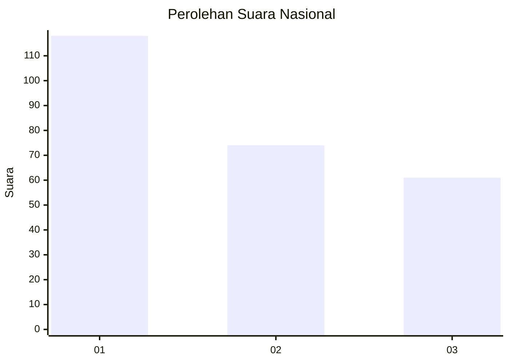
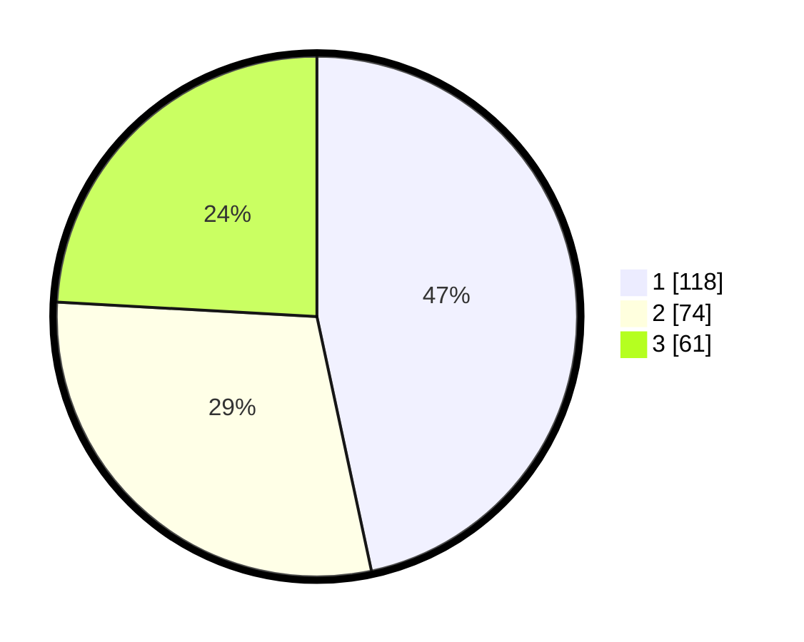

# Hasil

## Grafik

## Tabel

| No.    | Nama Paslon    | Suara | Suara (raw) | Persentase |
|:------ |:-------------- | -----:| -----------:| ----------:|
| 100025 | ANIES MUHAIMIN | 118   | [118][p-1]  | 46,64      |
| 100026 | PRABOWO GIBRAN | 74    | [74][p-2]   | 29,25      |
| 100027 | GANJAR MAHFUD  | 61    | [61][p-3]   | 24,11      |

[p-1]: https://github.com/gigit-pemilu/pemilu-2024/blob/main/pilpres/hitung-suara/sub/31-dki-jakarta/sub/75-jakarta-timur/sub/07-duren-sawit/sub/1001-duren-sawit/sub/150-tps/sub/paslon-1.txt
[p-2]: https://github.com/gigit-pemilu/pemilu-2024/blob/main/pilpres/hitung-suara/sub/31-dki-jakarta/sub/75-jakarta-timur/sub/07-duren-sawit/sub/1001-duren-sawit/sub/150-tps/sub/paslon-2.txt
[p-3]: https://github.com/gigit-pemilu/pemilu-2024/blob/main/pilpres/hitung-suara/sub/31-dki-jakarta/sub/75-jakarta-timur/sub/07-duren-sawit/sub/1001-duren-sawit/sub/150-tps/sub/paslon-3.txt

## Foto C Plano

https://sirekap-obj-formc.kpu.go.id/3a44/pemilu/ppwp/31/75/07/10/01/3175071001150-20240215-020822--962067db-67a9-40fa-bb3e-46ff09783309.jpg

https://sirekap-obj-formc.kpu.go.id/3a44/pemilu/ppwp/31/75/07/10/01/3175071001150-20240215-020918--6f5290c1-d1ba-4222-ab3e-cfa66db67088.jpg

https://sirekap-obj-formc.kpu.go.id/3a44/pemilu/ppwp/31/75/07/10/01/3175071001150-20240215-021006--8f5463d7-97ac-498e-869b-eeba3cd54419.jpg

## Metadata

| Key        | Value               |
| ---------- | ------------------- |
| Time Stamp | 2024-02-15 22:40:13 |

