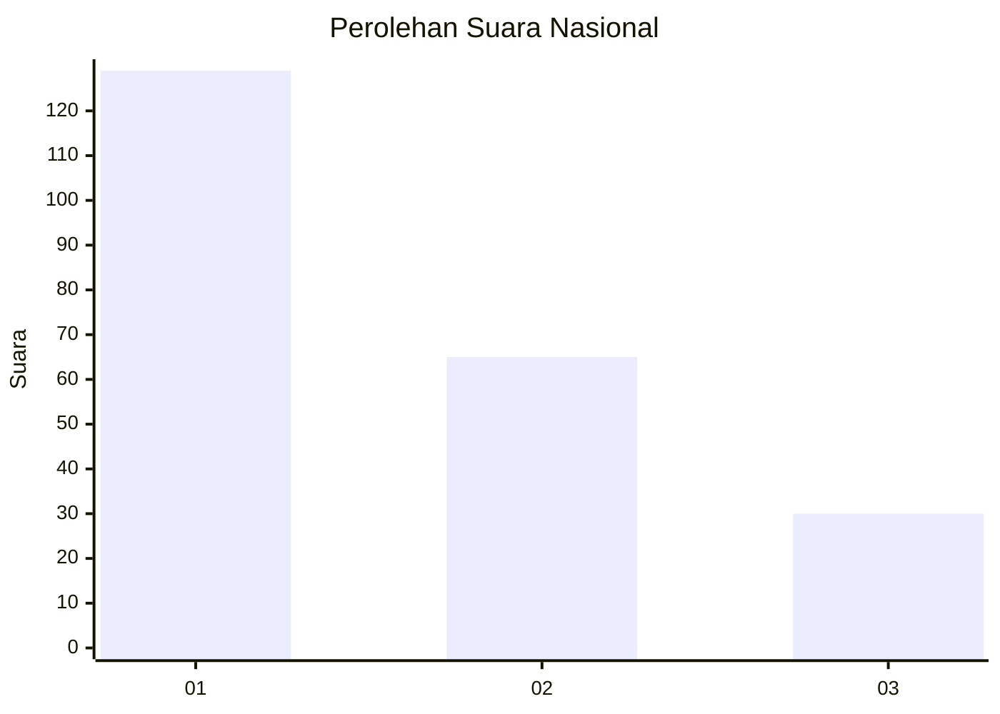
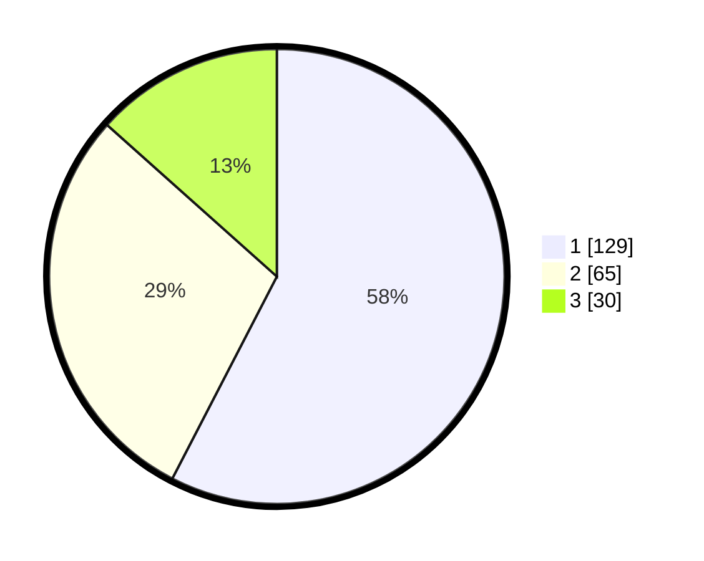

# Hasil

## Grafik

## Tabel

| No.    | Nama Paslon    | Suara | Suara (raw) | Persentase |
|:------ |:-------------- | -----:| -----------:| ----------:|
| 100025 | ANIES MUHAIMIN | 129   | [129][p-1]  | 57,59      |
| 100026 | PRABOWO GIBRAN | 65    | [65][p-2]   | 29,02      |
| 100027 | GANJAR MAHFUD  | 30    | [30][p-3]   | 13,39      |

[p-1]: https://github.com/gigit-pemilu/pemilu-2024/blob/main/pilpres/hitung-suara/sub/31-dki-jakarta/sub/75-jakarta-timur/sub/07-duren-sawit/sub/1001-duren-sawit/sub/156-tps/sub/paslon-1.txt
[p-2]: https://github.com/gigit-pemilu/pemilu-2024/blob/main/pilpres/hitung-suara/sub/31-dki-jakarta/sub/75-jakarta-timur/sub/07-duren-sawit/sub/1001-duren-sawit/sub/156-tps/sub/paslon-2.txt
[p-3]: https://github.com/gigit-pemilu/pemilu-2024/blob/main/pilpres/hitung-suara/sub/31-dki-jakarta/sub/75-jakarta-timur/sub/07-duren-sawit/sub/1001-duren-sawit/sub/156-tps/sub/paslon-3.txt

## Foto C Plano

https://sirekap-obj-formc.kpu.go.id/b7c2/pemilu/ppwp/31/75/07/10/01/3175071001156-20240214-193019--d23a217a-bc05-4b99-8154-5b32d1d34fe6.jpg

https://sirekap-obj-formc.kpu.go.id/b7c2/pemilu/ppwp/31/75/07/10/01/3175071001156-20240214-193339--27ec1864-e815-4328-a768-8914f059d484.jpg

https://sirekap-obj-formc.kpu.go.id/b7c2/pemilu/ppwp/31/75/07/10/01/3175071001156-20240214-193530--76b7b550-34f1-4486-96d3-101a5e6c10d0.jpg

## Metadata

| Key        | Value               |
| ---------- | ------------------- |
| Time Stamp | 2024-02-21 09:00:00 |

