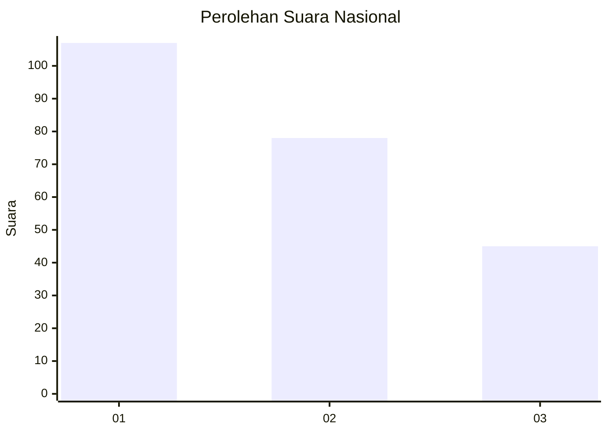
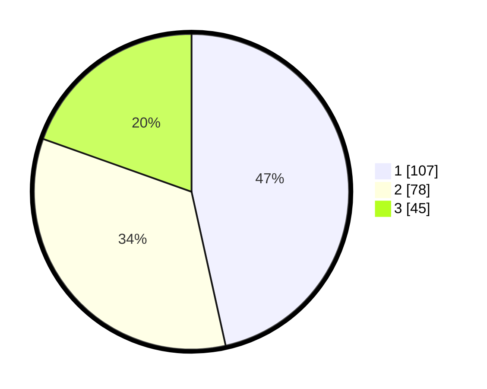

# Hasil

## Grafik

## Tabel

| No.    | Nama Paslon    | Suara | Suara (raw) | Persentase |
|:------ |:-------------- | -----:| -----------:| ----------:|
| 100025 | ANIES MUHAIMIN | 107   | [107][p-1]  | 46,52      |
| 100026 | PRABOWO GIBRAN | 78    | [78][p-2]   | 33,91      |
| 100027 | GANJAR MAHFUD  | 45    | [45][p-3]   | 19,57      |

[p-1]: https://github.com/gigit-pemilu/pemilu-2024/blob/main/pilpres/hitung-suara/sub/31-dki-jakarta/sub/75-jakarta-timur/sub/07-duren-sawit/sub/1001-duren-sawit/sub/179-tps/sub/paslon-1.txt
[p-2]: https://github.com/gigit-pemilu/pemilu-2024/blob/main/pilpres/hitung-suara/sub/31-dki-jakarta/sub/75-jakarta-timur/sub/07-duren-sawit/sub/1001-duren-sawit/sub/179-tps/sub/paslon-2.txt
[p-3]: https://github.com/gigit-pemilu/pemilu-2024/blob/main/pilpres/hitung-suara/sub/31-dki-jakarta/sub/75-jakarta-timur/sub/07-duren-sawit/sub/1001-duren-sawit/sub/179-tps/sub/paslon-3.txt

## Foto C Plano

https://sirekap-obj-formc.kpu.go.id/c175/pemilu/ppwp/31/75/07/10/01/3175071001179-20240215-003030--4d25826a-1f82-4aac-b703-b5979523df06.jpg

https://sirekap-obj-formc.kpu.go.id/c175/pemilu/ppwp/31/75/07/10/01/3175071001179-20240214-234711--49411bd2-013c-41d5-a170-795b8a664196.jpg

https://sirekap-obj-formc.kpu.go.id/c175/pemilu/ppwp/31/75/07/10/01/3175071001179-20240214-235010--5e45070a-32a4-47fa-b055-c689297d7fac.jpg

## Metadata

| Key        | Value               |
| ---------- | ------------------- |
| Time Stamp | 2024-02-21 09:00:00 |

