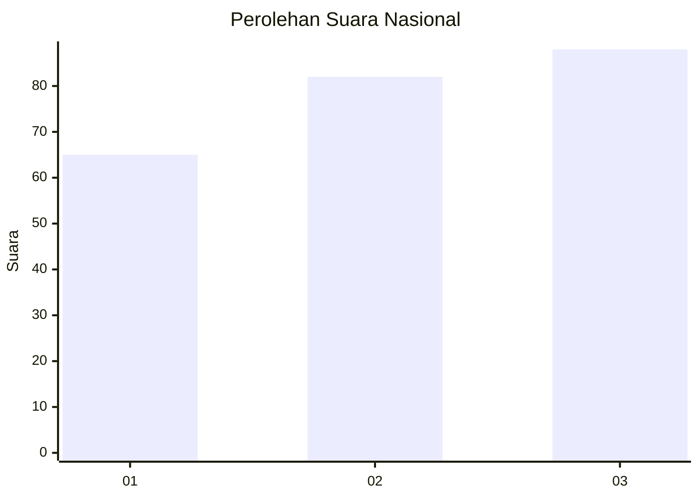
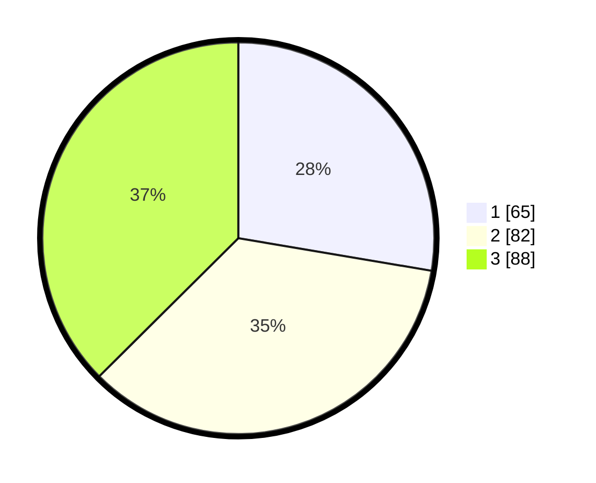

# Hasil

## Grafik

## Tabel

| No.    | Nama Paslon    | Suara | Suara (raw) | Persentase |
|:------ |:-------------- | -----:| -----------:| ----------:|
| 100025 | ANIES MUHAIMIN | 65    | [65][p-1]   | 27,66      |
| 100026 | PRABOWO GIBRAN | 82    | [82][p-2]   | 34,89      |
| 100027 | GANJAR MAHFUD  | 88    | [88][p-3]   | 37,45      |

[p-1]: https://github.com/gigit-pemilu/pemilu-2024/blob/main/pilpres/hitung-suara/sub/31-dki-jakarta/sub/75-jakarta-timur/sub/07-duren-sawit/sub/1001-duren-sawit/sub/197-tps/sub/paslon-1.txt
[p-2]: https://github.com/gigit-pemilu/pemilu-2024/blob/main/pilpres/hitung-suara/sub/31-dki-jakarta/sub/75-jakarta-timur/sub/07-duren-sawit/sub/1001-duren-sawit/sub/197-tps/sub/paslon-2.txt
[p-3]: https://github.com/gigit-pemilu/pemilu-2024/blob/main/pilpres/hitung-suara/sub/31-dki-jakarta/sub/75-jakarta-timur/sub/07-duren-sawit/sub/1001-duren-sawit/sub/197-tps/sub/paslon-3.txt

## Foto C Plano

https://sirekap-obj-formc.kpu.go.id/e17b/pemilu/ppwp/31/75/07/10/01/3175071001197-20240215-050252--c26a4893-5013-4201-980c-7fbfb0ca7580.jpg

https://sirekap-obj-formc.kpu.go.id/e17b/pemilu/ppwp/31/75/07/10/01/3175071001197-20240215-050257--5fac9f32-5c16-4bfb-a082-a03c424ef702.jpg

https://sirekap-obj-formc.kpu.go.id/e17b/pemilu/ppwp/31/75/07/10/01/3175071001197-20240215-050303--7bb08d44-ff5d-4dff-ac77-a68215758b08.jpg

## Metadata

| Key        | Value               |
| ---------- | ------------------- |
| Time Stamp | 2024-02-15 23:29:50 |

