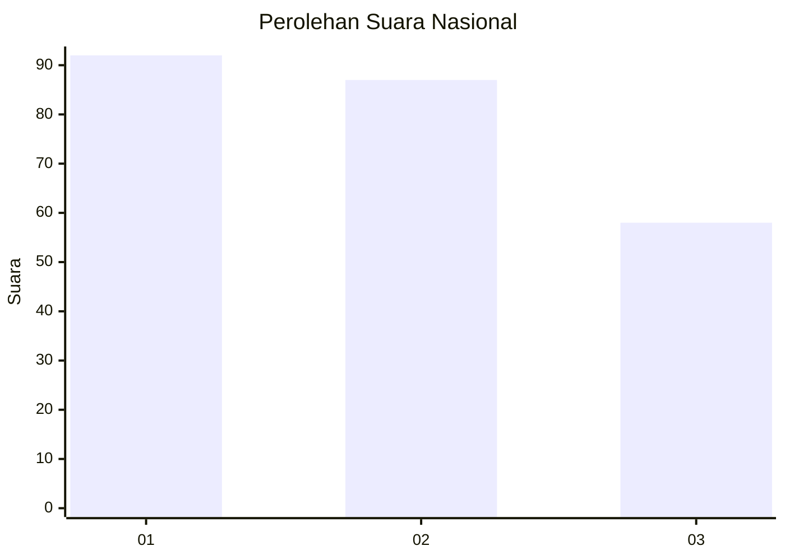
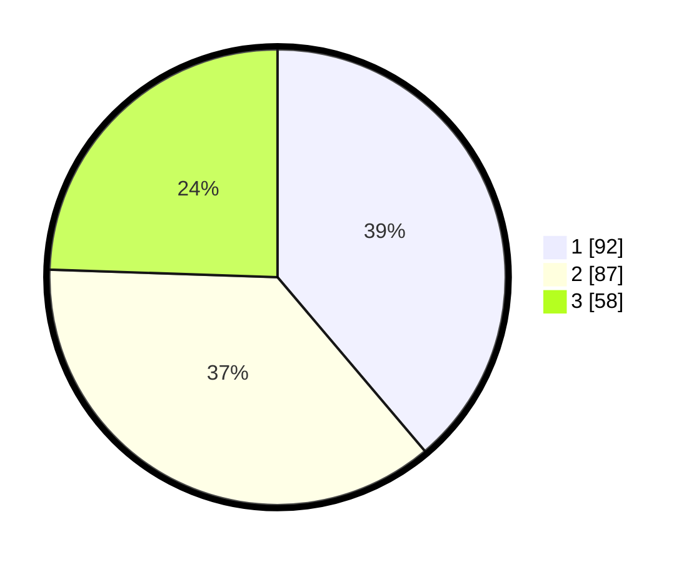

# Hasil

## Grafik

## Tabel

| No.    | Nama Paslon    | Suara | Suara (raw) | Persentase |
|:------ |:-------------- | -----:| -----------:| ----------:|
| 100025 | ANIES MUHAIMIN | 92    | [92][p-1]   | 38,82      |
| 100026 | PRABOWO GIBRAN | 87    | [87][p-2]   | 36,71      |
| 100027 | GANJAR MAHFUD  | 58    | [58][p-3]   | 24,47      |

[p-1]: https://github.com/gigit-pemilu/pemilu-2024/blob/main/pilpres/hitung-suara/sub/31-dki-jakarta/sub/75-jakarta-timur/sub/07-duren-sawit/sub/1001-duren-sawit/sub/204-tps/sub/paslon-1.txt
[p-2]: https://github.com/gigit-pemilu/pemilu-2024/blob/main/pilpres/hitung-suara/sub/31-dki-jakarta/sub/75-jakarta-timur/sub/07-duren-sawit/sub/1001-duren-sawit/sub/204-tps/sub/paslon-2.txt
[p-3]: https://github.com/gigit-pemilu/pemilu-2024/blob/main/pilpres/hitung-suara/sub/31-dki-jakarta/sub/75-jakarta-timur/sub/07-duren-sawit/sub/1001-duren-sawit/sub/204-tps/sub/paslon-3.txt

## Foto C Plano

https://sirekap-obj-formc.kpu.go.id/a98b/pemilu/ppwp/31/75/07/10/01/3175071001204-20240214-192617--e08193c4-fc06-49d3-81f4-c8ebc89fc24a.jpg

https://sirekap-obj-formc.kpu.go.id/a98b/pemilu/ppwp/31/75/07/10/01/3175071001204-20240214-222048--f1299fc6-8e76-4c22-bb08-e0cfe55c048d.jpg

https://sirekap-obj-formc.kpu.go.id/a98b/pemilu/ppwp/31/75/07/10/01/3175071001204-20240214-195503--cd8ea7e2-8ac7-404f-b202-3bbb96a63477.jpg

## Metadata

| Key        | Value               |
| ---------- | ------------------- |
| Time Stamp | 2024-02-21 09:00:00 |

